# Technical Specifications

## 1. INTRODUCTION

### EXECUTIVE SUMMARY

The VAT Filing Pricing Tool is a comprehensive web-based application designed to provide businesses with accurate cost estimates for VAT filing services across multiple jurisdictions. This system addresses the complex challenge of determining VAT filing costs based on various factors including business size, transaction volume, filing frequency, and country-specific tax regulations.

| Key Aspect | Description |
| --- | --- |
| Business Problem | Businesses struggle to accurately estimate VAT filing costs across multiple jurisdictions with varying requirements and complexities |
| Primary Users | Finance teams, accountants, business owners, tax consultants, and administrative staff |
| Key Stakeholders | Finance departments, accounting firms, multinational businesses, tax authorities |
| Value Proposition | Transparent, accurate pricing for VAT filing services that scales with business complexity and provides predictable cost management |

### SYSTEM OVERVIEW

#### Project Context

The VAT Filing Pricing Tool positions itself as an essential financial planning instrument for businesses operating across multiple tax jurisdictions. The system addresses the gap in the market for transparent, dynamic pricing of VAT compliance services.

| Context Element | Description |
| --- | --- |
| Market Positioning | Enterprise-grade solution for businesses requiring multi-jurisdictional VAT filing services |
| Current Limitations | Manual calculations, inconsistent pricing models, lack of transparency in cost structures |
| Enterprise Integration | Connects with Microsoft Dynamics 365, ERP systems, and accounting platforms to leverage existing business data |

#### High-Level Description

The system provides a comprehensive solution for VAT filing cost estimation through a user-friendly interface backed by sophisticated calculation engines and country-specific rule sets.

| Component | Description |
| --- | --- |
| Primary Capabilities | User authentication, service selection, dynamic pricing calculation, country-specific rule application, reporting |
| Key Architecture | Cloud-based microservices architecture on Microsoft Azure with secure API integrations |
| Major Components | Authentication service, pricing engine, rules engine, reporting module, admin configuration portal |
| Technical Approach | .NET Core backend, Blazor/React frontend, Azure SQL Database, Azure Active Directory integration |

#### Success Criteria

| Criterion Type | Metrics |
| --- | --- |
| Measurable Objectives | 95% pricing accuracy, 99.5% system availability, <2 second response time for calculations |
| Critical Success Factors | Accurate country-specific VAT rules, intuitive user interface, reliable integration with ERP systems |
| KPIs | User adoption rate, pricing estimate accuracy, customer satisfaction scores, time saved vs. manual calculations |

### SCOPE

#### In-Scope

**Core Features and Functionalities**

| Feature Category | Included Elements |
| --- | --- |
| User Management | Registration, authentication via Azure AD, role-based access control, profile management |
| Pricing Capabilities | Service type selection, country-specific rule application, dynamic calculation engine, detailed cost breakdowns |
| Reporting | PDF/Excel exports, historical data tracking, detailed cost analysis, service comparisons |
| Administration | Rule configuration, user management, pricing model adjustments, audit logging |

**Implementation Boundaries**

| Boundary Type | Coverage |
| --- | --- |
| System Boundaries | Web application with API integrations to ERP/accounting systems |
| User Groups | Finance professionals, accountants, business administrators, tax consultants |
| Geographic Coverage | EU member states, UK, US, and major global economies with VAT/GST systems |
| Data Domains | Transaction volumes, invoice counts, filing frequencies, country-specific tax rules |

#### Out-of-Scope

- Actual VAT filing submission to tax authorities
- Tax advisory services or legal consultations
- Direct integration with government tax portals
- Automated VAT return preparation (calculation only, not form completion)
- Historical VAT filing data migration from legacy systems
- Mobile application versions (initial release will be web-based only)
- Integration with non-Microsoft ERP systems (planned for future phases)
- Support for specialized industry-specific VAT schemes (e.g., margin schemes for used goods)

## 2. PRODUCT REQUIREMENTS

### 2.1 FEATURE CATALOG

#### User Management and Authentication (F-100 Series)

| Feature Metadata | Details |
| --- | --- |
| ID | F-101 |
| Name | User Registration and Authentication |
| Category | Security & Access Control |
| Priority | Critical |
| Status | Approved |

**Description**:
- **Overview**: Enables users to register accounts, authenticate via Azure AD, and manage their profiles.
- **Business Value**: Ensures secure access to the system and maintains user data privacy.
- **User Benefits**: Seamless login experience with enterprise-grade security.
- **Technical Context**: Leverages Azure Active Directory for identity management.

**Dependencies**:
- **System Dependencies**: Azure Active Directory, Microsoft Identity Platform
- **External Dependencies**: None
- **Integration Requirements**: OAuth 2.0 authentication flow

| Feature Metadata | Details |
| --- | --- |
| ID | F-102 |
| Name | Role-Based Access Control |
| Category | Security & Access Control |
| Priority | High |
| Status | Approved |

**Description**:
- **Overview**: Implements role-based permissions for different user types (admin, accountant, customer).
- **Business Value**: Ensures appropriate access levels based on user responsibilities.
- **User Benefits**: Access to features relevant to user role without unnecessary complexity.
- **Technical Context**: Integrated with authentication system to enforce permissions.

**Dependencies**:
- **Prerequisite Features**: F-101 (User Registration and Authentication)
- **System Dependencies**: Azure Active Directory
- **Integration Requirements**: Role definitions in identity management system

#### Pricing and Calculation (F-200 Series)

| Feature Metadata | Details |
| --- | --- |
| ID | F-201 |
| Name | Service Type Selection |
| Category | Core Functionality |
| Priority | Critical |
| Status | Approved |

**Description**:
- **Overview**: Allows users to select different VAT filing service types.
- **Business Value**: Enables accurate pricing based on service complexity.
- **User Benefits**: Clear differentiation between service options and associated costs.
- **Technical Context**: Forms the foundation for the pricing calculation engine.

**Dependencies**:
- **Prerequisite Features**: F-101 (User Registration and Authentication)
- **System Dependencies**: Pricing database
- **Integration Requirements**: None

| Feature Metadata | Details |
| --- | --- |
| ID | F-202 |
| Name | Dynamic Pricing Calculation Engine |
| Category | Core Functionality |
| Priority | Critical |
| Status | Approved |

**Description**:
- **Overview**: Calculates VAT filing costs based on multiple parameters including transaction volume, countries, and service level.
- **Business Value**: Provides accurate, transparent pricing for services.
- **User Benefits**: Immediate cost estimates without manual calculations.
- **Technical Context**: Complex calculation logic with multiple variables and country-specific rules.

**Dependencies**:
- **Prerequisite Features**: F-201 (Service Type Selection), F-203 (Tax Jurisdiction Rules)
- **System Dependencies**: Azure SQL Database
- **Integration Requirements**: None

| Feature Metadata | Details |
| --- | --- |
| ID | F-203 |
| Name | Tax Jurisdiction Rules Engine |
| Category | Core Functionality |
| Priority | Critical |
| Status | Approved |

**Description**:
- **Overview**: Manages country-specific VAT rules, rates, and filing requirements.
- **Business Value**: Ensures compliance with diverse international tax regulations.
- **User Benefits**: Accurate pricing based on specific jurisdictional requirements.
- **Technical Context**: Rules database with country-specific parameters.

**Dependencies**:
- **System Dependencies**: Azure SQL Database
- **External Dependencies**: Tax regulation updates
- **Integration Requirements**: None

| Feature Metadata | Details |
| --- | --- |
| ID | F-204 |
| Name | Pricing Breakdown and Estimates |
| Category | Core Functionality |
| Priority | High |
| Status | Approved |

**Description**:
- **Overview**: Provides detailed cost breakdowns for VAT filing services.
- **Business Value**: Transparent pricing increases customer trust and satisfaction.
- **User Benefits**: Clear understanding of cost components and service value.
- **Technical Context**: Visualization of calculation engine results.

**Dependencies**:
- **Prerequisite Features**: F-202 (Dynamic Pricing Calculation Engine)
- **System Dependencies**: None
- **Integration Requirements**: None

#### Integration and Data Processing (F-300 Series)

| Feature Metadata | Details |
| --- | --- |
| ID | F-301 |
| Name | ERP System Integration |
| Category | Integration |
| Priority | High |
| Status | Approved |

**Description**:
- **Overview**: Integrates with Microsoft Dynamics 365 and other ERP systems to retrieve transaction data.
- **Business Value**: Streamlines data collection for pricing calculations.
- **User Benefits**: Reduced manual data entry and improved accuracy.
- **Technical Context**: API-based integration with secure data exchange.

**Dependencies**:
- **Prerequisite Features**: F-101 (User Registration and Authentication)
- **System Dependencies**: Azure API Management
- **External Dependencies**: ERP system APIs
- **Integration Requirements**: Secure API connections, data mapping

| Feature Metadata | Details |
| --- | --- |
| ID | F-302 |
| Name | OCR Document Processing |
| Category | Integration |
| Priority | Medium |
| Status | Proposed |

**Description**:
- **Overview**: Uses Azure Cognitive Services to extract data from invoices and VAT forms.
- **Business Value**: Reduces manual data entry and improves data accuracy.
- **User Benefits**: Faster processing of documents and reduced errors.
- **Technical Context**: AI-powered document analysis and data extraction.

**Dependencies**:
- **System Dependencies**: Azure Cognitive Services
- **External Dependencies**: None
- **Integration Requirements**: Document upload interface, OCR processing pipeline

#### Reporting and Export (F-400 Series)

| Feature Metadata | Details |
| --- | --- |
| ID | F-401 |
| Name | Report Generation |
| Category | Reporting |
| Priority | High |
| Status | Approved |

**Description**:
- **Overview**: Generates detailed reports on VAT filing costs and breakdowns.
- **Business Value**: Provides documentation for financial planning and budgeting.
- **User Benefits**: Comprehensive view of VAT filing costs across jurisdictions.
- **Technical Context**: Report templates with dynamic data population.

**Dependencies**:
- **Prerequisite Features**: F-202 (Dynamic Pricing Calculation Engine), F-204 (Pricing Breakdown and Estimates)
- **System Dependencies**: Azure Blob Storage
- **Integration Requirements**: None

| Feature Metadata | Details |
| --- | --- |
| ID | F-402 |
| Name | Export Functionality |
| Category | Reporting |
| Priority | Medium |
| Status | Approved |

**Description**:
- **Overview**: Allows export of reports and pricing estimates in PDF and Excel formats.
- **Business Value**: Facilitates sharing of information with stakeholders.
- **User Benefits**: Flexibility in using pricing data outside the system.
- **Technical Context**: Document generation with multiple format support.

**Dependencies**:
- **Prerequisite Features**: F-401 (Report Generation)
- **System Dependencies**: Document generation libraries
- **Integration Requirements**: None

#### Administration (F-500 Series)

| Feature Metadata | Details |
| --- | --- |
| ID | F-501 |
| Name | Admin Configuration Portal |
| Category | Administration |
| Priority | High |
| Status | Approved |

**Description**:
- **Overview**: Interface for administrators to configure pricing models, VAT rates, and system settings.
- **Business Value**: Enables system maintenance without developer intervention.
- **User Benefits**: Up-to-date pricing and tax information.
- **Technical Context**: Administrative interface with database management capabilities.

**Dependencies**:
- **Prerequisite Features**: F-102 (Role-Based Access Control)
- **System Dependencies**: Azure SQL Database
- **Integration Requirements**: None

| Feature Metadata | Details |
| --- | --- |
| ID | F-502 |
| Name | Audit Logging |
| Category | Administration |
| Priority | Medium |
| Status | Approved |

**Description**:
- **Overview**: Tracks system usage, configuration changes, and pricing queries.
- **Business Value**: Ensures accountability and provides data for system optimization.
- **User Benefits**: Transparent record of system activities.
- **Technical Context**: Comprehensive logging system with search capabilities.

**Dependencies**:
- **System Dependencies**: Azure SQL Database, Azure Monitor
- **Integration Requirements**: None

### 2.2 FUNCTIONAL REQUIREMENTS TABLE

#### User Management and Authentication

| Requirement Details | Specifications |
| --- | --- |
| ID | F-101-RQ-001 |
| Description | System must support user registration with email verification |
| Acceptance Criteria | Users can create accounts, receive verification emails, and activate accounts |
| Priority | Must-Have |
| Complexity | Medium |

**Technical Specifications**:
- **Input Parameters**: Email, password, user details
- **Output/Response**: Account creation confirmation, verification email
- **Performance Criteria**: < 3 seconds for registration process
- **Data Requirements**: User profile storage in secure database

**Validation Rules**:
- **Business Rules**: Valid email format required
- **Data Validation**: Password complexity requirements
- **Security Requirements**: Encrypted password storage
- **Compliance Requirements**: GDPR compliance for EU users

| Requirement Details | Specifications |
| --- | --- |
| ID | F-101-RQ-002 |
| Description | System must integrate with Azure Active Directory for authentication |
| Acceptance Criteria | Users can log in using Azure AD credentials with SSO capability |
| Priority | Must-Have |
| Complexity | High |

**Technical Specifications**:
- **Input Parameters**: Azure AD credentials
- **Output/Response**: Authentication token, user session
- **Performance Criteria**: < 2 seconds for authentication process
- **Data Requirements**: User identity mapping to Azure AD

**Validation Rules**:
- **Business Rules**: Valid Azure AD account required
- **Security Requirements**: OAuth 2.0 protocol implementation
- **Compliance Requirements**: Microsoft identity platform standards

#### Pricing and Calculation

| Requirement Details | Specifications |
| --- | --- |
| ID | F-202-RQ-001 |
| Description | System must calculate VAT filing costs based on transaction volume, countries, and service level |
| Acceptance Criteria | Accurate cost calculation with detailed breakdown for all supported countries |
| Priority | Must-Have |
| Complexity | High |

**Technical Specifications**:
- **Input Parameters**: Transaction count, countries, service type, filing frequency
- **Output/Response**: Total cost, itemized breakdown
- **Performance Criteria**: < 1 second for calculation
- **Data Requirements**: Country-specific VAT rules, pricing models

**Validation Rules**:
- **Business Rules**: Different pricing tiers based on volume
- **Data Validation**: Input parameter range validation
- **Security Requirements**: Calculation logic protected from manipulation
- **Compliance Requirements**: Transparent pricing disclosure

| Requirement Details | Specifications |
| --- | --- |
| ID | F-203-RQ-001 |
| Description | System must maintain up-to-date tax jurisdiction rules for all supported countries |
| Acceptance Criteria | All country-specific VAT rates and rules are current and accurately applied |
| Priority | Must-Have |
| Complexity | High |

**Technical Specifications**:
- **Input Parameters**: Country selection
- **Output/Response**: Applied tax rules
- **Performance Criteria**: Rules updated within 24 hours of official changes
- **Data Requirements**: VAT rates, filing frequencies, thresholds by country

**Validation Rules**:
- **Business Rules**: Country-specific tax regulations
- **Data Validation**: Rule consistency checks
- **Compliance Requirements**: Adherence to international tax standards

#### Integration and Data Processing

| Requirement Details | Specifications |
| --- | --- |
| ID | F-301-RQ-001 |
| Description | System must integrate with Microsoft Dynamics 365 to retrieve transaction data |
| Acceptance Criteria | Seamless data retrieval with proper authorization and mapping |
| Priority | Should-Have |
| Complexity | High |

**Technical Specifications**:
- **Input Parameters**: API credentials, data query parameters
- **Output/Response**: Transaction data set
- **Performance Criteria**: < 5 seconds for data retrieval
- **Data Requirements**: Transaction counts, invoice data

**Validation Rules**:
- **Business Rules**: Data access permissions
- **Security Requirements**: Secure API communication
- **Compliance Requirements**: Data privacy regulations

#### Reporting and Export

| Requirement Details | Specifications |
| --- | --- |
| ID | F-401-RQ-001 |
| Description | System must generate detailed VAT filing cost reports |
| Acceptance Criteria | Reports include all cost components with clear categorization |
| Priority | Should-Have |
| Complexity | Medium |

**Technical Specifications**:
- **Input Parameters**: Calculation results, report parameters
- **Output/Response**: Formatted report
- **Performance Criteria**: < 3 seconds for report generation
- **Data Requirements**: Pricing breakdown, service details

**Validation Rules**:
- **Business Rules**: Report formatting standards
- **Data Validation**: Data completeness check
- **Security Requirements**: Report access controls

| Requirement Details | Specifications |
| --- | --- |
| ID | F-402-RQ-001 |
| Description | System must support export of reports in PDF and Excel formats |
| Acceptance Criteria | Exported documents maintain formatting and contain all report data |
| Priority | Should-Have |
| Complexity | Medium |

**Technical Specifications**:
- **Input Parameters**: Report data, export format selection
- **Output/Response**: Downloadable file
- **Performance Criteria**: < 5 seconds for file generation
- **Data Requirements**: Report content, formatting templates

**Validation Rules**:
- **Business Rules**: File format standards
- **Security Requirements**: Exported file protection

### 2.3 FEATURE RELATIONSHIPS

#### Feature Dependencies Map

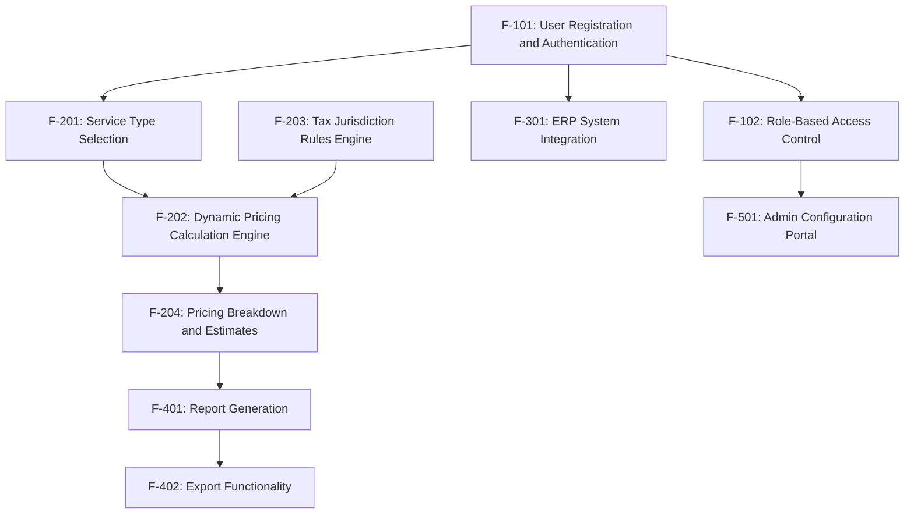

#### Integration Points

| Integration Point | Connected Features | Description |
| --- | --- | --- |
| Authentication Service | F-101, F-102 | Azure AD integration for user authentication and role management |
| Pricing Engine | F-201, F-202, F-203, F-204 | Core calculation system with rules application |
| ERP Connector | F-301, F-202 | Data exchange with Microsoft Dynamics 365 |
| Document Processing | F-302, F-202 | OCR processing for invoice data extraction |
| Reporting System | F-401, F-402 | Report generation and export functionality |

#### Shared Components

| Component | Used By Features | Description |
| --- | --- | --- |
| User Identity Service | F-101, F-102, F-501, F-502 | Manages user authentication and authorization |
| Rules Database | F-203, F-202, F-501 | Stores and applies country-specific VAT rules |
| Calculation Engine | F-202, F-204, F-401 | Performs pricing calculations based on inputs |
| Document Generator | F-401, F-402 | Creates formatted reports and exports |

### 2.4 IMPLEMENTATION CONSIDERATIONS

#### Technical Constraints

| Feature | Constraints |
| --- | --- |
| F-101: User Registration and Authentication | Must comply with Azure AD integration standards |
| F-202: Dynamic Pricing Calculation Engine | Must handle complex calculation logic with multiple variables |
| F-301: ERP System Integration | Dependent on ERP system API availability and compatibility |
| F-302: OCR Document Processing | Limited by OCR accuracy and document quality |

#### Performance Requirements

| Feature | Requirements |
| --- | --- |
| F-101: User Registration and Authentication | Authentication response < 2 seconds |
| F-202: Dynamic Pricing Calculation Engine | Calculation time < 1 second regardless of complexity |
| F-301: ERP System Integration | Data retrieval < 5 seconds |
| F-401: Report Generation | Report generation < 3 seconds |

#### Scalability Considerations

| Feature | Considerations |
| --- | --- |
| F-202: Dynamic Pricing Calculation Engine | Must scale to handle peak usage periods |
| F-203: Tax Jurisdiction Rules Engine | Must accommodate growing number of countries and rule changes |
| F-301: ERP System Integration | Must handle increasing data volumes from multiple ERP systems |
| F-501: Admin Configuration Portal | Must support multiple concurrent admin users |

#### Security Implications

| Feature | Security Implications |
| --- | --- |
| F-101: User Registration and Authentication | Requires robust identity protection and access controls |
| F-301: ERP System Integration | Requires secure API communication and data protection |
| F-501: Admin Configuration Portal | Requires strict access controls and audit logging |
| F-502: Audit Logging | Must securely store sensitive operational data |

#### Maintenance Requirements

| Feature | Maintenance Requirements |
| --- | --- |
| F-203: Tax Jurisdiction Rules Engine | Regular updates to tax rates and rules |
| F-301: ERP System Integration | API compatibility monitoring and updates |
| F-501: Admin Configuration Portal | User management and system configuration |
| F-502: Audit Logging | Log rotation and archiving |

## 3. TECHNOLOGY STACK

### 3.1 PROGRAMMING LANGUAGES

| Component | Language | Version | Justification |
| --- | --- | --- | --- |
| Backend Services | C# | 10.0 | Aligns with Microsoft ecosystem requirements, strong type safety, excellent performance for enterprise applications, and seamless integration with Azure services |
| Frontend Web Application | TypeScript | 4.7+ | Type safety for complex UI interactions, improved maintainability, and excellent integration with React/Blazor frameworks |
| Database Access | T-SQL | - | Native language for Azure SQL Database, optimized for complex data operations and reporting queries |
| Serverless Functions | C# | 10.0 | Consistency with main backend, efficient execution in Azure Functions environment |
| Build Scripts | PowerShell | 7.2+ | Native Windows support, comprehensive Azure management capabilities, and automation of deployment processes |

### 3.2 FRAMEWORKS & LIBRARIES

| Component | Framework/Library | Version | Justification |
| --- | --- | --- | --- |
| Backend API | ASP.NET Core | 6.0+ | Enterprise-grade performance, comprehensive security features, excellent Azure integration, and robust middleware ecosystem |
| Frontend UI | Blazor WebAssembly | 6.0+ | Seamless C# integration between frontend and backend, reducing context switching for developers, with rich component ecosystem |
| Alternative Frontend | React | 18.0+ | Optional alternative for teams with JavaScript expertise, extensive component libraries, and proven enterprise scalability |
| ORM | Entity Framework Core | 6.0+ | Simplified data access, code-first approach for database management, and integration with Azure SQL |
| API Documentation | Swagger/OpenAPI | 3.0 | Industry standard for API documentation, client generation, and testing |
| UI Component Library | Blazor UI Kit / Material UI | Latest | Consistent enterprise UI components, accessibility compliance, and responsive design |
| Authentication | Microsoft Identity | 1.0+ | Seamless integration with Azure AD, enterprise-grade security, and support for various authentication flows |
| PDF Generation | PDFsharp | 1.50+ | .NET library for PDF document creation with high-quality output for reports and exports |
| Excel Export | EPPlus | 5.8+ | Comprehensive Excel document generation for detailed financial reports |

### 3.3 DATABASES & STORAGE

| Component | Technology | Version | Justification |
| --- | --- | --- | --- |
| Primary Database | Azure SQL Database | Latest | Enterprise-grade relational database, high performance for complex financial calculations, robust security features, and seamless Azure integration |
| Caching Layer | Azure Redis Cache | Latest | High-performance distributed caching for calculation results and frequently accessed data, reducing database load |
| Document Storage | Azure Blob Storage | Latest | Scalable storage for PDF reports, Excel exports, and uploaded documents with fine-grained access control |
| Audit Logging | Azure SQL Database | Latest | Structured storage of audit trails with indexing for efficient querying and reporting |
| Configuration Storage | Azure App Configuration | Latest | Centralized management of application settings, feature flags, and environment-specific configurations |
| Secrets Management | Azure Key Vault | Latest | Secure storage of connection strings, API keys, and certificates with access control and audit logging |

### 3.4 THIRD-PARTY SERVICES

| Service | Provider | Purpose | Justification |
| --- | --- | --- | --- |
| Authentication | Azure Active Directory | User identity and access management | Enterprise-standard authentication, single sign-on capabilities, and integration with Microsoft ecosystem |
| Document Processing | Azure Cognitive Services (OCR) | Automated extraction of data from VAT forms and invoices | High accuracy OCR with pre-trained models for financial documents, reducing manual data entry |
| ERP Integration | Microsoft Dynamics 365 API | Retrieval of transaction data for VAT calculations | Native integration with Microsoft business applications, comprehensive data access |
| Email Notifications | Azure Communication Services | User notifications and alerts | Reliable email delivery with templates, tracking, and Azure integration |
| Monitoring | Azure Application Insights | Application performance monitoring and error tracking | Comprehensive telemetry, integration with Azure ecosystem, and powerful analytics |
| Geographic Data | Azure Maps | Country-specific information and visualization | Accurate geographic data for multi-jurisdictional tax calculations |

### 3.5 DEVELOPMENT & DEPLOYMENT

| Component | Technology | Version | Justification |
| --- | --- | --- | --- |
| IDE | Visual Studio | 2022+ | Comprehensive C#/.NET development environment with advanced debugging and Azure integration |
| Source Control | Azure DevOps Repos / GitHub | Latest | Enterprise-grade version control, code review workflows, and CI/CD integration |
| CI/CD Pipeline | Azure DevOps Pipelines | Latest | Automated build, test, and deployment workflows with Azure integration |
| Infrastructure as Code | Azure Resource Manager (ARM) | Latest | Native Azure infrastructure definition, consistent environment provisioning |
| Containerization | Docker | 20.10+ | Application isolation, consistent environments, and simplified deployment |
| Container Orchestration | Azure Kubernetes Service (AKS) | Latest | Scalable container management for microservices architecture |
| API Management | Azure API Management | Latest | Centralized API gateway, security, throttling, and developer portal |
| Load Testing | Azure Load Testing | Latest | Performance validation under various load conditions |
| Security Scanning | Microsoft Defender for Cloud | Latest | Vulnerability assessment, compliance monitoring, and security recommendations |

### 3.6 ARCHITECTURE DIAGRAM

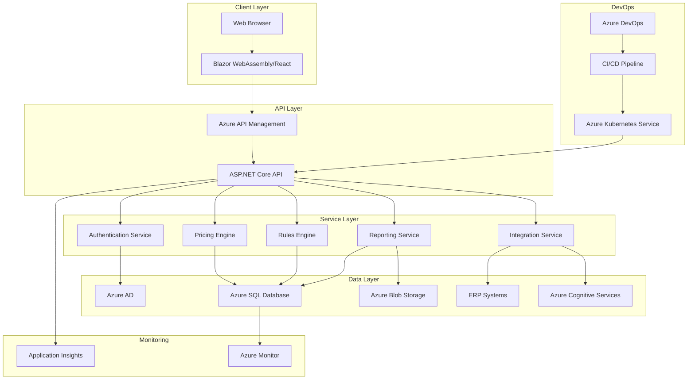

## 4. PROCESS FLOWCHART

### 4.1 SYSTEM WORKFLOWS

#### 4.1.1 Core Business Processes

##### User Registration and Authentication Flow

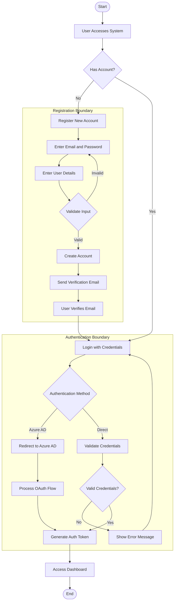

##### VAT Filing Cost Estimation Flow

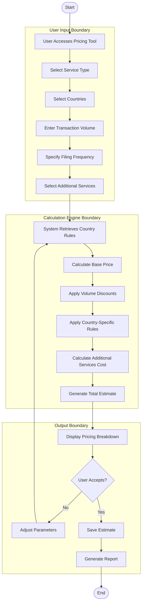

##### Report Generation and Export Flow

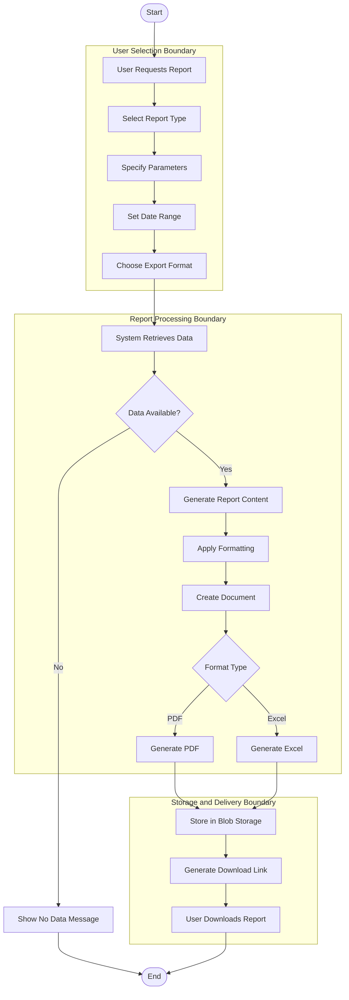

#### 4.1.2 Integration Workflows

##### ERP System Integration Flow

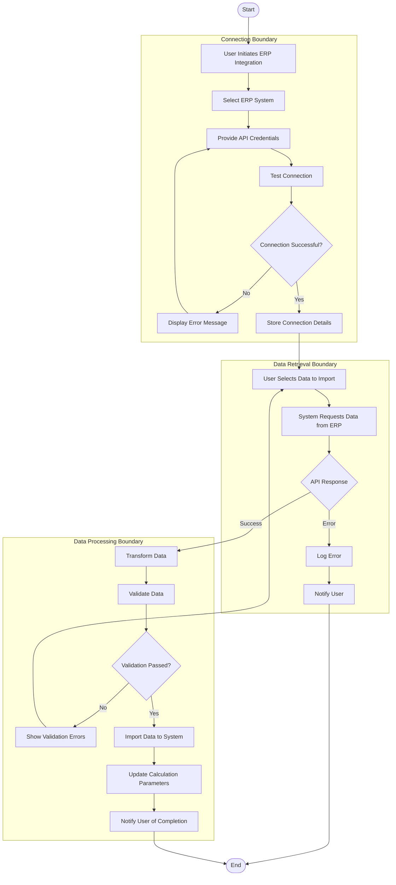

##### OCR Document Processing Flow

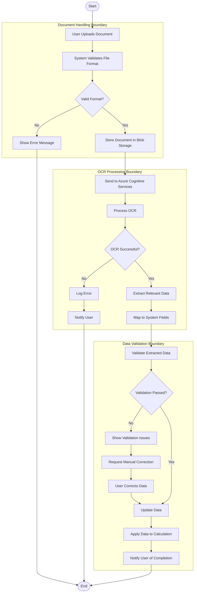

### 4.2 FLOWCHART REQUIREMENTS

#### 4.2.1 High-Level System Workflow

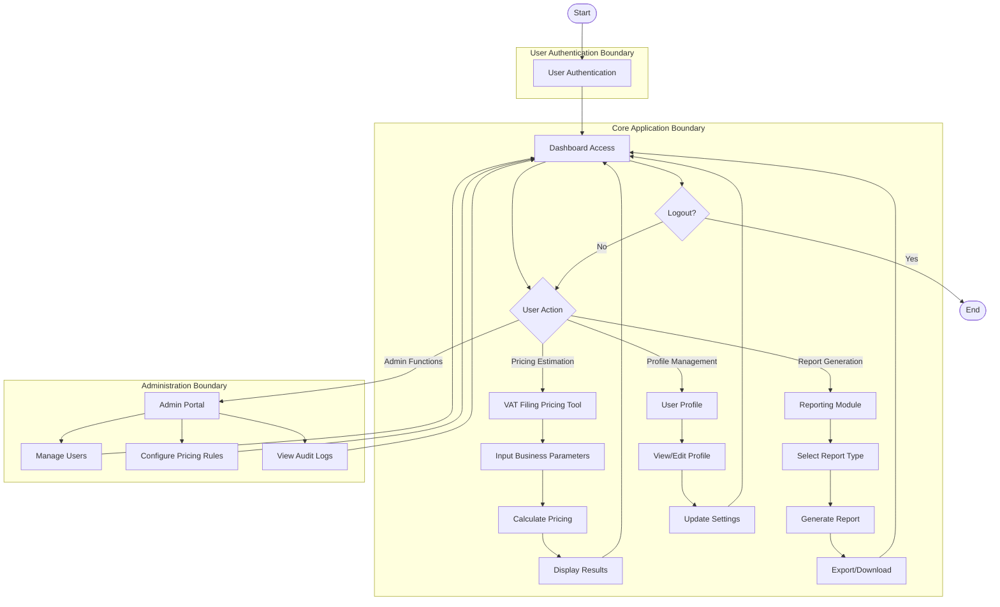

#### 4.2.2 Detailed Process Flows

##### Service Type Selection Process

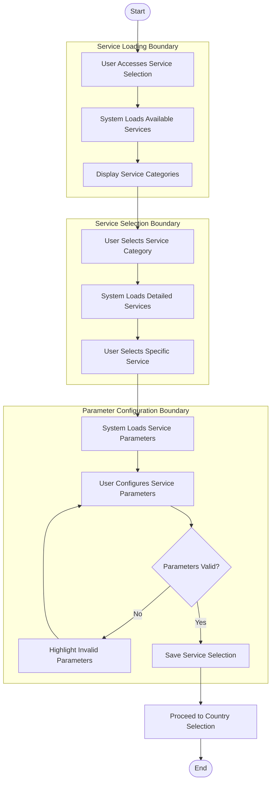

##### Country-Specific Rule Application

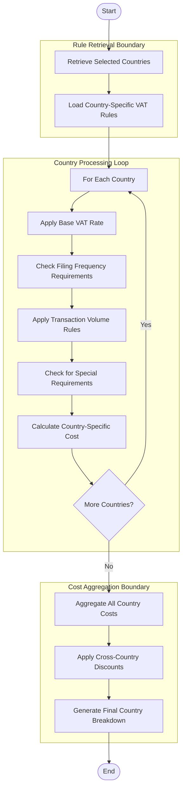

##### Admin Configuration Process

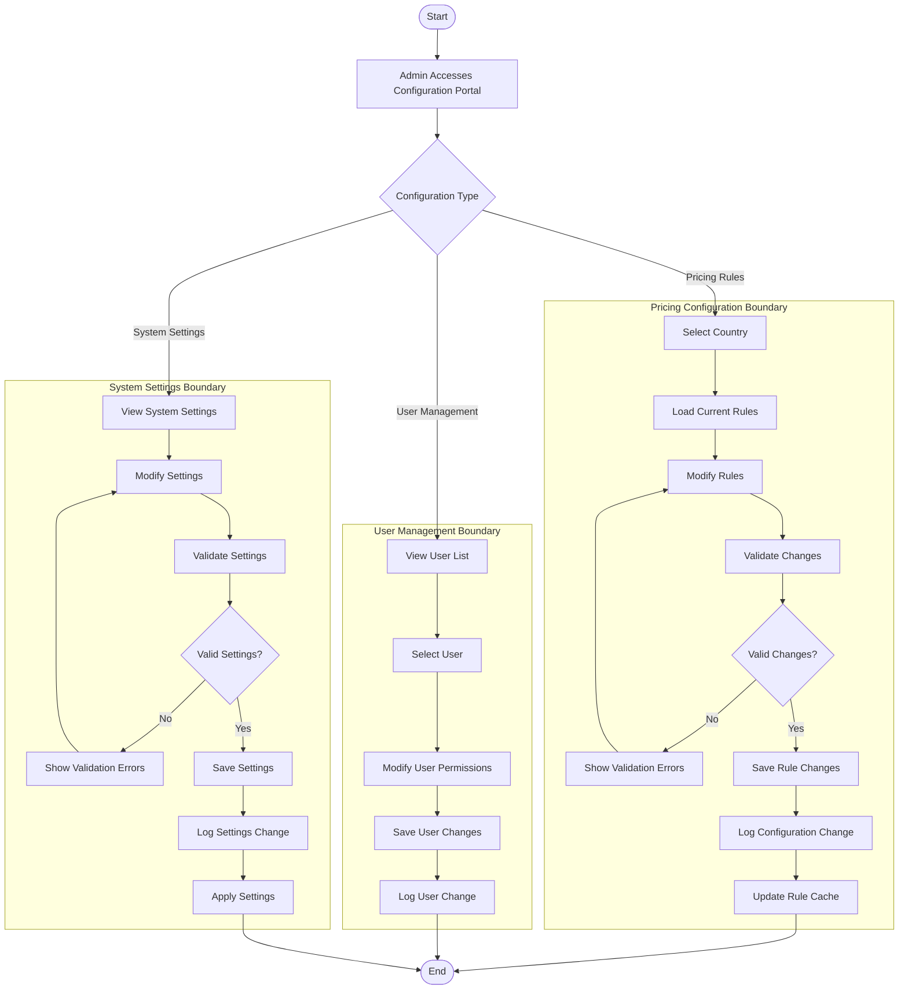

### 4.3 TECHNICAL IMPLEMENTATION

#### 4.3.1 State Management Diagram

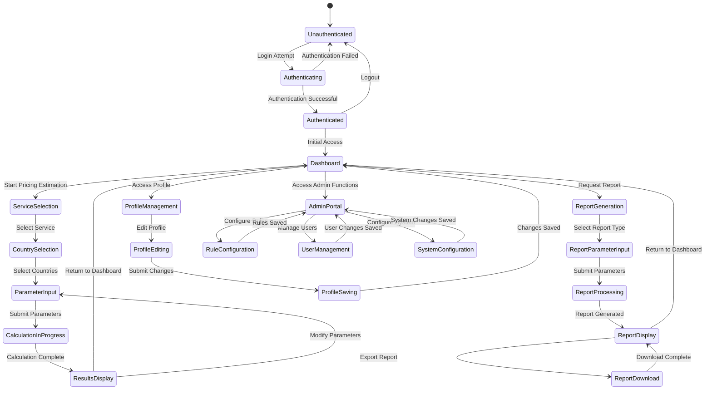

#### 4.3.2 Error Handling Flow

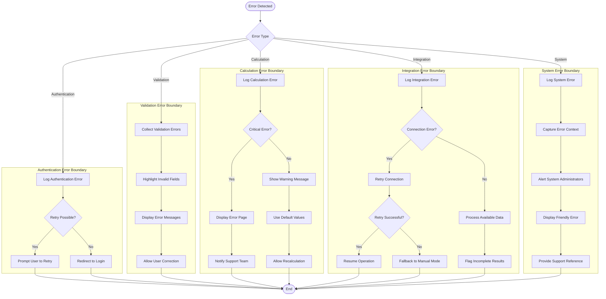

### 4.4 INTEGRATION SEQUENCE DIAGRAMS

#### 4.4.1 ERP Integration Sequence

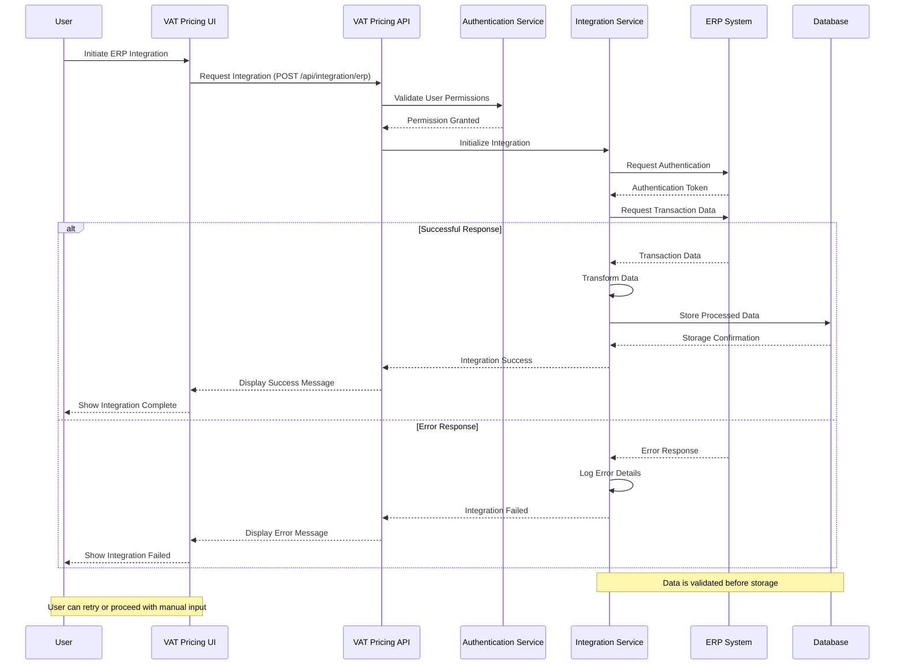

#### 4.4.2 OCR Document Processing Sequence

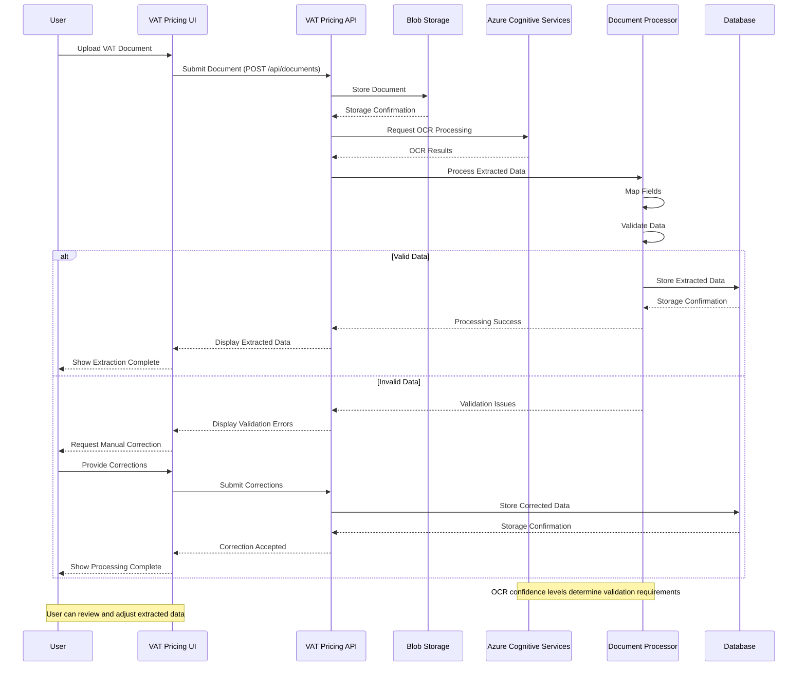

### 4.5 VALIDATION RULES

#### 4.5.1 Business Rule Application Flow

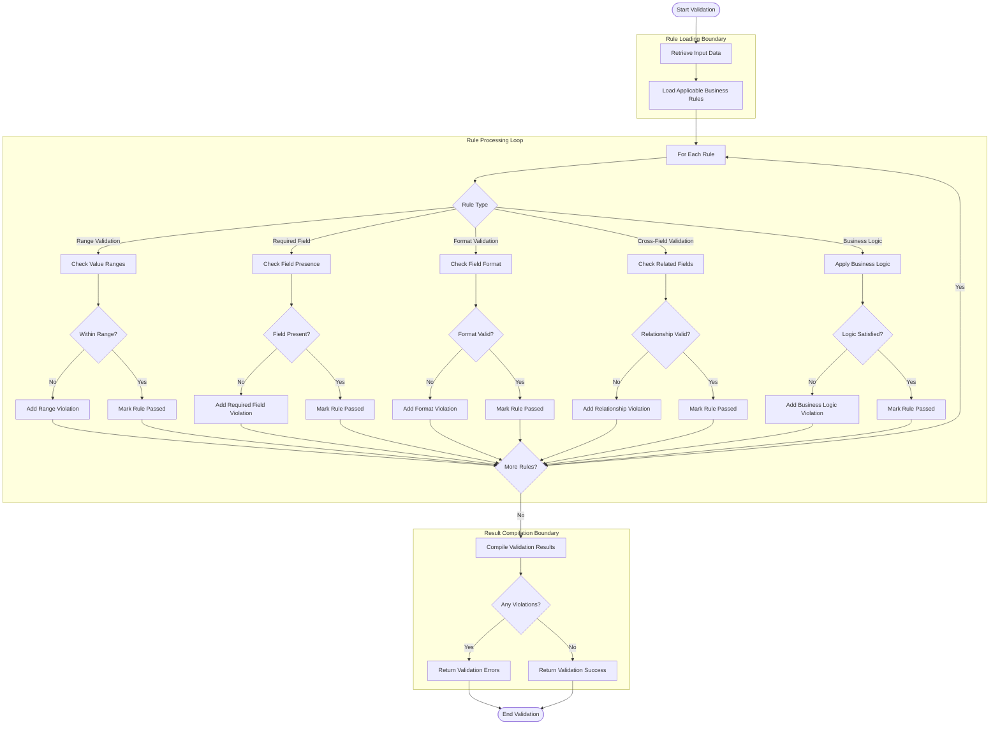

#### 4.5.2 Authorization Checkpoint Flow

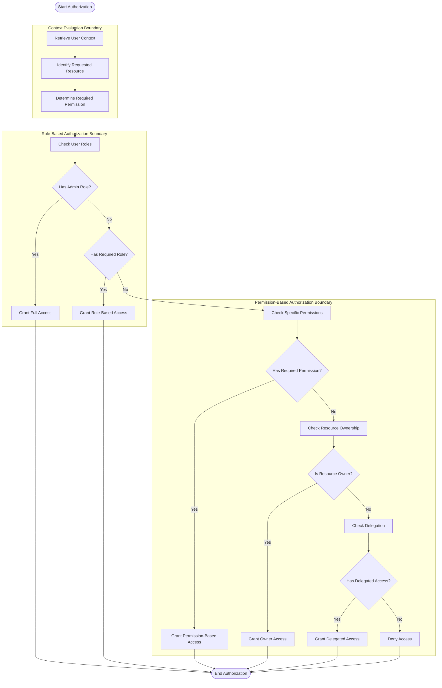

### 4.6 TRANSACTION BOUNDARIES

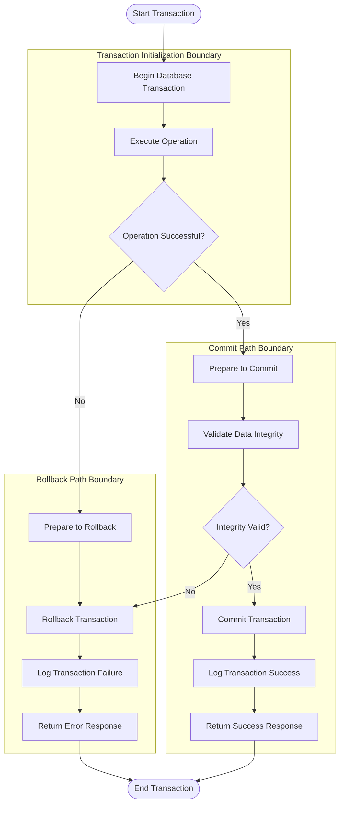

## 5. SYSTEM ARCHITECTURE

### 5.1 HIGH-LEVEL ARCHITECTURE

#### 5.1.1 System Overview

The VAT Filing Pricing Tool employs a **cloud-based microservices architecture** hosted on Microsoft Azure, designed to provide scalable, maintainable, and secure VAT filing cost estimation services. This architecture was selected to enable:

- **Separation of concerns**: Each microservice handles a specific business capability, allowing for independent development, deployment, and scaling.
- **Technology flexibility**: Services can use the most appropriate technologies for their specific requirements.
- **Resilience**: Failure in one service doesn't compromise the entire system.
- **Scalability**: Individual components can scale independently based on demand.

The system follows these key architectural principles:

- **API-first design**: All services expose well-defined APIs, enabling loose coupling and interoperability.
- **Event-driven communication**: For asynchronous operations and integration scenarios.
- **Defense in depth**: Multiple security layers protect sensitive financial and business data.
- **Configuration externalization**: Environment-specific settings are stored outside the application code.

System boundaries are clearly defined with external interfaces to:
- Microsoft Dynamics 365 and other ERP systems
- Azure Active Directory for authentication
- Azure Cognitive Services for document processing
- Client web browsers for user interaction

#### 5.1.2 Core Components Table

| Component Name | Primary Responsibility | Key Dependencies | Critical Considerations |
| --- | --- | --- | --- |
| Authentication Service | User identity management and access control | Azure AD, User Database | Security, compliance with identity standards |
| Pricing Engine | Calculate VAT filing costs based on multiple parameters | Rules Engine, Country Database | Calculation accuracy, performance |
| Rules Engine | Apply country-specific VAT rules and regulations | Country Database, Admin Configuration | Rule versioning, regulatory compliance |
| Integration Service | Connect with external systems (ERP, OCR) | Azure API Management, ERP APIs | Security, data transformation, resilience |
| Reporting Service | Generate and export detailed cost reports | Blob Storage, Pricing Engine | Format consistency, data accuracy |
| Admin Portal | Configure pricing models, rules, and user management | All services | Access control, audit logging |
| Client Application | Provide user interface for all system functions | All backend services | Responsiveness, usability, accessibility |

#### 5.1.3 Data Flow Description

The VAT Filing Pricing Tool's data flows follow a structured pattern:

1. **User Authentication Flow**: Client requests are authenticated through the Authentication Service, which integrates with Azure AD to validate user identity and permissions.

2. **Pricing Calculation Flow**: User inputs (transaction volumes, countries, service types) flow from the Client Application to the Pricing Engine, which consults the Rules Engine to apply country-specific VAT regulations and calculate accurate cost estimates.

3. **Integration Data Flow**: The Integration Service facilitates bidirectional data exchange with external systems:
   - Inbound: Transaction data from ERP systems and document data from OCR processing
   - Outbound: Cost estimates and reports to external systems

4. **Configuration Flow**: Administrative changes to pricing models and rules flow from the Admin Portal to the respective services and are persisted in the appropriate data stores.

5. **Reporting Flow**: Report generation requests flow from the Client Application to the Reporting Service, which retrieves data from the Pricing Engine and generates formatted reports stored in Azure Blob Storage.

Key data stores include:
- **Azure SQL Database**: Primary storage for user data, pricing models, and transaction records
- **Azure Cosmos DB**: Storage for country-specific VAT rules and flexible configuration data
- **Azure Redis Cache**: Caching layer for frequently accessed data like pricing rules and calculation results
- **Azure Blob Storage**: Storage for generated reports and uploaded documents

#### 5.1.4 External Integration Points

| System Name | Integration Type | Data Exchange Pattern | Protocol/Format | SLA Requirements |
| --- | --- | --- | --- | --- |
| Azure Active Directory | Authentication | Request/Response | OAuth 2.0/OpenID Connect | 99.9% availability, <500ms response time |
| Microsoft Dynamics 365 | Data Import | Request/Response, Batch | REST API, JSON | 99.5% availability, <3s response time |
| Azure Cognitive Services | Document Processing | Asynchronous | REST API, JSON/Binary | 99% availability, <10s processing time |
| ERP Systems (Generic) | Data Import | Request/Response | REST API, JSON/XML | 99% availability, <5s response time |
| Email Service | Notification | Asynchronous | SMTP | 99% delivery rate, <5min delivery time |

### 5.2 COMPONENT DETAILS

#### 5.2.1 Authentication Service

**Purpose and Responsibilities**:
- Manage user authentication and authorization
- Integrate with Azure Active Directory
- Implement role-based access control
- Maintain user session management
- Provide secure token validation

**Technologies and Frameworks**:
- ASP.NET Core Identity
- Microsoft Identity Platform
- JWT for token-based authentication
- Azure Key Vault for secret management

**Key Interfaces and APIs**:
- `/api/auth/login`: Authenticate users
- `/api/auth/register`: Register new users
- `/api/auth/token`: Validate and refresh tokens
- `/api/auth/roles`: Manage user roles and permissions

**Data Persistence Requirements**:
- User profiles stored in Azure SQL Database
- Authentication tokens cached in Azure Redis Cache
- Audit logs for authentication events

**Scaling Considerations**:
- Horizontal scaling for handling authentication spikes
- Token validation distributed across instances
- Session state externalized for stateless operation

**Component Interaction Diagram**:

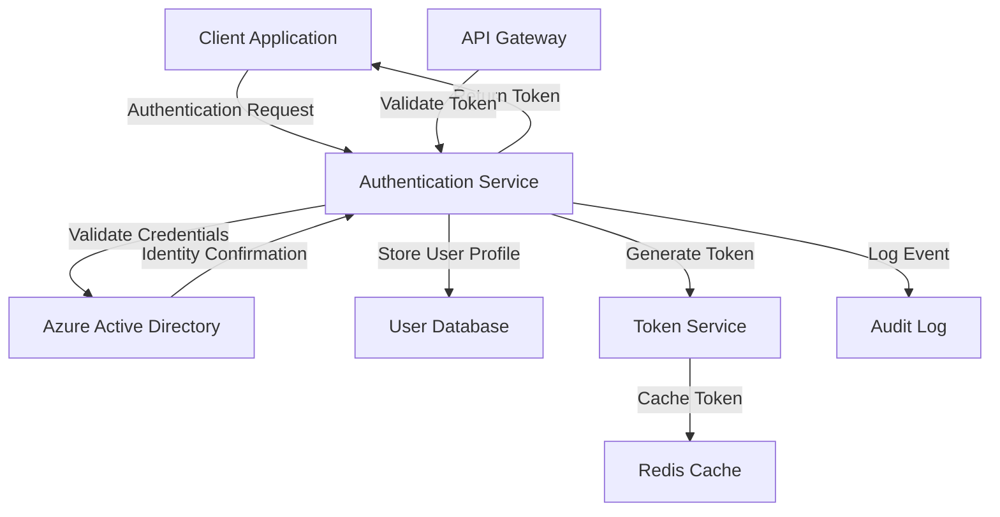

#### 5.2.2 Pricing Engine

**Purpose and Responsibilities**:
- Calculate VAT filing costs based on multiple parameters
- Apply volume-based pricing tiers
- Generate detailed cost breakdowns
- Support what-if scenarios and comparisons
- Cache calculation results for performance

**Technologies and Frameworks**:
- .NET Core for calculation logic
- Azure Functions for serverless calculation operations
- Entity Framework Core for data access
- Azure Redis Cache for result caching

**Key Interfaces and APIs**:
- `/api/pricing/calculate`: Calculate pricing based on parameters
- `/api/pricing/breakdown`: Generate detailed cost breakdown
- `/api/pricing/compare`: Compare multiple pricing scenarios
- `/api/pricing/history`: Retrieve historical pricing calculations

**Data Persistence Requirements**:
- Pricing models stored in Azure SQL Database
- Calculation results cached in Azure Redis Cache
- Historical calculations archived in Azure SQL Database

**Scaling Considerations**:
- Compute-intensive calculations offloaded to Azure Functions
- Horizontal scaling for handling peak calculation loads
- Caching strategy to minimize recalculations

**Sequence Diagram for Pricing Calculation**:

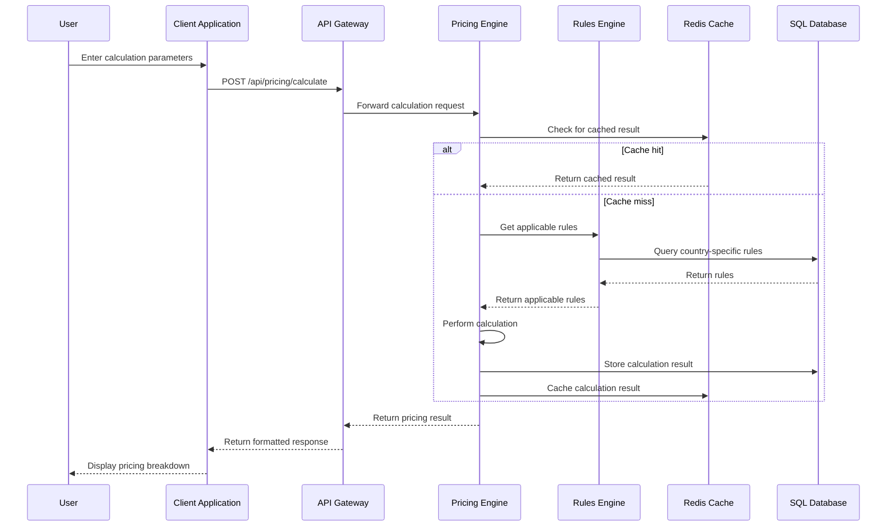

#### 5.2.3 Rules Engine

**Purpose and Responsibilities**:
- Manage country-specific VAT rules and regulations
- Apply business rules to pricing calculations
- Support rule versioning and effective dates
- Provide rule validation and consistency checking
- Enable administrative configuration of rules

**Technologies and Frameworks**:
- .NET Core for rule processing
- Azure Cosmos DB for flexible rule storage
- Expression Trees for dynamic rule evaluation
- Azure Event Grid for rule change notifications

**Key Interfaces and APIs**:
- `/api/rules/countries`: Retrieve country-specific rules
- `/api/rules/apply`: Apply rules to a specific scenario
- `/api/rules/validate`: Validate rule consistency
- `/api/rules/admin`: Administrative rule management

**Data Persistence Requirements**:
- Rules stored in Azure Cosmos DB for flexibility
- Rule versions maintained with effective dates
- Rule change history for audit purposes

**Scaling Considerations**:
- Rule evaluation distributed across instances
- Caching of frequently used rules
- Eventual consistency model for rule updates

**State Transition Diagram for Rule Lifecycle**:

```mermaid
stateDiagram-v2
    [*] --> Draft: Create Rule
    Draft --> UnderReview: Submit for Review
    UnderReview --> Rejected: Reject
    Rejected --> Draft: Revise
    UnderReview --> Approved: Approve
    Approved --> Active: Publish
    Active --> Deprecated: Supersede
    Deprecated --> Inactive: Expire
    Active --> Inactive: Expire
    Inactive --> [*]
    
    note right of Draft
        Initial rule creation by admin
    end note
    
    note right of Active
        Rule applied to calculations
    end note
    
    note right of Deprecated
        New version exists but
        old version still valid
    end note
```

#### 5.2.4 Integration Service

**Purpose and Responsibilities**:
- Facilitate data exchange with external systems
- Transform data between system formats
- Provide resilient connection handling
- Implement retry and circuit breaker patterns
- Monitor integration health and performance

**Technologies and Frameworks**:
- ASP.NET Core for API endpoints
- Azure API Management for API gateway
- Azure Logic Apps for integration workflows
- Azure Service Bus for asynchronous messaging
- Polly for resilience patterns

**Key Interfaces and APIs**:
- `/api/integration/erp`: Connect with ERP systems
- `/api/integration/ocr`: Process documents via OCR
- `/api/integration/import`: Import transaction data
- `/api/integration/export`: Export calculation results

**Data Persistence Requirements**:
- Integration configurations stored in Azure SQL Database
- Transaction logs stored in Azure Cosmos DB
- Temporary data stored in Azure Blob Storage

**Scaling Considerations**:
- Asynchronous processing for long-running integrations
- Rate limiting for external API calls
- Bulkhead pattern for isolating integration failures

**Component Interaction Diagram**:

```mermaid
graph TD
    A[Client Application] -->|Integration Request| B[API Gateway]
    B -->|Route Request| C[Integration Service]
    
    subgraph "Integration Service"
        C -->|Transform Request| D[Adapter Layer]
        D -->|Connect to External| E[Connection Manager]
        E -->|Handle Resilience| F[Resilience Layer]
        F -->|Process Async| G[Queue Manager]
        G -->|Send Message| H[Service Bus]
        H -->|Trigger| I[Integration Worker]
        I -->|Process Data| J[Data Transformer]
        J -->|Store Results| K[Result Manager]
    end
    
    F -->|Synchronous Call| L[External Systems]
    L -->|Response| F
    
    K -->|Return Results| C
    C -->|Format Response| B
    B -->|Return to Client| A
```

#### 5.2.5 Reporting Service

**Purpose and Responsibilities**:
- Generate detailed VAT filing cost reports
- Support multiple export formats (PDF, Excel)
- Provide report templates and customization
- Schedule recurring reports
- Archive historical reports

**Technologies and Frameworks**:
- .NET Core for report processing
- PDFsharp for PDF generation
- EPPlus for Excel document creation
- Azure Blob Storage for report storage
- Azure Functions for scheduled report generation

**Key Interfaces and APIs**:
- `/api/reports/generate`: Generate a new report
- `/api/reports/download`: Download a generated report
- `/api/reports/templates`: Manage report templates
- `/api/reports/schedule`: Schedule recurring reports

**Data Persistence Requirements**:
- Report templates stored in Azure SQL Database
- Generated reports stored in Azure Blob Storage
- Report metadata stored in Azure SQL Database

**Scaling Considerations**:
- Offload report generation to background workers
- Parallel processing for multiple report requests
- Content Delivery Network for report distribution

**Sequence Diagram for Report Generation**:

```mermaid
sequenceDiagram
    participant User
    participant Client as Client Application
    participant API as API Gateway
    participant Reports as Reporting Service
    participant Pricing as Pricing Engine
    participant Storage as Blob Storage
    
    User->>Client: Request Report
    Client->>API: POST /api/reports/generate
    API->>Reports: Forward report request
    
    Reports->>Pricing: Get pricing data
    Pricing-->>Reports: Return pricing data
    
    Reports->>Reports: Generate report content
    
    alt PDF Format
        Reports->>Reports: Format as PDF
    else Excel Format
        Reports->>Reports: Format as Excel
    end
    
    Reports->>Storage: Store generated report
    Storage-->>Reports: Return storage location
    
    Reports-->>API: Return report metadata
    API-->>Client: Return download link
    Client-->>User: Display download option
    
    User->>Client: Download Report
    Client->>API: GET /api/reports/download
    API->>Reports: Forward download request
    Reports->>Storage: Retrieve report
    Storage-->>Reports: Return report content
    Reports-->>API: Stream report content
    API-->>Client: Stream report file
    Client-->>User: Save report file
```

### 5.3 TECHNICAL DECISIONS

#### 5.3.1 Architecture Style Decisions

| Decision Area | Selected Approach | Alternatives Considered | Rationale |
| --- | --- | --- | --- |
| Overall Architecture | Microservices | Monolithic, Serverless | Enables independent scaling of components, supports team autonomy, and provides flexibility for future enhancements |
| API Design | REST with JSON | GraphQL, gRPC | Widely adopted standard, excellent tooling support, and simplifies integration with various clients |
| Frontend Architecture | Single Page Application | Server-rendered MVC | Provides responsive user experience, reduces server load, and enables rich interactive features |
| Deployment Model | Containerized | VM-based, PaaS-only | Offers consistency across environments, simplifies scaling, and supports modern DevOps practices |

**Architecture Decision Record (ADR) for Microservices**:

```mermaid
graph TD
    A[Context: Architecture Style Selection] --> B{Decision Point}
    B -->|Option 1| C[Microservices]
    B -->|Option 2| D[Monolithic]
    B -->|Option 3| E[Serverless]
    
    C --> F[Pros: Independent scaling, Team autonomy, Technology flexibility]
    C --> G[Cons: Operational complexity, Distributed system challenges]
    
    D --> H[Pros: Simplicity, Lower initial overhead]
    D --> I[Cons: Scaling limitations, Technology lock-in]
    
    E --> J[Pros: Cost efficiency, Automatic scaling]
    E --> K[Cons: Vendor lock-in, Cold start latency]
    
    F --> L[Selected: Microservices]
    G --> L
    
    L --> M[Consequences: Need for API gateway, Service discovery, Distributed monitoring]
```

#### 5.3.2 Communication Pattern Choices

| Pattern | Use Cases | Benefits | Considerations |
| --- | --- | --- | --- |
| Synchronous REST | User-initiated actions, Real-time calculations | Immediate response, Simple implementation | Potential for cascading failures |
| Asynchronous Messaging | Document processing, Report generation | Resilience, Decoupling, Load leveling | Eventual consistency, Complexity |
| Event-driven | Rule changes, Integration events | Loose coupling, Scalability | Event versioning, Ordering challenges |
| Publish/Subscribe | Notifications, Cache invalidation | Multicast capability, Decoupling | Message delivery guarantees |

**Decision Tree for Communication Patterns**:

```mermaid
graph TD
    A[Communication Requirement] --> B{Response Time Critical?}
    B -->|Yes| C{Simple Request/Response?}
    B -->|No| D{Multiple Consumers?}
    
    C -->|Yes| E[Synchronous REST]
    C -->|No| F{Complex Workflow?}
    
    F -->|Yes| G[Orchestration Service]
    F -->|No| E
    
    D -->|Yes| H[Publish/Subscribe]
    D -->|No| I{Long-running Process?}
    
    I -->|Yes| J[Asynchronous Messaging]
    I -->|No| K{State Change Notification?}
    
    K -->|Yes| L[Event-driven]
    K -->|No| J
```

#### 5.3.3 Data Storage Solution Rationale

| Data Type | Selected Solution | Alternatives Considered | Rationale |
| --- | --- | --- | --- |
| Structured Business Data | Azure SQL Database | Cosmos DB, MySQL | Strong consistency, relational integrity, and familiar query language for complex financial data |
| Flexible Configuration Data | Azure Cosmos DB | SQL Database, Table Storage | Schema flexibility for varying country rules, global distribution, and multi-region writes |
| Temporary Calculation Results | Azure Redis Cache | In-memory cache, SQL Database | High performance, TTL support, and distributed caching capabilities |
| Document Storage | Azure Blob Storage | File Storage, SQL FILESTREAM | Cost-effective for large objects, CDN integration, and tiered storage options |

**Data Storage Decision Matrix**:

```mermaid
graph TD
    A[Data Storage Requirements] --> B{Data Structure}
    
    B -->|Structured| C{Transaction Requirements}
    B -->|Semi-structured| D[Cosmos DB]
    B -->|Unstructured| E[Blob Storage]
    
    C -->|ACID Important| F[SQL Database]
    C -->|Eventual Consistency OK| G{Read/Write Pattern}
    
    G -->|Read-heavy| H[SQL Database with Redis Cache]
    G -->|Write-heavy| I[Cosmos DB]
    G -->|Balanced| F
    
    J[Performance Requirements] --> K{Response Time}
    K -->|Sub-millisecond| L[Redis Cache]
    K -->|< 10ms| F
    K -->|< 100ms| D
    
    M[Scaling Requirements] --> N{Scale Pattern}
    N -->|Vertical| F
    N -->|Horizontal| O{Global Distribution}
    O -->|Required| D
    O -->|Not Required| P{Data Size}
    P -->|Large| E
    P -->|Small-Medium| F
```

#### 5.3.4 Caching Strategy Justification

| Cache Type | Implementation | Use Cases | Eviction Policy |
| --- | --- | --- | --- |
| Application Data | Azure Redis Cache | User profiles, Country rules | Time-based (30 minutes) |
| Calculation Results | Azure Redis Cache | Pricing calculations, Rule evaluations | Time-based (15 minutes) |
| API Responses | API Gateway Cache | Frequently requested data | Time-based (5 minutes) |
| Static Content | Azure CDN | UI assets, Report templates | Version-based invalidation |

**Caching Decision Rationale**:
- Redis Cache selected for application data due to its distributed nature, high performance, and rich feature set
- Short TTL for calculation results to balance performance with data freshness
- API Gateway caching implemented to reduce backend load for common queries
- CDN caching for static content to improve global performance and reduce origin load

#### 5.3.5 Security Mechanism Selection

| Security Aspect | Selected Mechanism | Alternatives Considered | Rationale |
| --- | --- | --- | --- |
| Authentication | Azure AD + JWT | Custom auth, Identity Server | Enterprise integration, single sign-on capabilities, and robust security features |
| Authorization | Role-based + Claims-based | Simple role checks, Resource-based | Granular permission control, scalable across microservices |
| API Security | OAuth 2.0 + HTTPS | API Keys, Basic Auth | Industry standard, token-based security with refresh capabilities |
| Data Protection | TDE + Column Encryption | Application-level encryption | Defense in depth, transparent to application with minimal performance impact |

**Security Implementation Decision**:

```mermaid
graph TD
    A[Security Requirements] --> B{Authentication Type}
    
    B -->|Enterprise Users| C[Azure AD]
    B -->|Mixed Users| D[Azure AD B2C]
    B -->|Custom Requirements| E[Identity Server]
    
    F[Authorization Model] --> G{Granularity Needed}
    G -->|Coarse-grained| H[Role-based]
    G -->|Fine-grained| I[Claims-based]
    G -->|Resource-specific| J[Policy-based]
    
    K[Data Protection] --> L{Data Sensitivity}
    L -->|Highly Sensitive| M[Column-level Encryption]
    L -->|Sensitive| N[TDE]
    L -->|Standard| O[HTTPS Only]
    
    P[API Security] --> Q{Client Type}
    Q -->|Browser| R[Cookies + CSRF]
    Q -->|Mobile/SPA| S[JWT]
    Q -->|Service-to-Service| T[Client Credentials]
```

### 5.4 CROSS-CUTTING CONCERNS

#### 5.4.1 Monitoring and Observability Approach

The VAT Filing Pricing Tool implements a comprehensive monitoring strategy using Azure's native monitoring capabilities:

- **Application Performance Monitoring**: Azure Application Insights tracks request rates, response times, and failure rates across all services.
- **Infrastructure Monitoring**: Azure Monitor collects metrics from all Azure resources, enabling proactive scaling and issue detection.
- **Business Metrics**: Custom metrics track key business indicators like calculation accuracy, pricing model usage, and user engagement.
- **Alerting**: Multi-level alerting based on severity with appropriate notification channels (email, SMS, Teams).
- **Dashboards**: Custom dashboards for different stakeholders (operations, development, business).

**Key Monitoring Metrics**:

| Metric Category | Key Metrics | Alert Thresholds | Retention Period |
| --- | --- | --- | --- |
| Performance | Response time, CPU usage, Memory usage | >2s response, >80% CPU, >85% memory | 30 days |
| Reliability | Error rate, Availability, Dependency failures | >1% error rate, <99.9% availability | 90 days |
| Business | Calculation count, Report generation, User activity | 30% deviation from baseline | 365 days |
| Security | Failed logins, Permission violations, API anomalies | >5 failed attempts, Any violation | 180 days |

#### 5.4.2 Logging and Tracing Strategy

The system implements a structured logging approach with correlation IDs to track requests across services:

- **Log Levels**: Debug, Information, Warning, Error, Critical with appropriate filtering per environment
- **Contextual Information**: Every log entry includes user context, operation ID, and relevant business context
- **Distributed Tracing**: OpenTelemetry implementation for end-to-end request tracking
- **Log Aggregation**: All logs centralized in Azure Log Analytics for unified querying and analysis
- **Sensitive Data Handling**: PII and financial data redacted from logs with appropriate masking

**Log Storage and Retention**:

| Log Type | Storage Location | Retention Period | Access Control |
| --- | --- | --- | --- |
| Application Logs | Log Analytics | 30 days | Operations Team |
| Security Logs | Log Analytics + Secure Storage | 1 year | Security Team |
| Audit Logs | Azure SQL Database | 7 years | Compliance Team |
| Performance Logs | Application Insights | 90 days | Development Team |

#### 5.4.3 Error Handling Patterns

The system implements a consistent error handling strategy across all components:

- **Exception Hierarchy**: Custom exception types for different error categories
- **Retry Pattern**: Automatic retries for transient failures with exponential backoff
- **Circuit Breaker**: Prevent cascading failures when dependent services are unavailable
- **Fallback Mechanism**: Graceful degradation when non-critical services fail
- **Error Responses**: Standardized error response format across all APIs

**Error Handling Flow**:

```mermaid
flowchart TD
    A[Error Occurs] --> B{Error Type}
    
    B -->|Transient| C[Apply Retry Policy]
    C --> D{Retry Successful?}
    D -->|Yes| E[Continue Operation]
    D -->|No| F[Check Circuit Breaker]
    
    B -->|Client Error| G[Return Appropriate Status Code]
    G --> H[Log Client Error]
    H --> I[Return Error Response]
    
    B -->|Server Error| J[Log Detailed Error]
    J --> K[Alert Operations]
    K --> L[Return Sanitized Error]
    
    F --> M{Circuit Open?}
    M -->|Yes| N[Execute Fallback]
    M -->|No| O[Log Failure]
    
    N --> P[Return Degraded Response]
    O --> Q[Update Circuit State]
    Q --> R[Return Error Response]
    
    subgraph "Retry Boundary"
        C
        D
        E
        F
    end
    
    subgraph "Client Error Boundary"
        G
        H
        I
    end
    
    subgraph "Server Error Boundary"
        J
        K
        L
        M
        N
        O
        P
        Q
        R
    end
```

#### 5.4.4 Authentication and Authorization Framework

The VAT Filing Pricing Tool uses Azure Active Directory as the primary authentication provider with a comprehensive authorization model:

- **Authentication Methods**:
  - Interactive login with MFA support
  - OAuth 2.0 authorization code flow for web applications
  - Client credentials flow for service-to-service communication

- **Authorization Layers**:
  - Role-based access control for coarse-grained permissions
  - Claims-based authorization for fine-grained access control
  - Resource-based authorization for data-level security

- **Identity Management**:
  - User provisioning through Azure AD
  - Role assignment through Admin Portal
  - Just-in-time access for administrative functions

**Authorization Matrix**:

| Role | Pricing Calculation | Report Generation | Rule Configuration | User Management |
| --- | --- | --- | --- | --- |
| Administrator | Full Access | Full Access | Full Access | Full Access |
| Accountant | Full Access | Full Access | Read Only | No Access |
| Customer | Limited Access | Own Reports Only | No Access | No Access |
| System | API Access | Scheduled Reports | No Access | No Access |

#### 5.4.5 Performance Requirements and SLAs

The VAT Filing Pricing Tool is designed to meet the following performance requirements:

- **Response Time**:
  - User interface interactions: < 1 second
  - Simple pricing calculations: < 2 seconds
  - Complex multi-country calculations: < 5 seconds
  - Report generation: < 10 seconds

- **Throughput**:
  - Support for 100 concurrent users
  - 1,000 pricing calculations per minute
  - 50 report generations per minute

- **Availability**:
  - Core pricing functionality: 99.9% uptime
  - Reporting functionality: 99.5% uptime
  - Administrative functions: 99% uptime

- **Scalability**:
  - Horizontal scaling to handle 3x peak load
  - Automatic scaling based on CPU and request queue metrics

**Performance Optimization Techniques**:
- Caching of calculation results and frequently accessed data
- Asynchronous processing for long-running operations
- Database query optimization and indexing
- Content delivery network for static assets

#### 5.4.6 Disaster Recovery Procedures

The system implements a comprehensive disaster recovery strategy:

- **Backup Strategy**:
  - Azure SQL Database: Full backup daily, differential every 12 hours, transaction logs every 15 minutes
  - Cosmos DB: Continuous backup with point-in-time restore
  - Blob Storage: Geo-redundant storage with soft delete enabled

- **Recovery Time Objective (RTO)**:
  - Critical components: < 1 hour
  - Non-critical components: < 4 hours

- **Recovery Point Objective (RPO)**:
  - Critical data: < 15 minutes
  - Non-critical data: < 1 hour

- **Disaster Recovery Testing**:
  - Quarterly DR drills
  - Annual full recovery simulation

**Recovery Procedures**:

| Scenario | Primary Action | Secondary Action | Responsible Team | Communication Plan |
| --- | --- | --- | --- | --- |
| Database Corruption | Point-in-time restore | Geo-restore if needed | Database Team | Status page + Email |
| Service Outage | Activate standby region | Scale up resources | Operations Team | Status page + Email + SMS |
| Data Center Failure | Failover to secondary region | Rebuild in new region | Disaster Recovery Team | All channels + Management |
| Security Breach | Isolate affected systems | Restore from clean backup | Security Team | Controlled disclosure |

## 6. SYSTEM COMPONENTS DESIGN

### 6.1 COMPONENT ARCHITECTURE

#### 6.1.1 Component Breakdown

The VAT Filing Pricing Tool is structured into the following major components, each with distinct responsibilities and interfaces:

| Component | Primary Responsibility | Key Interfaces | Dependencies |
| --- | --- | --- | --- |
| User Interface Layer | Provide interactive web interface for all user interactions | Browser, API Gateway | Authentication Service, Pricing Engine |
| Authentication Service | Manage user identity and access control | Azure AD, API Gateway | User Database |
| Pricing Engine | Calculate VAT filing costs based on input parameters | API Gateway, Rules Engine | Country Database, Pricing Models |
| Rules Engine | Apply country-specific VAT regulations | Pricing Engine, Admin Portal | Country Database |
| Integration Service | Connect with external systems | ERP Systems, OCR Service | Azure API Management |
| Reporting Service | Generate and export detailed reports | API Gateway, Blob Storage | Pricing Engine |
| Admin Portal | Configure system settings and manage users | API Gateway, All Services | Authentication Service |
| Data Storage Layer | Persist all system data | All Services | Azure SQL, Cosmos DB, Blob Storage |

#### 6.1.2 Component Interaction Diagram

```mermaid
graph TD
    A[Client Browser] --> B[API Gateway]
    
    subgraph "Presentation Layer"
        B --> C[Authentication Service]
        B --> D[UI Service]
    end
    
    subgraph "Business Logic Layer"
        D --> E[Pricing Engine]
        E --> F[Rules Engine]
        D --> G[Reporting Service]
        D --> H[Integration Service]
    end
    
    subgraph "Data Layer"
        E --> I[Pricing Database]
        F --> J[Rules Database]
        G --> K[Report Storage]
        H --> L[Integration Database]
        C --> M[User Database]
    end
    
    subgraph "External Systems"
        H --> N[ERP Systems]
        H --> O[OCR Service]
        C --> P[Azure AD]
    end
    
    subgraph "Admin Components"
        Q[Admin Portal] --> B
        Q --> F
        Q --> C
        Q --> I
    end
```

#### 6.1.3 Component Responsibilities Matrix

| Component | Data Management | Business Logic | User Interaction | Integration | Security |
| --- | --- | --- | --- | --- | --- |
| User Interface Layer | Client-side caching | Input validation | All user interactions | Browser API | CSRF protection |
| Authentication Service | User profiles | Authentication logic | Login/registration | Azure AD | Token management |
| Pricing Engine | Pricing models | Calculation algorithms | None | Rules Engine | Data validation |
| Rules Engine | Country rules | Rule application | None | Pricing Engine | Rule integrity |
| Integration Service | Connection configs | Data transformation | None | External systems | Secure communication |
| Reporting Service | Report templates | Report generation | Report viewing | Blob Storage | Access control |
| Admin Portal | Configuration data | Admin workflows | Admin interface | All services | Admin authentication |
| Data Storage Layer | All persistent data | Data integrity | None | Database services | Data encryption |

### 6.2 USER INTERFACE COMPONENTS

#### 6.2.1 UI Architecture

The VAT Filing Pricing Tool employs a Single Page Application (SPA) architecture using Blazor WebAssembly, with the following key UI components:

| UI Component | Purpose | Key Features | Technical Implementation |
| --- | --- | --- | --- |
| Authentication UI | User login and registration | SSO integration, MFA support | Blazor components with Azure AD integration |
| Dashboard | Central navigation hub | Activity summary, quick actions | Responsive grid layout with card components |
| Pricing Calculator | Core pricing functionality | Dynamic form, real-time calculation | Reactive form components with validation |
| Country Selector | Select VAT jurisdictions | Multi-select with search | Custom dropdown with filtering |
| Service Configurator | Configure service parameters | Dynamic options based on selections | Conditional form elements |
| Results Display | Show pricing breakdown | Visual charts, detailed tables | Dynamic tables and chart components |
| Report Generator | Create and export reports | Format selection, customization | PDF/Excel generation components |
| Admin Console | System configuration | Rule management, user administration | Protected admin components |

#### 6.2.2 UI Component Hierarchy

```mermaid
graph TD
    A[App Root] --> B[Authentication Shell]
    B --> C[Login Component]
    B --> D[Registration Component]
    B --> E[Password Reset]
    
    A --> F[Main Application Shell]
    F --> G[Navigation Component]
    F --> H[User Profile Component]
    F --> I[Notification Component]
    
    F --> J[Dashboard]
    J --> K[Activity Summary]
    J --> L[Quick Actions]
    J --> M[Recent Calculations]
    
    F --> N[Pricing Calculator]
    N --> O[Country Selector]
    N --> P[Service Type Selector]
    N --> Q[Parameter Input Form]
    N --> R[Calculation Results]
    R --> S[Cost Breakdown]
    R --> T[Visualization Charts]
    
    F --> U[Reports Module]
    U --> V[Report List]
    U --> W[Report Generator]
    U --> X[Export Options]
    
    F --> Y[Admin Module]
    Y --> Z[User Management]
    Y --> AA[Rule Configuration]
    Y --> AB[System Settings]
    Y --> AC[Audit Logs]
```

#### 6.2.3 UI Wireframes

**Dashboard Wireframe**

```
+-------------------------------------------------------+
|  LOGO   Dashboard | Calculator | Reports | Admin | 👤 |
+-------------------------------------------------------+
|                                                       |
|  +-------------------+      +-------------------+     |
|  | Activity Summary  |      | Recent Estimates  |     |
|  | ✓ 5 Calculations  |      | > UK VAT Filing   |     |
|  | ✓ 2 Reports       |      | > EU VAT Filing   |     |
|  | ✓ Last login: ... |      | > US Sales Tax    |     |
|  +-------------------+      +-------------------+     |
|                                                       |
|  +-------------------+      +-------------------+     |
|  | Quick Actions     |      | Notifications     |     |
|  | [New Calculation] |      | > VAT rate update |     |
|  | [Generate Report] |      | > New feature     |     |
|  | [Import Data]     |      | > System update   |     |
|  +-------------------+      +-------------------+     |
|                                                       |
+-------------------------------------------------------+
```

**Pricing Calculator Wireframe**

```
+-------------------------------------------------------+
|  LOGO   Dashboard | Calculator | Reports | Admin | 👤 |
+-------------------------------------------------------+
|                                                       |
|  VAT FILING PRICING CALCULATOR                        |
|                                                       |
|  +-------------------+      +-------------------+     |
|  | 1. Select Countries                          |     |
|  | [✓] United Kingdom  [✓] Germany  [✓] France  |     |
|  | [ ] Italy          [ ] Spain    [ ] More...  |     |
|  +-------------------------------------------+     |
|                                                       |
|  +-------------------------------------------+     |
|  | 2. Service Type                           |     |
|  | (○) Standard Filing                       |     |
|  | (○) Complex Filing                        |     |
|  | (○) Priority Service                      |     |
|  +-------------------------------------------+     |
|                                                       |
|  +-------------------------------------------+     |
|  | 3. Transaction Volume                     |     |
|  | Invoices per month: [____] (e.g., 500)    |     |
|  | Filing frequency:   [Monthly ▼]           |     |
|  +-------------------------------------------+     |
|                                                       |
|  +-------------------------------------------+     |
|  | 4. Additional Services                    |     |
|  | [✓] Tax consultancy                       |     |
|  | [ ] Historical data processing            |     |
|  | [ ] Reconciliation services               |     |
|  +-------------------------------------------+     |
|                                                       |
|  [Calculate Pricing]                                  |
|                                                       |
+-------------------------------------------------------+
```

**Pricing Results Wireframe**

```
+-------------------------------------------------------+
|  LOGO   Dashboard | Calculator | Reports | Admin | 👤 |
+-------------------------------------------------------+
|                                                       |
|  PRICING RESULTS                        [Edit Inputs] |
|                                                       |
|  Total Estimated Cost: €4,250 per quarter             |
|                                                       |
|  +-------------------------------------------+     |
|  | Cost Breakdown by Country                 |     |
|  |                                           |     |
|  | Country    | Base Cost | Add-ons | Total  |     |
|  | ---------- | --------- | ------- | ------ |     |
|  | UK         | €1,200    | €300    | €1,500 |     |
|  | Germany    | €1,000    | €250    | €1,250 |     |
|  | France     | €1,200    | €300    | €1,500 |     |
|  +-------------------------------------------+     |
|                                                       |
|  +-------------------------------------------+     |
|  | Service Breakdown                         |     |
|  |                                           |     |
|  | Service Type: Complex Filing              |     |
|  | Transaction Volume: 500 invoices/month    |     |
|  | Filing Frequency: Quarterly               |     |
|  | Additional Services: Tax consultancy      |     |
|  +-------------------------------------------+     |
|                                                       |
|  [Save Estimate]    [Generate Report]    [Download]   |
|                                                       |
+-------------------------------------------------------+
```

#### 6.2.4 UI Component Specifications

**Country Selector Component**

| Attribute | Specification |
| --- | --- |
| Component Type | Multi-select dropdown with search |
| Data Source | Country database with VAT jurisdictions |
| Events | OnSelectionChanged, OnSearchInput |
| Validation | At least one country must be selected |
| Accessibility | Keyboard navigation, screen reader support |
| Responsive Behavior | Adapts to mobile view with scrollable list |
| States | Default, Focused, Error, Disabled |

**Pricing Calculation Form**

| Attribute | Specification |
| --- | --- |
| Component Type | Dynamic form with conditional sections |
| Inputs | Service type, transaction volume, filing frequency, additional services |
| Validation | Required fields, numeric ranges, logical constraints |
| Events | OnInputChanged, OnSubmit, OnReset |
| Reactivity | Dynamic recalculation of dependent fields |
| Error Handling | Inline validation messages, form-level errors |
| Accessibility | ARIA labels, tab order, error announcements |

**Results Display Component**

| Attribute | Specification |
| --- | --- |
| Component Type | Tabbed container with tables and charts |
| Data Visualization | Bar charts for country comparison, pie charts for cost breakdown |
| Interactivity | Drill-down capability, tooltip information |
| Export Options | PDF, Excel, CSV formats |
| Responsive Behavior | Stacked view on mobile, side-by-side on desktop |
| Accessibility | Data table alternatives for charts, high contrast support |
| States | Loading, Results, Error, Empty |

### 6.3 BUSINESS LOGIC COMPONENTS

#### 6.3.1 Pricing Engine Design

The Pricing Engine is the core calculation component of the system, responsible for determining VAT filing costs based on multiple parameters:

| Component Aspect | Specification |
| --- | --- |
| Responsibility | Calculate accurate VAT filing cost estimates based on input parameters |
| Input Parameters | Countries, service type, transaction volume, filing frequency, additional services |
| Output | Total cost, cost breakdown by country, service breakdown |
| Algorithm | Multi-step calculation with base pricing, volume scaling, country-specific rules, and service add-ons |
| Performance | Sub-second calculation time for standard requests, <3 seconds for complex multi-country calculations |
| Caching Strategy | Results cached by parameter hash for 15 minutes, invalidated on rule changes |
| Extensibility | Pluggable pricing models, configurable calculation steps |

**Pricing Calculation Algorithm**:

1. Determine base price for selected service type
2. Apply volume-based scaling factors
3. Apply country-specific rules and rates
4. Calculate additional service costs
5. Apply any applicable discounts
6. Generate detailed cost breakdown
7. Return final pricing result

**Class Diagram for Pricing Engine**:

```mermaid
classDiagram
    class PricingEngine {
        +CalculatePrice(PricingRequest request) PricingResult
        -ApplyBasePrice(PricingRequest) decimal
        -ApplyVolumeScaling(decimal, PricingRequest) decimal
        -ApplyCountryRules(decimal, PricingRequest) CountryBreakdown
        -CalculateAdditionalServices(PricingRequest) ServiceBreakdown
        -ApplyDiscounts(decimal, PricingRequest) DiscountBreakdown
    }
    
    class PricingRequest {
        +List~Country~ SelectedCountries
        +ServiceType ServiceType
        +int TransactionVolume
        +FilingFrequency Frequency
        +List~AdditionalService~ AdditionalServices
        +Dictionary~string, object~ CustomParameters
    }
    
    class PricingResult {
        +decimal TotalCost
        +CountryBreakdown CountryCosts
        +ServiceBreakdown ServiceCosts
        +DiscountBreakdown AppliedDiscounts
        +DateTime CalculationTime
        +string CurrencyCode
        +GenerateReport() Report
    }
    
    class CountryBreakdown {
        +Dictionary~Country, decimal~ CountryCosts
        +GetTotalCost() decimal
        +GetHighestCost() KeyValuePair~Country, decimal~
    }
    
    class ServiceBreakdown {
        +Dictionary~Service, decimal~ ServiceCosts
        +GetTotalCost() decimal
    }
    
    class DiscountBreakdown {
        +List~Discount~ AppliedDiscounts
        +GetTotalDiscount() decimal
    }
    
    class RulesEngine {
        +ApplyRules(Country country, PricingRequest request) RuleResult
        -LoadCountryRules(Country) List~Rule~
        -EvaluateRules(List~Rule~, PricingRequest) RuleResult
    }
    
    PricingEngine --> PricingRequest : processes
    PricingEngine --> PricingResult : produces
    PricingEngine --> RulesEngine : uses
    PricingResult *-- CountryBreakdown
    PricingResult *-- ServiceBreakdown
    PricingResult *-- DiscountBreakdown
```

#### 6.3.2 Rules Engine Design

The Rules Engine manages and applies country-specific VAT rules and regulations to pricing calculations:

| Component Aspect | Specification |
| --- | --- |
| Responsibility | Apply country-specific VAT rules to pricing calculations |
| Rule Types | Rate rules, threshold rules, complexity rules, special requirement rules |
| Rule Storage | Versioned rules in Cosmos DB with effective dates |
| Rule Evaluation | Expression-based evaluation with parameter substitution |
| Rule Management | Admin interface for rule creation, editing, and versioning |
| Performance | Optimized rule loading and caching for fast evaluation |
| Extensibility | Custom rule types, rule templates, rule import/export |

**Rule Definition Structure**:

```json
{
  "ruleId": "UK-VAT-001",
  "countryCode": "GB",
  "ruleType": "VatRate",
  "name": "UK Standard VAT Rate",
  "description": "Standard VAT rate for UK filings",
  "effectiveFrom": "2023-01-01",
  "effectiveTo": null,
  "expression": "basePrice * 0.20",
  "parameters": ["basePrice"],
  "priority": 100,
  "conditions": [
    {
      "parameter": "serviceType",
      "operator": "equals",
      "value": "StandardFiling"
    }
  ]
}
```

**Rule Evaluation Sequence**:

1. Load applicable rules for selected countries
2. Filter rules based on effective dates and conditions
3. Sort rules by priority
4. Evaluate each rule in sequence
5. Aggregate rule results
6. Return final rule evaluation result

**State Diagram for Rule Lifecycle**:

```mermaid
stateDiagram-v2
    [*] --> Draft: Create Rule
    Draft --> UnderReview: Submit
    UnderReview --> Rejected: Reject
    UnderReview --> Approved: Approve
    Rejected --> Draft: Revise
    Approved --> Active: Publish
    Active --> Deprecated: New Version
    Active --> Inactive: Expire
    Deprecated --> Inactive: Expire
    Inactive --> [*]
```

#### 6.3.3 Integration Service Design

The Integration Service facilitates data exchange with external systems:

| Component Aspect | Specification |
| --- | --- |
| Responsibility | Connect with external systems for data import/export |
| Integration Types | ERP systems, OCR services, accounting software |
| Connection Methods | REST APIs, SFTP, message queues |
| Data Transformation | Mapping templates, transformation pipelines |
| Error Handling | Retry policies, circuit breakers, fallback mechanisms |
| Security | API keys, OAuth 2.0, mutual TLS |
| Monitoring | Connection health, data flow metrics, error tracking |

**Integration Adapter Pattern**:

```mermaid
classDiagram
    class IntegrationService {
        +ImportData(string source, ImportRequest request) ImportResult
        +ExportData(string destination, ExportRequest request) ExportResult
        -GetAdapter(string system) IIntegrationAdapter
        -LogIntegration(IntegrationEvent event) void
    }
    
    class IIntegrationAdapter {
        <<interface>>
        +Connect() ConnectionResult
        +Import(ImportRequest) ImportResult
        +Export(ExportRequest) ExportResult
        +Disconnect() void
    }
    
    class ERPAdapter {
        -ApiClient client
        +Connect() ConnectionResult
        +Import(ImportRequest) ImportResult
        +Export(ExportRequest) ExportResult
        +Disconnect() void
    }
    
    class OCRAdapter {
        -CognitiveServicesClient client
        +Connect() ConnectionResult
        +Import(ImportRequest) ImportResult
        +Export(ExportRequest) ExportResult
        +Disconnect() void
    }
    
    class ImportRequest {
        +string Source
        +DataType Type
        +Dictionary~string, object~ Parameters
        +DateTime RequestTime
    }
    
    class ImportResult {
        +bool Success
        +List~DataRecord~ Records
        +List~ValidationError~ Errors
        +DateTime ProcessingTime
    }
    
    IntegrationService --> IIntegrationAdapter : uses
    IIntegrationAdapter <|.. ERPAdapter : implements
    IIntegrationAdapter <|.. OCRAdapter : implements
    IntegrationService --> ImportRequest : processes
    IntegrationService --> ImportResult : produces
```

**ERP Integration Sequence**:

```mermaid
sequenceDiagram
    participant User
    participant UI as User Interface
    participant IS as Integration Service
    participant Adapter as ERP Adapter
    participant ERP as ERP System
    
    User->>UI: Request ERP Integration
    UI->>IS: ImportData(source="Dynamics365", request)
    IS->>IS: GetAdapter("Dynamics365")
    IS->>Adapter: Connect()
    Adapter->>ERP: Authenticate(credentials)
    ERP-->>Adapter: Authentication Token
    
    Adapter->>ERP: RequestData(parameters)
    ERP-->>Adapter: Raw Data
    Adapter->>Adapter: Transform Data
    Adapter->>IS: ImportResult
    
    IS->>IS: Validate Data
    IS->>IS: Log Integration
    IS-->>UI: Integration Result
    UI-->>User: Display Result
```

#### 6.3.4 Reporting Service Design

The Reporting Service generates detailed reports on VAT filing costs:

| Component Aspect | Specification |
| --- | --- |
| Responsibility | Generate, format, and export reports |
| Report Types | Cost summaries, detailed breakdowns, comparison reports |
| Output Formats | PDF, Excel, CSV, HTML |
| Templating | Customizable report templates with branding options |
| Data Sources | Pricing results, historical calculations, user data |
| Scheduling | On-demand and scheduled report generation |
| Storage | Report archiving in Blob Storage with metadata |

**Report Generation Process**:

1. Receive report request with parameters
2. Load appropriate report template
3. Retrieve required data from data sources
4. Apply data transformations and calculations
5. Generate report in requested format
6. Store report in Blob Storage
7. Return report metadata and download link

**Class Diagram for Reporting Service**:

```mermaid
classDiagram
    class ReportingService {
        +GenerateReport(ReportRequest request) ReportResult
        +GetReportTemplates() List~ReportTemplate~
        +GetReportHistory(string userId) List~ReportMetadata~
        +DownloadReport(string reportId) FileStream
        -ApplyTemplate(ReportTemplate, ReportData) void
        -FormatReport(ReportFormat) byte[]
    }
    
    class ReportRequest {
        +string UserId
        +ReportType Type
        +string TemplateId
        +ReportFormat Format
        +Dictionary~string, object~ Parameters
        +DateTime RequestTime
    }
    
    class ReportResult {
        +string ReportId
        +bool Success
        +string DownloadUrl
        +DateTime GenerationTime
        +long FileSize
        +string ContentType
    }
    
    class ReportTemplate {
        +string TemplateId
        +string Name
        +ReportType Type
        +List~ReportFormat~ SupportedFormats
        +string TemplatePath
        +Dictionary~string, string~ Placeholders
    }
    
    class ReportData {
        +Dictionary~string, object~ DataSources
        +List~Calculation~ Calculations
        +Dictionary~string, string~ Metadata
    }
    
    class ReportStorage {
        +StoreReport(byte[] reportData, ReportMetadata metadata) string
        +RetrieveReport(string reportId) byte[]
        +GetReportMetadata(string reportId) ReportMetadata
        +ListReports(string userId) List~ReportMetadata~
    }
    
    ReportingService --> ReportRequest : processes
    ReportingService --> ReportResult : produces
    ReportingService --> ReportTemplate : uses
    ReportingService --> ReportData : compiles
    ReportingService --> ReportStorage : uses
```

### 6.4 DATA COMPONENTS

#### 6.4.1 Data Model

The VAT Filing Pricing Tool uses a comprehensive data model to support all system functions:

**Core Entities**:

| Entity | Description | Key Attributes | Relationships |
| --- | --- | --- | --- |
| User | System user with authentication details | UserId, Email, Roles | 1:M with Calculation |
| Country | VAT jurisdiction with specific rules | CountryCode, Name, VatRate | M:M with Calculation |
| Service | VAT filing service type | ServiceId, Name, BasePrice | 1:M with Calculation |
| Calculation | Record of a pricing calculation | CalculationId, TotalCost, Date | M:1 with User, M:M with Country |
| Rule | Country-specific VAT rule | RuleId, CountryCode, Expression | M:1 with Country |
| Report | Generated report document | ReportId, Format, URL | M:1 with User, M:1 with Calculation |
| Integration | External system connection | IntegrationId, SystemType, Config | M:1 with User |

**Entity Relationship Diagram**:

```mermaid
erDiagram
    User ||--o{ Calculation : performs
    User ||--o{ Report : owns
    User ||--o{ Integration : configures
    
    Country ||--o{ Rule : defines
    Country }o--o{ Calculation : included_in
    
    Service ||--o{ Calculation : used_in
    
    Calculation ||--o{ Report : generates
    Calculation }o--o{ AdditionalService : includes
    
    Rule }o--o{ RuleParameter : uses
    
    CALCULATION_COUNTRY }o--|| Calculation : belongs_to
    CALCULATION_COUNTRY }o--|| Country : references
    
    User {
        string UserId PK
        string Email
        string FirstName
        string LastName
        string[] Roles
        datetime CreatedDate
        datetime LastLoginDate
    }
    
    Country {
        string CountryCode PK
        string Name
        decimal StandardVatRate
        string CurrencyCode
        boolean IsActive
    }
    
    Service {
        string ServiceId PK
        string Name
        string Description
        decimal BasePrice
        boolean IsActive
    }
    
    Calculation {
        string CalculationId PK
        string UserId FK
        string ServiceId FK
        int TransactionVolume
        string FilingFrequency
        decimal TotalCost
        datetime CalculationDate
        string CurrencyCode
    }
    
    Rule {
        string RuleId PK
        string CountryCode FK
        string RuleType
        string Name
        string Expression
        date EffectiveFrom
        date EffectiveTo
        int Priority
    }
    
    Report {
        string ReportId PK
        string UserId FK
        string CalculationId FK
        string ReportType
        string Format
        string StorageUrl
        datetime GenerationDate
        long FileSize
    }
    
    Integration {
        string IntegrationId PK
        string UserId FK
        string SystemType
        string ConnectionString
        datetime LastSyncDate
        boolean IsActive
    }
    
    CALCULATION_COUNTRY {
        string CalculationId PK,FK
        string CountryCode PK,FK
        decimal CountryCost
    }
```

#### 6.4.2 Database Design

The system uses multiple database technologies to optimize for different data access patterns:

**Azure SQL Database (Relational Data)**:

| Table | Purpose | Key Columns | Indexes | Partitioning Strategy |
| --- | --- | --- | --- | --- |
| Users | Store user profiles | UserId, Email, Roles | Email, UserId | None |
| Countries | Store country information | CountryCode, Name, VatRate | CountryCode | None |
| Services | Store service definitions | ServiceId, Name, BasePrice | ServiceId | None |
| Calculations | Store calculation records | CalculationId, UserId, TotalCost | UserId, CalculationDate | By CalculationDate (monthly) |
| CalculationDetails | Store calculation breakdowns | CalculationId, CountryCode, Cost | CalculationId | By CalculationId |
| Reports | Store report metadata | ReportId, UserId, CalculationId | UserId, GenerationDate | By GenerationDate (monthly) |
| Integrations | Store integration configurations | IntegrationId, UserId, SystemType | UserId, SystemType | None |

**Azure Cosmos DB (Document Data)**:

| Container | Document Type | Partition Key | TTL | Indexing Policy |
| --- | --- | --- | --- | --- |
| Rules | Country-specific VAT rules | /countryCode | None | Include paths: /countryCode, /ruleType, /effectiveFrom, /effectiveTo |
| Configurations | System configuration settings | /configType | None | Include paths: /configType, /name, /version |
| AuditLogs | System audit events | /userId | 365 days | Include paths: /userId, /eventType, /timestamp |

**Azure Blob Storage**:

| Container | Content Type | Access Tier | Lifecycle Policy |
| --- | --- | --- | --- |
| reports | Generated PDF/Excel reports | Hot | Archive after 90 days, delete after 7 years |
| templates | Report templates | Hot | None |
| documents | Uploaded user documents | Cool | Delete after 30 days |

#### 6.4.3 Data Access Layer

The data access layer provides a consistent interface for all data operations:

| Component | Responsibility | Implementation | Key Patterns |
| --- | --- | --- | --- |
| EntityFramework Context | Access to relational data | EF Core with Azure SQL | Repository, Unit of Work |
| CosmosDB Client | Access to document data | Cosmos DB SDK | Repository |
| Blob Storage Client | Access to blob storage | Azure Storage SDK | Adapter |
| Redis Cache Client | Access to cached data | StackExchange.Redis | Cache-Aside |

**Data Access Class Diagram**:

```mermaid
classDiagram
    class IRepository~T~ {
        <<interface>>
        +GetById(string id) T
        +GetAll() IEnumerable~T~
        +Add(T entity) void
        +Update(T entity) void
        +Delete(string id) void
    }
    
    class SqlRepository~T~ {
        -DbContext context
        +GetById(string id) T
        +GetAll() IEnumerable~T~
        +Add(T entity) void
        +Update(T entity) void
        +Delete(string id) void
    }
    
    class CosmosRepository~T~ {
        -CosmosClient client
        -Container container
        +GetById(string id) T
        +GetAll() IEnumerable~T~
        +Add(T entity) void
        +Update(T entity) void
        +Delete(string id) void
    }
    
    class BlobStorageRepository {
        -BlobServiceClient client
        +StoreBlob(string containerName, string blobName, Stream data) string
        +GetBlob(string containerName, string blobName) Stream
        +DeleteBlob(string containerName, string blobName) void
        +ListBlobs(string containerName) IEnumerable~BlobItem~
    }
    
    class CacheService {
        -IConnectionMultiplexer connection
        +Get~T~(string key) T
        +Set~T~(string key, T value, TimeSpan expiry) void
        +Remove(string key) void
        +Exists(string key) bool
    }
    
    class UnitOfWork {
        -DbContext context
        +IRepository~User~ Users
        +IRepository~Calculation~ Calculations
        +IRepository~Country~ Countries
        +IRepository~Service~ Services
        +IRepository~Report~ Reports
        +Commit() void
        +Rollback() void
    }
    
    IRepository <|.. SqlRepository : implements
    IRepository <|.. CosmosRepository : implements
    UnitOfWork --> IRepository : contains
```

#### 6.4.4 Data Flow Diagrams

**Calculation Data Flow**:

```mermaid
graph TD
    A[User Input] --> B[UI Component]
    B --> C[API Gateway]
    C --> D[Pricing Controller]
    D --> E[Pricing Service]
    
    E --> F{Cache Check}
    F -->|Cache Hit| G[Return Cached Result]
    F -->|Cache Miss| H[Pricing Engine]
    
    H --> I[Load User Data]
    I --> J[SQL Repository]
    J --> K[(SQL Database)]
    
    H --> L[Load Country Rules]
    L --> M[Cosmos Repository]
    M --> N[(Cosmos DB)]
    
    H --> O[Calculate Price]
    O --> P[Store Calculation]
    P --> J
    
    O --> Q[Cache Result]
    Q --> R[(Redis Cache)]
    
    G --> S[Format Response]
    O --> S
    S --> T[Return to UI]
    T --> U[Display Result]
```

**Report Generation Data Flow**:

```mermaid
graph TD
    A[User Request] --> B[UI Component]
    B --> C[API Gateway]
    C --> D[Report Controller]
    D --> E[Reporting Service]
    
    E --> F[Load Calculation]
    F --> G[SQL Repository]
    G --> H[(SQL Database)]
    
    E --> I[Load Template]
    I --> J[Blob Repository]
    J --> K[(Blob Storage)]
    
    E --> L[Generate Report]
    L --> M[Store Report]
    M --> J
    
    E --> N[Create Metadata]
    N --> G
    
    E --> O[Return Report URL]
    O --> P[UI Download Link]
    P --> Q[User Downloads]
    Q --> R[Blob Storage Direct]
    R --> K
```

### 6.5 SECURITY COMPONENTS

#### 6.5.1 Authentication Components

The authentication system leverages Azure Active Directory with the following components:

| Component | Responsibility | Implementation | Security Features |
| --- | --- | --- | --- |
| Identity Provider | User authentication | Azure Active Directory | MFA, Conditional Access |
| Authentication Service | Token validation, session management | ASP.NET Core Identity | JWT validation, token refresh |
| Authorization Service | Permission enforcement | Policy-based authorization | Role-based and claims-based access |
| User Management | User profile and role management | Custom admin interface | Secure password reset, account lockout |

**Authentication Flow**:

```mermaid
sequenceDiagram
    participant User
    participant Client as Client Application
    participant API as API Gateway
    participant Auth as Authentication Service
    participant AAD as Azure Active Directory
    
    User->>Client: Access Application
    Client->>Client: Check for token
    
    alt No Valid Token
        Client->>Auth: Initiate Authentication
        Auth->>AAD: Redirect to AAD Login
        AAD->>User: Present Login Form
        User->>AAD: Enter Credentials
        
        alt MFA Required
            AAD->>User: Request MFA
            User->>AAD: Provide MFA
        end
        
        AAD->>Auth: Authentication Code
        Auth->>AAD: Token Request
        AAD->>Auth: ID and Access Tokens
        Auth->>Client: Return Tokens
        Client->>Client: Store Tokens
    end
    
    Client->>API: API Request with Token
    API->>Auth: Validate Token
    Auth->>API: Token Valid
    API->>API: Process Request
    API->>Client: Return Response
    Client->>User: Display Result
```

#### 6.5.2 Authorization Components

The authorization system implements a layered approach:

| Component | Responsibility | Implementation | Key Features |
| --- | --- | --- | --- |
| Role Provider | Define and assign roles | Azure AD Roles | Role hierarchy, group mapping |
| Policy Provider | Define authorization policies | ASP.NET Core Authorization Policies | Fine-grained access control |
| Permission Evaluator | Evaluate user permissions | Claims-based authorization | Dynamic permission evaluation |
| Resource Guard | Protect specific resources | Resource-based authorization | Owner-based access control |

**Role and Permission Matrix**:

| Role | Dashboard | Pricing Calculator | Reports | User Management | Rule Configuration | System Settings |
| --- | --- | --- | --- | --- | --- | --- |
| Administrator | Full Access | Full Access | Full Access | Full Access | Full Access | Full Access |
| Manager | Full Access | Full Access | Full Access | View Only | View Only | No Access |
| Accountant | Full Access | Full Access | Full Access | No Access | No Access | No Access |
| Customer | Limited Access | Limited Access | Own Reports Only | No Access | No Access | No Access |
| API Client | No Access | API Access | API Access | No Access | No Access | No Access |

**Authorization Decision Flow**:

```mermaid
graph TD
    A[Request] --> B[Authentication Check]
    B -->|Unauthenticated| C[Return 401]
    B -->|Authenticated| D[Extract Claims]
    
    D --> E{Resource Type}
    
    E -->|API Endpoint| F[Check API Permission]
    F -->|Denied| G[Return 403]
    F -->|Allowed| H[Process Request]
    
    E -->|User Data| I[Check User Permission]
    I -->|Owner| J[Allow Access]
    I -->|Admin| J
    I -->|Other| K[Check Special Permission]
    K -->|Granted| J
    K -->|Denied| G
    
    E -->|Admin Function| L[Check Admin Role]
    L -->|Admin| M[Allow Access]
    L -->|Not Admin| G
    
    J --> H
    H --> N[Return Result]
```

#### 6.5.3 Data Protection Components

The system implements multiple layers of data protection:

| Component | Responsibility | Implementation | Protection Level |
| --- | --- | --- | --- |
| Transport Security | Secure data in transit | TLS 1.2+, HTTPS | Network |
| Database Encryption | Secure data at rest | Transparent Data Encryption (TDE) | Storage |
| Column Encryption | Protect sensitive fields | Always Encrypted | Database |
| Application Encryption | Protect specific data | AES-256 encryption | Application |
| Key Management | Secure key storage | Azure Key Vault | Infrastructure |

**Data Classification and Protection**:

| Data Category | Examples | Protection Measures | Access Control |
| --- | --- | --- | --- |
| Public Data | Country names, VAT rates | No special protection | Public access |
| Business Data | Calculation results, reports | TDE, access control | User-specific access |
| Sensitive Data | Transaction volumes, pricing | Column encryption, audit logging | Role-based access |
| Highly Sensitive | User credentials, API keys | Key Vault, encryption, MFA | Strict access control |

**Encryption Flow for Sensitive Data**:

```mermaid
graph TD
    A[Sensitive Data] --> B[Application Layer]
    B --> C{Encryption Required?}
    
    C -->|Yes| D[Request Encryption Key]
    D --> E[Key Vault]
    E --> F[Return Key]
    F --> G[Encrypt Data]
    G --> H[Store Encrypted Data]
    
    C -->|No| I[Store Data]
    
    H --> J[(Encrypted Database)]
    I --> K[(Protected Database)]
    
    L[Data Request] --> M[Authentication]
    M --> N[Authorization]
    N --> O{Access Granted?}
    
    O -->|No| P[Access Denied]
    O -->|Yes| Q[Retrieve Data]
    Q --> R{Is Encrypted?}
    
    R -->|Yes| S[Request Decryption Key]
    S --> E
    E --> T[Return Key]
    T --> U[Decrypt Data]
    U --> V[Return Data]
    
    R -->|No| V
```

#### 6.5.4 Security Monitoring Components

The system includes comprehensive security monitoring:

| Component | Responsibility | Implementation | Key Features |
| --- | --- | --- | --- |
| Authentication Monitor | Track login attempts | Azure AD monitoring | Failed login detection, account lockout |
| Authorization Monitor | Track access violations | Custom logging | Unauthorized access attempts, privilege escalation |
| Data Access Monitor | Track sensitive data access | Audit logging | Who accessed what data and when |
| Threat Detection | Identify security threats | Azure Security Center | Anomaly detection, vulnerability scanning |
| Security Alerting | Notify of security events | Azure Monitor Alerts | Real-time notifications, escalation |

**Security Monitoring Architecture**:

```mermaid
graph TD
    A[User Activity] --> B[Application Logs]
    C[System Events] --> B
    D[Authentication Events] --> E[Azure AD Logs]
    
    B --> F[Log Analytics]
    E --> F
    
    F --> G[Security Dashboard]
    F --> H[Anomaly Detection]
    F --> I[Compliance Reporting]
    
    H --> J{Security Alert?}
    J -->|Yes| K[Generate Alert]
    K --> L[Notify Security Team]
    K --> M[Trigger Automated Response]
    
    M -->|High Severity| N[Block User/IP]
    M -->|Medium Severity| O[Additional Monitoring]
    M -->|Low Severity| P[Log for Review]
```

### 6.6 INTEGRATION COMPONENTS

#### 6.6.1 ERP Integration Components

The system integrates with Microsoft Dynamics 365 and other ERP systems:

| Component | Responsibility | Implementation | Integration Points |
| --- | --- | --- | --- |
| ERP Connector | Establish connection to ERP | Custom adapter | Authentication, API endpoints |
| Data Mapper | Transform ERP data formats | Mapping templates | Field mapping, data conversion |
| Transaction Importer | Import transaction data | Scheduled jobs | Invoice data, transaction volumes |
| Configuration Manager | Manage connection settings | Admin interface | Connection strings, credentials |

**ERP Integration Architecture**:

```mermaid
graph TD
    A[VAT Pricing Tool] --> B[Integration Service]
    B --> C[ERP Connector Factory]
    
    C -->|Dynamics 365| D[Dynamics Connector]
    C -->|SAP| E[SAP Connector]
    C -->|Generic| F[Generic ERP Connector]
    
    D --> G[Dynamics API Client]
    E --> H[SAP API Client]
    F --> I[REST Client]
    
    G --> J[Microsoft Dynamics 365]
    H --> K[SAP ERP]
    I --> L[Other ERP Systems]
    
    B --> M[Data Transformation Service]
    M --> N[Field Mapper]
    M --> O[Data Validator]
    M --> P[Error Handler]
    
    B --> Q[Integration Database]
    Q --> R[(Azure SQL Database)]
```

**ERP Data Import Sequence**:

```mermaid
sequenceDiagram
    participant User
    participant UI as User Interface
    participant IS as Integration Service
    participant Conn as ERP Connector
    participant ERP as ERP System
    participant DB as Database
    
    User->>UI: Configure ERP Connection
    UI->>IS: Save Connection (credentials, endpoints)
    IS->>DB: Store Encrypted Connection
    
    User->>UI: Request Data Import
    UI->>IS: Initiate Import
    IS->>DB: Retrieve Connection Details
    IS->>Conn: Initialize Connection
    Conn->>ERP: Authenticate
    ERP-->>Conn: Authentication Token
    
    Conn->>ERP: Request Transaction Data
    ERP-->>Conn: Raw Transaction Data
    Conn->>IS: Raw Data
    IS->>IS: Transform Data
    IS->>IS: Validate Data
    
    alt Valid Data
        IS->>DB: Store Processed Data
        IS-->>UI: Import Success
    else Invalid Data
        IS-->>UI: Validation Errors
        UI-->>User: Display Errors
    end
```

#### 6.6.2 OCR Integration Components

The system integrates with Azure Cognitive Services for document processing:

| Component | Responsibility | Implementation | Integration Points |
| --- | --- | --- | --- |
| Document Uploader | Handle document uploads | Blob storage client | File upload, validation |
| OCR Processor | Process documents with OCR | Cognitive Services client | Image preprocessing, OCR |
| Data Extractor | Extract structured data from OCR results | Custom algorithms | Field recognition, data extraction |
| Validation Service | Validate extracted data | Business rules | Data validation, error handling |

**OCR Integration Architecture**:

```mermaid
graph TD
    A[User] --> B[Document Upload UI]
    B --> C[Document Service]
    C --> D[Blob Storage]
    
    C --> E[OCR Processing Service]
    E --> F[Azure Cognitive Services]
    F --> G[OCR Results]
    
    G --> H[Data Extraction Service]
    H --> I[Field Recognition]
    H --> J[Data Mapping]
    
    J --> K[Validation Service]
    K --> L{Valid Data?}
    
    L -->|Yes| M[Store Extracted Data]
    M --> N[Database]
    
    L -->|No| O[Manual Review UI]
    O --> P[User Correction]
    P --> M
```

**Document Processing Sequence**:

```mermaid
sequenceDiagram
    participant User
    participant UI as User Interface
    participant Doc as Document Service
    participant Blob as Blob Storage
    participant OCR as OCR Service
    participant Cog as Cognitive Services
    participant Ext as Extraction Service
    participant DB as Database
    
    User->>UI: Upload VAT Document
    UI->>Doc: Submit Document
    Doc->>Doc: Validate Format
    Doc->>Blob: Store Document
    Blob-->>Doc: Document URL
    
    Doc->>OCR: Process Document (URL)
    OCR->>Cog: Send to Cognitive Services
    Cog-->>OCR: OCR Results
    OCR->>Ext: Extract Data
    
    Ext->>Ext: Identify Fields
    Ext->>Ext: Map to System Fields
    Ext->>Ext: Validate Data
    
    alt Valid Data
        Ext->>DB: Store Extracted Data
        Ext-->>UI: Processing Complete
        UI-->>User: Show Extracted Data
    else Invalid Data
        Ext-->>UI: Show Validation Issues
        UI-->>User: Request Corrections
        User->>UI: Provide Corrections
        UI->>DB: Store Corrected Data
    end
```

#### 6.6.3 API Integration Components

The system provides APIs for external integration:

| Component | Responsibility | Implementation | Integration Points |
| --- | --- | --- | --- |
| API Gateway | Manage API access | Azure API Management | Authentication, rate limiting |
| API Controllers | Handle API requests | ASP.NET Core API controllers | Endpoints, request handling |
| API Documentation | Document API capabilities | Swagger/OpenAPI | Interactive documentation |
| API Versioning | Manage API versions | URL/header versioning | Version compatibility |

**API Architecture**:

```mermaid
graph TD
    A[External Systems] --> B[Azure API Management]
    B --> C[API Gateway]
    
    C --> D[Authentication Middleware]
    D --> E[Rate Limiting Middleware]
    E --> F[Routing Middleware]
    
    F -->|v1| G[API v1 Controllers]
    F -->|v2| H[API v2 Controllers]
    
    G --> I[Service Layer]
    H --> I
    
    I --> J[Data Access Layer]
    J --> K[Databases]
    
    L[Swagger UI] --> M[OpenAPI Specification]
    M --> C
```

**API Request Sequence**:

```mermaid
sequenceDiagram
    participant Client
    participant APIM as API Management
    participant Gateway as API Gateway
    participant Auth as Auth Service
    participant API as API Controller
    participant Service as Business Service
    participant DB as Database
    
    Client->>APIM: API Request + Key
    APIM->>APIM: Validate API Key
    APIM->>APIM: Apply Rate Limiting
    APIM->>Gateway: Forward Request
    
    Gateway->>Auth: Validate Token
    Auth-->>Gateway: Token Valid
    
    Gateway->>API: Route Request
    API->>Service: Process Request
    Service->>DB: Data Operation
    DB-->>Service: Data Result
    
    Service-->>API: Business Result
    API-->>Gateway: Format Response
    Gateway-->>APIM: Return Response
    APIM-->>Client: API Response
```

### 6.7 DEPLOYMENT COMPONENTS

#### 6.7.1 Deployment Architecture

The system is deployed on Azure using a containerized approach:

| Component | Deployment Method | Azure Service | Scaling Strategy |
| --- | --- | --- | --- |
| Web Application | Docker containers | Azure Kubernetes Service | Horizontal pod autoscaling |
| API Services | Docker containers | Azure Kubernetes Service | Horizontal pod autoscaling |
| Background Services | Docker containers | Azure Kubernetes Service | Horizontal pod autoscaling |
| Databases | Managed service | Azure SQL Database, Cosmos DB | Vertical and horizontal scaling |
| Storage | Managed service | Azure Blob Storage | Automatic scaling |
| Cache | Managed service | Azure Redis Cache | Vertical scaling |

**Deployment Topology**:

```mermaid
graph TD
    subgraph "Azure Region - Primary"
        A[Azure Front Door] --> B[Azure CDN]
        A --> C[API Management]
        
        B --> D[Static Content]
        C --> E[AKS Cluster]
        
        subgraph "AKS Cluster"
            E --> F[Web App Pods]
            E --> G[API Service Pods]
            E --> H[Background Service Pods]
        end
        
        E --> I[Azure SQL Database]
        E --> J[Cosmos DB]
        E --> K[Redis Cache]
        E --> L[Blob Storage]
        E --> M[Key Vault]
    end
    
    subgraph "Azure Region - Secondary"
        N[Standby AKS Cluster]
        O[SQL Database Replica]
        P[Cosmos DB Replica]
        Q[Blob Storage Replica]
    end
    
    I -.-> O
    J -.-> P
    L -.-> Q
```

#### 6.7.2 CI/CD Pipeline Components

The system uses Azure DevOps for continuous integration and deployment:

| Component | Responsibility | Implementation | Key Features |
| --- | --- | --- | --- |
| Source Control | Code repository | Azure DevOps Repos | Branch policies, code reviews |
| Build Pipeline | Compile and package code | Azure Pipelines | Multi-stage builds, testing |
| Release Pipeline | Deploy to environments | Azure Pipelines | Approval gates, rollback |
| Infrastructure Pipeline | Provision infrastructure | ARM templates, Terraform | Infrastructure as code |
| Quality Gates | Ensure code quality | SonarQube, automated tests | Code coverage, security scanning |

**CI/CD Pipeline Flow**:

```mermaid
graph TD
    A[Developer Commit] --> B[Source Control]
    B --> C[Build Pipeline]
    
    C --> D[Compile Code]
    D --> E[Run Unit Tests]
    E --> F[Static Code Analysis]
    F --> G[Build Docker Images]
    G --> H[Push to Container Registry]
    
    H --> I[Development Deployment]
    I --> J[Integration Tests]
    J --> K[Security Scan]
    
    K --> L{Approval}
    L -->|Approved| M[Staging Deployment]
    M --> N[Performance Tests]
    N --> O[UAT]
    
    O --> P{Production Approval}
    P -->|Approved| Q[Production Deployment]
    Q --> R[Smoke Tests]
    R --> S[Monitoring]
    
    T[Infrastructure Changes] --> U[Infrastructure Pipeline]
    U --> V[Terraform Plan]
    V --> W{Approval}
    W -->|Approved| X[Terraform Apply]
    X --> Y[Infrastructure Tests]
```

#### 6.7.3 Monitoring Components

The system implements comprehensive monitoring:

| Component | Responsibility | Implementation | Key Metrics |
| --- | --- | --- | --- |
| Application Monitoring | Track application performance | Application Insights | Response time, failure rate, dependencies |
| Infrastructure Monitoring | Monitor Azure resources | Azure Monitor | CPU, memory, disk usage |
| Business Monitoring | Track business metrics | Custom metrics | Calculation count, user activity |
| Alerting | Notify of issues | Azure Alerts | SLA breaches, errors, anomalies |
| Logging | Centralize logs | Log Analytics | Application logs, audit logs |

**Monitoring Architecture**:

```mermaid
graph TD
    A[Application Components] --> B[Application Insights SDK]
    C[Azure Resources] --> D[Azure Monitor]
    E[Databases] --> F[Database Metrics]
    
    B --> G[Application Insights]
    D --> H[Resource Metrics]
    F --> I[Database Telemetry]
    
    G --> J[Log Analytics]
    H --> J
    I --> J
    
    J --> K[Dashboards]
    J --> L[Alerts]
    J --> M[Reports]
    
    L --> N[Email Notifications]
    L --> O[SMS Alerts]
    L --> P[Teams Notifications]
    
    Q[Custom Business Events] --> R[Custom Metrics]
    R --> J
```

#### 6.7.4 Disaster Recovery Components

The system implements a comprehensive disaster recovery strategy:

| Component | Responsibility | Implementation | Recovery Metrics |
| --- | --- | --- | --- |
| Database Backup | Protect database data | Automated backups | RPO: 15 min, RTO: 1 hour |
| Geo-replication | Protect against regional outage | Secondary region | RPO: 5 min, RTO: 1 hour |
| Application Recovery | Restore application services | AKS in secondary region | RTO: 30 min |
| Data Recovery | Restore data integrity | Point-in-time restore | RPO: 15 min |
| DR Testing | Validate recovery procedures | Scheduled DR drills | Quarterly testing |

**Disaster Recovery Flow**:

```mermaid
graph TD
    A[Disaster Event] --> B{Impact Assessment}
    
    B -->|Database Corruption| C[Database Recovery]
    C --> D[Restore from Backup]
    D --> E[Validate Data]
    E --> F[Resume Operations]
    
    B -->|Application Failure| G[Application Recovery]
    G --> H[Deploy from Images]
    H --> I[Configure Services]
    I --> F
    
    B -->|Regional Outage| J[Regional Failover]
    J --> K[Activate Secondary Region]
    K --> L[Update DNS/Traffic Manager]
    L --> M[Validate Services]
    M --> F
    
    B -->|Data Center Failure| N[Full DR Plan]
    N --> O[Activate DR Site]
    O --> P[Restore from Geo-Replicas]
    P --> Q[Validate All Systems]
    Q --> F
```

## 6.1 CORE SERVICES ARCHITECTURE

### 6.1.1 SERVICE COMPONENTS

The VAT Filing Pricing Tool employs a microservices architecture to ensure modularity, scalability, and maintainability. Each service has well-defined boundaries and responsibilities, enabling independent development and deployment.

#### Service Boundaries and Responsibilities

| Service | Primary Responsibility | Key Functions |
| --- | --- | --- |
| Authentication Service | Manage user identity and access control | User authentication, role management, token validation |
| Pricing Engine Service | Calculate VAT filing costs | Apply pricing models, calculate costs based on parameters |
| Rules Engine Service | Manage country-specific VAT rules | Store and apply tax jurisdiction rules, validate rule consistency |
| Integration Service | Connect with external systems | ERP integration, OCR document processing |
| Reporting Service | Generate and export reports | Create PDF/Excel reports, manage report templates |
| Admin Service | System configuration and management | Manage pricing models, user administration, audit logging |

#### Inter-service Communication Patterns

| Pattern | Implementation | Use Cases |
| --- | --- | --- |
| Synchronous REST | HTTP/HTTPS with JSON | User-initiated actions, real-time calculations |
| Asynchronous Messaging | Azure Service Bus | Document processing, report generation |
| Event-driven | Azure Event Grid | Rule changes, integration events |
| Backend For Frontend (BFF) | API Gateway per client type | Optimized API responses for different clients |

#### Service Discovery and Communication

```mermaid
graph TD
    A[API Gateway] --> B[Service Registry]
    B --> C[Authentication Service]
    B --> D[Pricing Engine Service]
    B --> E[Rules Engine Service]
    B --> F[Integration Service]
    B --> G[Reporting Service]
    B --> H[Admin Service]
    
    I[Client Application] --> A
    
    D <--> E
    D <--> F
    G <--> D
    H <--> B
    
    subgraph "Communication Patterns"
        J[Synchronous REST] --- K[Asynchronous Messaging]
        K --- L[Event-driven]
    end
```

#### Load Balancing Strategy

The system implements a multi-level load balancing strategy to ensure optimal resource utilization and high availability:

| Level | Implementation | Purpose |
| --- | --- | --- |
| Global | Azure Front Door | Geographic distribution, traffic routing |
| Service | Azure Load Balancer | Distribute traffic across service instances |
| Application | Custom load balancing | Workload distribution within services |
| Database | Azure SQL elastic pools | Balance database workloads |

#### Circuit Breaker Patterns

To prevent cascading failures when services become unavailable, the system implements circuit breaker patterns:

| Service | Circuit Breaker Implementation | Fallback Strategy |
| --- | --- | --- |
| Integration Service | Polly with exponential backoff | Cache results, degraded functionality |
| Pricing Engine | Custom circuit breaker | Use simplified calculation model |
| Rules Engine | Health-based circuit breaker | Use cached rules, notify administrators |
| Reporting Service | Timeout-based circuit breaker | Queue report requests for later processing |

```mermaid
stateDiagram-v2
    [*] --> Closed
    Closed --> Open: Failure Threshold Exceeded
    Open --> HalfOpen: Timeout Period Elapsed
    HalfOpen --> Closed: Success Threshold Met
    HalfOpen --> Open: Failure Occurs
    
    note right of Closed
        Normal operation
        Failures counted
    end note
    
    note right of Open
        All requests fail fast
        No external calls made
    end note
    
    note right of HalfOpen
        Limited requests allowed
        Testing if service recovered
    end note
```

#### Retry and Fallback Mechanisms

| Service | Retry Strategy | Fallback Mechanism |
| --- | --- | --- |
| Authentication | 3 retries with linear backoff | Redirect to alternative auth provider |
| ERP Integration | 5 retries with exponential backoff | Manual data entry option |
| OCR Processing | 2 retries with jitter | Manual document review |
| Database Operations | Automatic retry with backoff | Read from replica, in-memory cache |

### 6.1.2 SCALABILITY DESIGN

The VAT Filing Pricing Tool is designed for elastic scalability to handle varying workloads efficiently.

#### Horizontal/Vertical Scaling Approach

| Component | Scaling Approach | Implementation |
| --- | --- | --- |
| Web Application | Horizontal | Multiple instances behind load balancer |
| API Services | Horizontal | Containerized services with auto-scaling |
| Calculation Engine | Both | Vertical for memory, horizontal for throughput |
| Databases | Both | Vertical for performance, horizontal for capacity |

#### Auto-scaling Triggers and Rules

| Service | Scaling Metric | Scale-Out Trigger | Scale-In Trigger |
| --- | --- | --- | --- |
| Web Application | CPU Utilization | >70% for 5 minutes | <30% for 10 minutes |
| API Services | Request Queue Length | >100 requests for 2 minutes | <20 requests for 5 minutes |
| Calculation Engine | Active Calculations | >50 concurrent calculations | <10 concurrent calculations |
| Integration Service | Processing Backlog | >20 pending integrations | <5 pending integrations |

```mermaid
graph TD
    A[Monitoring System] --> B{Scaling Decision}
    B -->|CPU > 70%| C[Scale Out]
    B -->|CPU < 30%| D[Scale In]
    B -->|Memory > 80%| C
    B -->|Queue Length > 100| C
    
    C --> E[Add Instances]
    E --> F[Update Load Balancer]
    F --> G[Health Check]
    G --> H[Accept Traffic]
    
    D --> I[Drain Connections]
    I --> J[Remove Instances]
    J --> K[Update Load Balancer]
    
    subgraph "Auto-scaling Process"
        B
        C
        D
    end
    
    subgraph "Scale Out Flow"
        E
        F
        G
        H
    end
    
    subgraph "Scale In Flow"
        I
        J
        K
    end
```

#### Resource Allocation Strategy

| Resource Type | Allocation Strategy | Optimization Approach |
| --- | --- | --- |
| Compute Resources | Right-sized containers | Resource limits based on workload profiles |
| Memory | Elastic allocation | Cache optimization, garbage collection tuning |
| Storage | Tiered approach | Hot data in premium storage, cold in standard |
| Network | Bandwidth allocation | Traffic prioritization, compression |

#### Performance Optimization Techniques

| Area | Technique | Implementation |
| --- | --- | --- |
| Calculation Engine | Parallel processing | Multi-threaded calculations for complex scenarios |
| Database | Query optimization | Indexed views, stored procedures, query caching |
| API Responses | Response caching | Cache frequently requested data with TTL |
| Static Content | CDN delivery | Azure CDN for UI assets and static resources |

#### Capacity Planning Guidelines

The system follows these capacity planning principles:

1. **Baseline Monitoring**: Establish performance baselines during normal operations
2. **Peak Analysis**: Identify peak usage patterns and resource requirements
3. **Growth Projection**: Plan for 30% annual growth in user base and transaction volume
4. **Headroom Allocation**: Maintain 40% resource headroom for unexpected spikes
5. **Regular Review**: Quarterly capacity review and adjustment

### 6.1.3 RESILIENCE PATTERNS

The VAT Filing Pricing Tool implements multiple resilience patterns to ensure high availability and fault tolerance.

#### Fault Tolerance Mechanisms

| Component | Fault Tolerance Mechanism | Implementation |
| --- | --- | --- |
| Service Instances | Multiple redundant instances | Minimum of 3 instances per critical service |
| Data Access | Connection pooling | Efficient database connection management |
| External Dependencies | Timeouts and circuit breakers | Prevent cascading failures |
| Critical Operations | Bulkhead pattern | Isolate critical from non-critical operations |

#### Disaster Recovery Procedures

| Scenario | Recovery Procedure | RTO | RPO |
| --- | --- | --- | --- |
| Service Failure | Automatic failover to healthy instances | < 1 minute | 0 |
| Database Corruption | Point-in-time restore from backups | < 1 hour | < 15 minutes |
| Region Outage | Geo-failover to secondary region | < 1 hour | < 5 minutes |
| Catastrophic Failure | Full system rebuild from backups | < 4 hours | < 1 hour |

```mermaid
flowchart TD
    A[Disaster Event] --> B{Impact Assessment}
    
    B -->|Service Failure| C[Service Recovery]
    C --> D[Health Check Failed]
    D --> E[Redirect Traffic]
    E --> F[Restart Service]
    F --> G[Verify Recovery]
    
    B -->|Data Corruption| H[Data Recovery]
    H --> I[Identify Corruption Point]
    I --> J[Restore from Backup]
    J --> K[Validate Data]
    K --> G
    
    B -->|Region Outage| L[Regional Failover]
    L --> M[Activate Secondary Region]
    M --> N[Update DNS/Traffic Manager]
    N --> O[Verify Regional Services]
    O --> G
    
    G --> P{Recovery Successful?}
    P -->|Yes| Q[Resume Operations]
    P -->|No| R[Escalate to DR Team]
    R --> S[Implement Manual Recovery]
    S --> G
```

#### Data Redundancy Approach

| Data Type | Redundancy Mechanism | Consistency Model |
| --- | --- | --- |
| Transactional Data | Geo-replicated SQL Database | Strong consistency with async replication |
| Document Storage | Zone-redundant blob storage | Eventually consistent |
| Configuration Data | Multi-region Cosmos DB | Strong consistency within region |
| Cache Data | Redis Cache with replication | Eventually consistent |

#### Failover Configurations

| Component | Failover Trigger | Failover Target | Recovery Action |
| --- | --- | --- | --- |
| Web Application | Health probe failure | Secondary instance | Automatic instance replacement |
| Database | Availability issue | Geo-replicated secondary | Automatic failover with manual fallback |
| API Services | Region outage | Secondary region | Traffic Manager redirection |
| Integration Points | Connection failure | Alternative endpoint | Circuit breaker with retry |

#### Service Degradation Policies

When facing resource constraints or partial system failures, the system implements graceful degradation:

| Scenario | Degradation Policy | User Impact |
| --- | --- | --- |
| High CPU Load | Disable complex calculations | Simplified pricing models used |
| Database Latency | Increase cache usage | Slightly outdated data possible |
| Integration Failure | Disable automatic imports | Manual data entry required |
| Report Generation Overload | Queue non-urgent reports | Delayed report delivery |

```mermaid
graph TD
    A[System Monitoring] --> B{Health Status}
    
    B -->|Healthy| C[Full Functionality]
    B -->|Degraded| D[Apply Degradation Policies]
    B -->|Critical| E[Emergency Mode]
    
    D --> F{Resource Constraint}
    F -->|CPU| G[Disable Complex Features]
    F -->|Memory| H[Increase Cache Eviction]
    F -->|Database| I[Read-Only Mode]
    F -->|Network| J[Reduce Payload Size]
    
    G --> K[Notify Users]
    H --> K
    I --> K
    J --> K
    
    E --> L[Essential Services Only]
    L --> M[Block Non-Critical Operations]
    M --> N[Emergency Notification]
    
    K --> O[Monitor Recovery]
    N --> O
    O --> P{Recovered?}
    P -->|Yes| C
    P -->|No| Q[Adjust Degradation Level]
    Q --> D
```

### 6.1.4 SERVICE INTERACTION PATTERNS

The VAT Filing Pricing Tool implements several service interaction patterns to ensure efficient communication between components:

#### Request-Response Pattern

Used for synchronous operations where an immediate response is required:

```mermaid
sequenceDiagram
    participant Client
    participant API as API Gateway
    participant Auth as Authentication Service
    participant Pricing as Pricing Engine
    participant Rules as Rules Engine
    
    Client->>API: Calculate Price Request
    API->>Auth: Validate Token
    Auth-->>API: Token Valid
    
    API->>Pricing: Forward Request
    Pricing->>Rules: Get Applicable Rules
    Rules-->>Pricing: Return Rules
    
    Pricing->>Pricing: Calculate Price
    Pricing-->>API: Return Result
    API-->>Client: Return Formatted Response
```

#### Event-Driven Pattern

Used for asynchronous operations and notifications:

```mermaid
sequenceDiagram
    participant Admin
    participant AdminSvc as Admin Service
    participant EventGrid as Azure Event Grid
    participant Rules as Rules Engine
    participant Pricing as Pricing Engine
    participant Cache as Redis Cache
    
    Admin->>AdminSvc: Update VAT Rule
    AdminSvc->>Rules: Update Rule
    Rules-->>AdminSvc: Rule Updated
    
    Rules->>EventGrid: Publish RuleChanged Event
    
    EventGrid->>Pricing: Notify Rule Change
    Pricing->>Cache: Invalidate Cached Calculations
    
    EventGrid->>Rules: Notify for Audit
    Rules->>Rules: Log Audit Entry
```

#### Saga Pattern

Used for distributed transactions that span multiple services:

```mermaid
sequenceDiagram
    participant Client
    participant API as API Gateway
    participant Report as Reporting Service
    participant Pricing as Pricing Engine
    participant Storage as Blob Storage
    participant Notify as Notification Service
    
    Client->>API: Generate Complex Report
    API->>Report: Create Report Request
    Report->>Report: Create Report Record
    
    Report->>Pricing: Request Calculation Data
    Pricing-->>Report: Return Calculation Data
    
    Report->>Report: Generate Report Content
    Report->>Storage: Store Report File
    
    alt Success
        Storage-->>Report: Storage Success
        Report->>Report: Update Report Status
        Report->>Notify: Send Completion Notification
        Notify-->>Client: Notify User
        Report-->>API: Return Success
        API-->>Client: Report Ready
    else Failure
        Storage-->>Report: Storage Failed
        Report->>Report: Revert Report Record
        Report->>Notify: Send Failure Notification
        Notify-->>Client: Notify User
        Report-->>API: Return Error
        API-->>Client: Report Failed
    end
```

This comprehensive Core Services Architecture ensures the VAT Filing Pricing Tool is built on a solid foundation of scalable, resilient, and well-organized services that can grow with business needs while maintaining high availability and performance.

## 6.2 DATABASE DESIGN

### 6.2.1 SCHEMA DESIGN

The VAT Filing Pricing Tool requires a robust database architecture to support its complex pricing calculations, country-specific rules, and user management. The system will primarily use Azure SQL Database for structured relational data and Azure Cosmos DB for flexible document storage of country-specific rules.

#### Entity Relationships

The core entities and their relationships are structured as follows:

| Entity | Description | Primary Relationships |
| --- | --- | --- |
| Users | System users with authentication details | 1:M with Calculations, Reports, Integrations |
| Countries | VAT jurisdictions with specific rules | 1:M with Rules, M:M with Calculations |
| Services | VAT filing service types | 1:M with Calculations |
| Calculations | Records of pricing calculations | M:1 with Users, M:M with Countries |
| Rules | Country-specific VAT rules | M:1 with Countries |
| Reports | Generated report documents | M:1 with Users, M:1 with Calculations |
| Integrations | External system connections | M:1 with Users |

#### Entity Relationship Diagram

```mermaid
erDiagram
    Users ||--o{ Calculations : performs
    Users ||--o{ Reports : owns
    Users ||--o{ Integrations : configures
    
    Countries ||--o{ Rules : defines
    Countries }o--o{ Calculations : included_in
    
    Services ||--o{ Calculations : used_in
    
    Calculations ||--o{ Reports : generates
    Calculations }o--o{ AdditionalServices : includes
    
    Rules }o--o{ RuleParameters : uses
    
    CalculationCountries }o--|| Calculations : belongs_to
    CalculationCountries }o--|| Countries : references
    
    Users {
        string UserId PK
        string Email UK
        string FirstName
        string LastName
        string[] Roles
        datetime CreatedDate
        datetime LastLoginDate
        boolean IsActive
    }
    
    Countries {
        string CountryCode PK
        string Name
        decimal StandardVatRate
        string CurrencyCode
        boolean IsActive
        datetime LastUpdated
    }
    
    Services {
        string ServiceId PK
        string Name
        string Description
        decimal BasePrice
        boolean IsActive
        int ComplexityLevel
    }
    
    Calculations {
        string CalculationId PK
        string UserId FK
        string ServiceId FK
        int TransactionVolume
        string FilingFrequency
        decimal TotalCost
        datetime CalculationDate
        string CurrencyCode
        boolean IsArchived
    }
    
    Rules {
        string RuleId PK
        string CountryCode FK
        string RuleType
        string Name
        string Expression
        date EffectiveFrom
        date EffectiveTo
        int Priority
        boolean IsActive
    }
    
    Reports {
        string ReportId PK
        string UserId FK
        string CalculationId FK
        string ReportType
        string Format
        string StorageUrl
        datetime GenerationDate
        long FileSize
        boolean IsArchived
    }
    
    Integrations {
        string IntegrationId PK
        string UserId FK
        string SystemType
        string ConnectionString
        datetime LastSyncDate
        boolean IsActive
        int RetryCount
    }
    
    CalculationCountries {
        string CalculationId PK,FK
        string CountryCode PK,FK
        decimal CountryCost
        string AppliedRules
    }
    
    AdditionalServices {
        string ServiceId PK
        string Name
        string Description
        decimal Cost
        boolean IsActive
    }
    
    RuleParameters {
        string ParameterId PK
        string RuleId FK
        string Name
        string DataType
        string DefaultValue
    }
```

#### Data Models and Structures

**Azure SQL Database Tables**

| Table | Primary Key | Foreign Keys | Key Attributes |
| --- | --- | --- | --- |
| Users | UserId | None | Email (UK), Roles, IsActive |
| Countries | CountryCode | None | Name, StandardVatRate, IsActive |
| Services | ServiceId | None | Name, BasePrice, ComplexityLevel |
| Calculations | CalculationId | UserId, ServiceId | TransactionVolume, TotalCost |
| CalculationCountries | CalculationId + CountryCode | CalculationId, CountryCode | CountryCost, AppliedRules |
| Reports | ReportId | UserId, CalculationId | ReportType, StorageUrl |
| Integrations | IntegrationId | UserId | SystemType, ConnectionString |
| AdditionalServices | ServiceId | None | Name, Cost, IsActive |

**Azure Cosmos DB Collections**

| Collection | Partition Key | Document Structure | Purpose |
| --- | --- | --- | --- |
| Rules | /countryCode | Rule definitions with expressions | Store flexible country-specific VAT rules |
| AuditLogs | /userId | Audit events with timestamps | Track system usage and changes |
| Configurations | /configType | System configuration settings | Store application configuration |

#### Indexing Strategy

**SQL Database Indexes**

| Table | Index Name | Columns | Type | Purpose |
| --- | --- | --- | --- | --- |
| Users | IX_Users_Email | Email | Unique | Fast user lookup by email |
| Users | IX_Users_Roles | Roles | Non-unique | Filter users by role |
| Calculations | IX_Calculations_UserId | UserId | Non-unique | Filter calculations by user |
| Calculations | IX_Calculations_Date | CalculationDate | Non-unique | Filter calculations by date |
| Reports | IX_Reports_UserId | UserId | Non-unique | Filter reports by user |
| Reports | IX_Reports_Date | GenerationDate | Non-unique | Filter reports by date |
| CalculationCountries | IX_CalcCountries_CountryCode | CountryCode | Non-unique | Filter by country |

**Cosmos DB Indexes**

| Collection | Indexed Paths | Excluded Paths | Purpose |
| --- | --- | --- | --- |
| Rules | /countryCode, /ruleType, /effectiveFrom, /effectiveTo | /description | Optimize rule queries |
| AuditLogs | /userId, /eventType, /timestamp | /details | Optimize audit log queries |
| Configurations | /configType, /name, /version | /value | Optimize configuration queries |

#### Partitioning Approach

**SQL Database Partitioning**

| Table | Partition Key | Partition Scheme | Boundary Values |
| --- | --- | --- | --- |
| Calculations | CalculationDate | Monthly | Rolling 36 months |
| Reports | GenerationDate | Monthly | Rolling 36 months |
| AuditLogs | Timestamp | Monthly | Rolling 12 months |

**Cosmos DB Partitioning**

| Collection | Partition Strategy | Rationale |
| --- | --- | --- |
| Rules | By countryCode | Rules are primarily queried by country |
| AuditLogs | By userId | Audit logs are typically filtered by user |
| Configurations | By configType | Configurations are accessed by type |

#### Replication Configuration

```mermaid
graph TD
    subgraph "Primary Region"
        A[Primary SQL Database] --> B[Read-Only Replica]
        C[Primary Cosmos DB] --> D[Cosmos DB Replica]
    end
    
    subgraph "Secondary Region"
        E[Geo-Replicated SQL DB]
        F[Cosmos DB Multi-Region]
    end
    
    A --> E
    C --> F
    
    G[Application Tier] --> A
    G --> B
    G --> C
    
    H[Reporting Services] --> B
    
    subgraph "Failover Configuration"
        I[Azure Traffic Manager]
        J[Auto-Failover Group]
    end
    
    J --> A
    J --> E
```

#### Backup Architecture

| Database | Backup Type | Frequency | Retention Period | Storage Location |
| --- | --- | --- | --- | --- |
| Azure SQL DB | Full | Daily | 35 days | Geo-redundant storage |
| Azure SQL DB | Differential | 12 hours | 35 days | Geo-redundant storage |
| Azure SQL DB | Transaction Log | 15 minutes | 35 days | Geo-redundant storage |
| Cosmos DB | Continuous | Real-time | Configurable (30 days) | Geo-redundant storage |
| Blob Storage | Snapshot | Daily | 90 days | Geo-redundant storage |

### 6.2.2 DATA MANAGEMENT

#### Migration Procedures

The system implements a structured approach to database migrations:

| Migration Type | Tool | Process | Validation Steps |
| --- | --- | --- | --- |
| Schema Changes | Entity Framework Migrations | Code-first migrations with versioning | Schema comparison, constraint validation |
| Data Migrations | Azure Data Factory | ETL pipelines with staging tables | Row count validation, data integrity checks |
| Emergency Fixes | Manual Scripts + Approval | Reviewed SQL scripts with rollback | Pre/post execution validation |

**Migration Workflow**:

```mermaid
graph TD
    A[Development Environment] --> B[Create Migration]
    B --> C[Test Migration]
    C --> D{Tests Pass?}
    D -->|No| B
    D -->|Yes| E[Review Migration]
    E --> F{Approved?}
    F -->|No| B
    F -->|Yes| G[Apply to Staging]
    G --> H[Validate in Staging]
    H --> I{Validation Pass?}
    I -->|No| J[Rollback]
    J --> B
    I -->|Yes| K[Schedule Production Migration]
    K --> L[Apply to Production]
    L --> M[Verify Production]
    M --> N{Verification Pass?}
    N -->|No| O[Rollback Production]
    O --> B
    N -->|Yes| P[Migration Complete]
```

#### Versioning Strategy

| Component | Versioning Approach | Change Management |
| --- | --- | --- |
| Database Schema | Sequential version numbers | EF Migrations with Up/Down methods |
| Rules Data | Effective date ranges | Overlapping validity periods for smooth transitions |
| Configuration Data | Version + timestamp | Audit trail of all configuration changes |
| Reference Data | Batch update with version | Complete refresh with version tracking |

#### Archival Policies

| Data Type | Archival Trigger | Archival Process | Retention Period |
| --- | --- | --- | --- |
| Calculations | Age > 3 years | Move to archive table, compress | 7 years |
| Reports | Age > 1 year | Move to cool storage tier | 7 years |
| Audit Logs | Age > 1 year | Export to long-term storage | 10 years |
| User Data | Account inactive > 2 years | Anonymize personal data | Indefinite for analytics |

#### Data Storage and Retrieval Mechanisms

| Data Type | Storage Mechanism | Retrieval Pattern | Optimization |
| --- | --- | --- | --- |
| Transactional Data | Azure SQL Database | Direct query with parameters | Stored procedures, indexes |
| Document Data | Azure Blob Storage | URL-based access with SAS tokens | CDN for frequent access |
| Rule Definitions | Cosmos DB | Query by country and date | Cached for frequent access |
| User Profiles | Azure SQL Database | Identity lookup | Cached after authentication |

#### Caching Policies

| Data Type | Cache Location | Invalidation Strategy | TTL |
| --- | --- | --- | --- |
| Country Rules | Redis Cache | Event-based on rule changes | 24 hours |
| Calculation Results | Redis Cache | Time-based | 15 minutes |
| User Profiles | In-memory cache | Time-based | 30 minutes |
| Reference Data | Redis Cache | Event-based on updates | 12 hours |

### 6.2.3 COMPLIANCE CONSIDERATIONS

#### Data Retention Rules

| Data Category | Minimum Retention | Maximum Retention | Legal Basis |
| --- | --- | --- | --- |
| Financial Calculations | 7 years | 10 years | Tax regulations, financial auditing |
| User Account Data | Active + 2 years | Upon request | GDPR, data minimization |
| Audit Logs | 2 years | 10 years | Security compliance, forensic analysis |
| System Configurations | 1 year of history | 7 years | Operational requirements |

#### Backup and Fault Tolerance Policies

| System Component | Recovery Point Objective | Recovery Time Objective | Backup Strategy |
| --- | --- | --- | --- |
| SQL Database | 15 minutes | 1 hour | Point-in-time restore, geo-replication |
| Cosmos DB | 5 minutes | 30 minutes | Continuous backup, multi-region |
| Blob Storage | 24 hours | 2 hours | Geo-redundant storage, soft delete |
| Redis Cache | N/A (Transient) | 5 minutes | Rebuild from primary data |

#### Privacy Controls

| Data Type | Privacy Measure | Implementation |
| --- | --- | --- |
| Personal Identifiers | Encryption at rest | Column-level encryption |
| User Credentials | One-way hashing | PBKDF2 with high iteration count |
| Business Data | Access controls | Row-level security, data masking |
| Audit Data | Minimization | Limited personal data in logs |

#### Audit Mechanisms

| Audit Scope | Tracking Method | Storage Location | Retention |
| --- | --- | --- | --- |
| Data Access | SQL Audit | Separate audit database | 2 years |
| Schema Changes | Change tracking | Version control system | Indefinite |
| Authentication | AAD logs | Azure Monitor | 1 year |
| Admin Actions | Application logs | Cosmos DB audit collection | 7 years |

**Data Flow for Audit Logging**:

```mermaid
graph TD
    A[User Action] --> B[Application Layer]
    B --> C[Audit Interceptor]
    
    C --> D[Capture Context]
    D --> E[Enrich Audit Event]
    E --> F[Determine Sensitivity]
    
    F -->|High Sensitivity| G[Immediate Write]
    F -->|Normal| H[Batch Processing]
    
    G --> I[Secure Audit Store]
    H --> J[Audit Queue]
    J --> K[Audit Processor]
    K --> I
    
    I --> L[Short-term Storage]
    L --> M[Archival Process]
    M --> N[Long-term Storage]
    
    O[Compliance Reporting] --> I
    P[Security Monitoring] --> I
```

#### Access Controls

| User Role | Data Access Level | Control Mechanism |
| --- | --- | --- |
| Administrator | Full access with audit | Role-based security, MFA |
| Accountant | Business data, limited PII | Row-level security, column masking |
| Customer | Own data only | User ID filtering, data isolation |
| System | Functional access only | Service principals, least privilege |

### 6.2.4 PERFORMANCE OPTIMIZATION

#### Query Optimization Patterns

| Query Type | Optimization Technique | Implementation |
| --- | --- | --- |
| Calculation Retrieval | Parameterized stored procedures | Pre-compiled execution plans |
| Report Generation | Indexed views | Materialized aggregations |
| User Data Access | Filtered indexes | Optimized for common filters |
| Rule Application | Denormalized rule data | Reduce joins for rule lookup |

#### Caching Strategy

| Cache Type | Implementation | Use Cases | Eviction Policy |
| --- | --- | --- | --- |
| Application Data | Azure Redis Cache | User profiles, Country rules | Time-based (30 minutes) |
| Calculation Results | Azure Redis Cache | Pricing calculations | Time-based (15 minutes) |
| API Responses | API Gateway Cache | Frequently requested data | Time-based (5 minutes) |
| Query Results | Entity Framework Second Level Cache | Repeated database queries | LRU with size limit |

#### Connection Pooling

| Database | Pool Size | Min Pool Size | Connection Timeout | Command Timeout |
| --- | --- | --- | --- | --- |
| Azure SQL | 100 per instance | 10 | 30 seconds | 60 seconds |
| Cosmos DB | 1000 per instance | 50 | 10 seconds | 30 seconds |
| Redis Cache | 50 per instance | 5 | 5 seconds | 10 seconds |

#### Read/Write Splitting

```mermaid
graph TD
    A[Application Layer] --> B{Operation Type}
    
    B -->|Read Operations| C{Read Type}
    B -->|Write Operations| D[Primary Database]
    
    C -->|Time-Sensitive| D
    C -->|Reporting| E[Read Replica]
    C -->|Reference Data| F[Cache Layer]
    
    D --> G[Write Confirmation]
    E --> H[Read Results]
    F --> H
    
    G --> I[Cache Invalidation]
    I --> F
    
    subgraph "Read/Write Split Architecture"
        B
        C
        D
        E
        F
    end
```

#### Batch Processing Approach

| Process Type | Batch Strategy | Scheduling | Error Handling |
| --- | --- | --- | --- |
| Report Generation | Queue-based processing | On-demand + scheduled | Retry with exponential backoff |
| Data Import | Chunked processing | Scheduled off-peak | Partial success with logging |
| Rule Updates | Atomic transactions | Scheduled maintenance window | All-or-nothing with rollback |
| Archival | Incremental with checkpoints | Daily off-peak | Resume from checkpoint |

**Batch Processing Flow**:

```mermaid
graph TD
    A[Batch Job Scheduler] --> B[Job Dispatcher]
    B --> C{Job Type}
    
    C -->|Data Import| D[Import Processor]
    C -->|Report Generation| E[Report Generator]
    C -->|Data Archival| F[Archival Service]
    
    D --> G[Chunk Data]
    G --> H[Process Chunks]
    H --> I{Success?}
    I -->|Yes| J[Commit Chunk]
    I -->|No| K[Retry Logic]
    K --> H
    J --> L{More Chunks?}
    L -->|Yes| G
    L -->|No| M[Complete Job]
    
    E --> N[Queue Reports]
    N --> O[Generate Reports]
    O --> P[Store Reports]
    
    F --> Q[Identify Archival Data]
    Q --> R[Archive in Batches]
    R --> S[Update References]
    
    M --> T[Job Completion Notification]
    P --> T
    S --> T
```

This comprehensive database design ensures the VAT Filing Pricing Tool has a robust, scalable, and compliant data storage foundation that supports all required functionality while maintaining optimal performance and security.

## 6.3 INTEGRATION ARCHITECTURE

The VAT Filing Pricing Tool requires robust integration with multiple external systems to provide accurate pricing calculations, automate data collection, and deliver a seamless user experience. This section outlines the integration architecture that enables these capabilities.

### 6.3.1 API DESIGN

#### Protocol Specifications

| Protocol | Usage | Implementation Details |
| --- | --- | --- |
| REST | Primary API protocol | JSON payloads, standard HTTP methods (GET, POST, PUT, DELETE) |
| GraphQL | Complex data queries | Limited implementation for reporting and dashboard data |
| WebSockets | Real-time updates | Used for calculation status updates and notifications |
| SFTP | Secure file transfers | Used for batch document processing and report delivery |

#### Authentication Methods

| Method | Use Cases | Implementation |
| --- | --- | --- |
| OAuth 2.0 | User authentication, API access | Azure AD integration with JWT tokens |
| API Keys | System-to-system integration | Static keys with IP restrictions for trusted systems |
| Client Certificates | High-security integrations | Mutual TLS for ERP connections |
| SAS Tokens | Temporary resource access | Time-limited access to blob storage resources |

#### Authorization Framework

```mermaid
graph TD
    A[API Request] --> B[Authentication]
    B --> C{Authentication Valid?}
    C -->|No| D[Return 401 Unauthorized]
    C -->|Yes| E[Extract Claims/Scopes]
    E --> F{Has Required Permissions?}
    F -->|No| G[Return 403 Forbidden]
    F -->|Yes| H[Authorize Request]
    H --> I[Process Request]
    I --> J[Return Response]
    
    subgraph "Authorization Layers"
        K[Role-Based Access Control]
        L[Resource-Based Authorization]
        M[Claim-Based Authorization]
        N[Policy-Based Authorization]
    end
    
    E --> K
    E --> L
    E --> M
    E --> N
```

#### Rate Limiting Strategy

| Tier | Rate Limit | Burst Allowance | Throttling Response |
| --- | --- | --- | --- |
| Standard | 100 requests/minute | 150 requests/minute | 429 Too Many Requests |
| Premium | 300 requests/minute | 450 requests/minute | 429 with retry-after header |
| Partner | 500 requests/minute | 750 requests/minute | Queued with degraded performance |
| Internal | 1000 requests/minute | 1500 requests/minute | Priority queue |

#### Versioning Approach

| Aspect | Strategy | Implementation |
| --- | --- | --- |
| API Versioning | URL path versioning | `/api/v1/pricing`, `/api/v2/pricing` |
| Backward Compatibility | Minimum 12 months | Deprecated endpoints remain functional |
| Version Lifecycle | Three stages | Active, Deprecated, Retired |
| Documentation | Version-specific docs | Swagger UI with version selector |

#### Documentation Standards

| Documentation Type | Tool/Format | Update Frequency |
| --- | --- | --- |
| API Reference | OpenAPI 3.0 (Swagger) | With each release |
| Integration Guides | Markdown + Examples | Monthly |
| Postman Collections | JSON | With each API version |
| Code Samples | GitHub repositories | Quarterly |

### 6.3.2 MESSAGE PROCESSING

#### Event Processing Patterns

```mermaid
graph TD
    A[Event Source] --> B[Event Grid]
    B --> C[Event Handler]
    
    subgraph "Event Types"
        D[Rule Changes]
        E[Calculation Requests]
        F[Integration Events]
        G[System Events]
    end
    
    subgraph "Event Handlers"
        H[Azure Functions]
        I[WebJobs]
        J[Logic Apps]
        K[Custom Services]
    end
    
    D --> B
    E --> B
    F --> B
    G --> B
    
    B --> H
    B --> I
    B --> J
    B --> K
    
    H --> L[Cache Invalidation]
    I --> M[Notification Service]
    J --> N[Integration Workflows]
    K --> O[Custom Processing]
```

#### Message Queue Architecture

| Queue Type | Technology | Use Cases | Characteristics |
| --- | --- | --- | --- |
| Command Queue | Azure Service Bus | Calculation requests, report generation | Guaranteed delivery, FIFO |
| Event Queue | Azure Event Grid | System events, notifications | Fan-out distribution |
| Dead Letter Queue | Azure Service Bus | Failed message handling | Error investigation, retry |
| Priority Queue | Custom implementation | Critical operations | Expedited processing |

#### Stream Processing Design

```mermaid
graph LR
    A[Data Sources] --> B[Event Hubs]
    B --> C[Stream Analytics]
    C --> D[Real-time Processing]
    C --> E[Batch Processing]
    
    D --> F[Alerts]
    D --> G[Dashboards]
    E --> H[Data Lake]
    H --> I[Analytics]
    
    subgraph "Stream Sources"
        J[ERP Data]
        K[User Activities]
        L[System Metrics]
    end
    
    J --> A
    K --> A
    L --> A
```

#### Batch Processing Flows

| Process Type | Trigger | Processing Steps | Output |
| --- | --- | --- | --- |
| Document Import | Scheduled (daily) | Extract, Transform, Validate, Load | Structured transaction data |
| Report Generation | On-demand/Scheduled | Data collection, Formatting, Rendering | PDF/Excel reports |
| Data Archival | Scheduled (monthly) | Filter, Compress, Transfer, Verify | Archived data in cold storage |
| Rule Updates | Event-triggered | Validate, Stage, Apply, Verify | Updated pricing rules |

#### Error Handling Strategy

```mermaid
flowchart TD
    A[Message Processing] --> B{Process Success?}
    B -->|Yes| C[Complete Processing]
    B -->|No| D{Error Type}
    
    D -->|Transient| E[Apply Retry Policy]
    E --> F{Retry Count < Max?}
    F -->|Yes| G[Exponential Backoff]
    G --> A
    F -->|No| H[Move to Dead Letter]
    
    D -->|Validation| I[Log Validation Error]
    I --> J[Notify Source System]
    J --> H
    
    D -->|System| K[Log System Error]
    K --> L[Alert Operations]
    L --> H
    
    H --> M[Error Analysis]
    M --> N{Recoverable?}
    N -->|Yes| O[Fix and Reprocess]
    O --> A
    N -->|No| P[Archive with Error Context]
```

### 6.3.3 EXTERNAL SYSTEMS

#### Third-party Integration Patterns

| Integration Pattern | Implementation | Use Cases |
| --- | --- | --- |
| API Gateway | Azure API Management | Centralized access to all external APIs |
| Adapter Pattern | Custom adapters per system | ERP system integration, standardized interfaces |
| Circuit Breaker | Polly library | Prevent cascading failures from external dependencies |
| Saga Pattern | Orchestrated transactions | Multi-step processes across systems |

#### Legacy System Interfaces

| Legacy System | Integration Method | Data Exchange Format | Frequency |
| --- | --- | --- | --- |
| On-premises ERP | Azure Logic Apps | XML/CSV files | Daily batch |
| Legacy Accounting | REST API with adapter | JSON | Real-time |
| Document Management | SFTP | PDF/TIFF files | On-demand |
| Tax Filing Systems | Custom connector | System-specific format | Per filing period |

#### API Gateway Configuration

```mermaid
graph TD
    A[Client Applications] --> B[Azure Front Door]
    B --> C[Azure API Management]
    
    C --> D[Authentication]
    D --> E[Rate Limiting]
    E --> F[Request Routing]
    
    F --> G[Internal APIs]
    F --> H[External APIs]
    
    G --> I[Pricing Service]
    G --> J[Rules Service]
    G --> K[Reporting Service]
    
    H --> L[ERP Connector]
    H --> M[OCR Service]
    H --> N[Tax Authority APIs]
    
    subgraph "API Management Policies"
        O[Caching]
        P[Transformation]
        Q[Validation]
        R[Logging]
    end
    
    F --> O
    O --> P
    P --> Q
    Q --> R
```

#### External Service Contracts

| Service | Contract Type | Version Control | Testing Approach |
| --- | --- | --- | --- |
| Microsoft Dynamics 365 | OData API | Semantic versioning | Integration test suite |
| Azure Cognitive Services | REST API | API version parameter | Mock responses + live tests |
| Tax Authority APIs | SOAP/REST | Country-specific versions | Compliance test suite |
| Payment Processors | REST API | Header versioning | Sandbox environment |

### 6.3.4 INTEGRATION FLOWS

#### ERP Integration Flow

```mermaid
sequenceDiagram
    participant User
    participant VAT as VAT Pricing Tool
    participant Gateway as API Gateway
    participant Adapter as ERP Adapter
    participant ERP as ERP System
    participant Rules as Rules Engine
    
    User->>VAT: Request ERP data import
    VAT->>Gateway: Initiate ERP connection
    Gateway->>Adapter: Connect to ERP
    
    Adapter->>ERP: Authentication request
    ERP-->>Adapter: Authentication token
    
    Adapter->>ERP: Request transaction data
    ERP-->>Adapter: Raw transaction data
    
    Adapter->>Adapter: Transform data format
    Adapter->>Gateway: Standardized transaction data
    Gateway->>VAT: Processed transaction data
    
    VAT->>Rules: Apply country rules
    Rules-->>VAT: Pricing calculation
    
    VAT-->>User: Display pricing estimate
    
    Note over Adapter,ERP: Secure connection with mutual TLS
    Note over VAT,Rules: Apply country-specific VAT rules
```

#### OCR Document Processing Flow

```mermaid
sequenceDiagram
    participant User
    participant VAT as VAT Pricing Tool
    participant Storage as Blob Storage
    participant OCR as Cognitive Services
    participant Processor as Document Processor
    
    User->>VAT: Upload VAT document
    VAT->>Storage: Store document
    Storage-->>VAT: Document URL
    
    VAT->>OCR: Submit document for processing
    OCR-->>VAT: Processing started (async)
    
    OCR->>OCR: Process document
    OCR-->>Processor: OCR results
    
    Processor->>Processor: Extract structured data
    Processor->>Processor: Validate data
    
    alt Valid Data
        Processor->>VAT: Extracted transaction data
        VAT->>VAT: Update pricing calculation
        VAT-->>User: Display updated estimate
    else Invalid Data
        Processor->>VAT: Validation errors
        VAT-->>User: Request manual correction
    end
    
    Note over OCR,Processor: AI-powered extraction with confidence scores
    Note over VAT,User: Real-time feedback on extraction quality
```

#### Multi-Country VAT Calculation Flow

```mermaid
sequenceDiagram
    participant User
    participant UI as User Interface
    participant API as API Gateway
    participant Pricing as Pricing Engine
    participant Rules as Rules Engine
    participant DB as Country Database
    
    User->>UI: Select multiple countries
    UI->>API: Submit calculation request
    API->>Pricing: Forward request
    
    Pricing->>DB: Retrieve country data
    DB-->>Pricing: Country VAT rules
    
    loop For Each Country
        Pricing->>Rules: Apply country-specific rules
        Rules->>Rules: Calculate country cost
        Rules-->>Pricing: Country calculation result
    end
    
    Pricing->>Pricing: Aggregate results
    Pricing->>Pricing: Apply volume discounts
    
    Pricing-->>API: Complete calculation
    API-->>UI: Return pricing breakdown
    UI-->>User: Display multi-country estimate
    
    Note over Pricing,Rules: Parallel processing for performance
    Note over UI,User: Interactive breakdown by country
```

### 6.3.5 SECURITY CONSIDERATIONS

#### API Security Framework

| Security Layer | Implementation | Purpose |
| --- | --- | --- |
| Transport Security | TLS 1.2+ | Secure data in transit |
| Authentication | OAuth 2.0 + JWT | Verify identity of callers |
| Authorization | RBAC + Claims | Control access to resources |
| Input Validation | Request schema validation | Prevent injection attacks |

#### Integration Security Controls

```mermaid
graph TD
    A[External Request] --> B[WAF]
    B --> C[API Gateway]
    C --> D[Authentication]
    D --> E[Authorization]
    E --> F[Rate Limiting]
    F --> G[Input Validation]
    G --> H[Business Logic]
    
    I[Sensitive Data] --> J{Data Classification}
    J -->|Public| K[Clear Text]
    J -->|Internal| L[TLS Only]
    J -->|Confidential| M[Encryption + TLS]
    J -->|Restricted| N[Field-level Encryption]
    
    H --> J
    
    subgraph "Security Monitoring"
        O[API Logs]
        P[Security Alerts]
        Q[Anomaly Detection]
    end
    
    C --> O
    D --> O
    E --> O
    F --> O
    G --> O
    
    O --> Q
    Q --> P
```

#### Credential Management

| Credential Type | Storage Location | Rotation Policy | Access Control |
| --- | --- | --- | --- |
| API Keys | Azure Key Vault | 90 days | Just-in-time access |
| Client Secrets | Azure Key Vault | 180 days | Role-based access |
| Connection Strings | Azure Key Vault | On configuration change | Managed identities |
| Service Accounts | Azure AD | 365 days | Privileged Identity Management |

### 6.3.6 MONITORING AND OBSERVABILITY

#### Integration Health Monitoring

| Monitoring Aspect | Tools | Metrics | Alerts |
| --- | --- | --- | --- |
| API Performance | Application Insights | Response time, throughput | >2s response time |
| Integration Status | Azure Monitor | Success rate, error rate | >1% error rate |
| Data Quality | Custom metrics | Validation success rate | >5% validation failures |
| System Availability | Azure Service Health | Uptime, outages | Any service disruption |

#### End-to-End Tracing

```mermaid
graph LR
    A[Client Request] -->|Request ID| B[API Gateway]
    B -->|Correlation ID| C[Authentication]
    C -->|Correlation ID| D[Business Service]
    D -->|Correlation ID| E[External Service]
    
    B -->|Logs| F[Log Analytics]
    C -->|Logs| F
    D -->|Logs| F
    E -->|Logs| F
    
    F --> G[Distributed Tracing]
    G --> H[Performance Analysis]
    G --> I[Error Analysis]
    G --> J[Dependency Mapping]
```

#### Integration Dashboards

| Dashboard | Primary Audience | Key Metrics | Refresh Rate |
| --- | --- | --- | --- |
| Integration Health | Operations Team | Availability, error rates | Real-time |
| API Performance | Development Team | Response times, throughput | 5 minutes |
| Data Quality | Business Users | Validation rates, data completeness | Hourly |
| Security Monitoring | Security Team | Authentication failures, anomalies | 15 minutes |

This comprehensive integration architecture ensures the VAT Filing Pricing Tool can securely and efficiently exchange data with external systems, process messages reliably, and maintain high availability while providing robust monitoring capabilities.

## 6.4 SECURITY ARCHITECTURE

The VAT Filing Pricing Tool handles sensitive financial and business data across multiple jurisdictions, requiring a comprehensive security architecture to protect data integrity, confidentiality, and availability while ensuring compliance with international regulations.

### 6.4.1 AUTHENTICATION FRAMEWORK

The system implements a robust authentication framework leveraging Azure Active Directory (AAD) as the primary identity provider.

#### Identity Management

| Component | Implementation | Purpose |
| --- | --- | --- |
| Identity Provider | Azure Active Directory | Centralized identity management with enterprise features |
| User Directory | AAD B2C | Support for external business users with self-service capabilities |
| Identity Lifecycle | Automated provisioning | User onboarding, offboarding, and access reviews |
| Federation | SAML 2.0, WS-Federation | Enterprise identity federation for single sign-on |

#### Multi-Factor Authentication

| MFA Method | Implementation | Use Cases |
| --- | --- | --- |
| Microsoft Authenticator | AAD MFA | Primary second factor for all users |
| SMS Verification | AAD MFA | Fallback authentication method |
| FIDO2 Security Keys | WebAuthn support | High-security accounts and administrative access |
| Conditional Access | Risk-based MFA | Adaptive authentication based on risk signals |

MFA is enforced for:
- All administrative accounts
- Access to sensitive data operations
- Unusual login patterns or locations
- High-risk operations (e.g., pricing rule changes)

#### Session Management

| Aspect | Implementation | Configuration |
| --- | --- | --- |
| Session Timeout | Idle timeout | 30 minutes for regular users, 15 minutes for admins |
| Session Tokens | JWT with short lifetime | 60-minute access tokens, 8-hour refresh tokens |
| Concurrent Sessions | Limited | Maximum 3 concurrent sessions per user |
| Session Validation | Server-side validation | Token validation on each request |

#### Token Handling

```mermaid
sequenceDiagram
    participant User
    participant Client as Client Application
    participant API as API Gateway
    participant Auth as Authentication Service
    participant AAD as Azure AD
    
    User->>Client: Login Request
    Client->>AAD: Redirect to AAD Login
    AAD->>User: Authentication Challenge
    User->>AAD: Credentials + MFA
    AAD->>Auth: Authorization Code
    Auth->>AAD: Token Request
    AAD->>Auth: ID & Access Tokens
    Auth->>Client: Tokens (HttpOnly, Secure)
    
    Note over Client,Auth: Access Token: 60 min expiry
    Note over Client,Auth: Refresh Token: 8 hour expiry
    
    Client->>API: API Request + Access Token
    API->>Auth: Validate Token
    Auth-->>API: Token Valid
    API->>API: Process Request
    API-->>Client: API Response
    
    Note over Client,API: Token Refresh Flow
    Client->>Auth: Refresh Token Request
    Auth->>AAD: Validate Refresh Token
    AAD->>Auth: New Access Token
    Auth->>Client: Updated Tokens
```

#### Password Policies

| Policy Element | Requirement | Implementation |
| --- | --- | --- |
| Minimum Length | 12 characters | Enforced by AAD password policy |
| Complexity | 3 of 4 character types | Uppercase, lowercase, numbers, symbols |
| History | 24 passwords | Prevent password reuse |
| Maximum Age | 90 days | Forced password rotation |
| Account Lockout | 5 failed attempts | 30-minute lockout period |

### 6.4.2 AUTHORIZATION SYSTEM

The system implements a layered authorization approach combining role-based access control with fine-grained permissions.

#### Role-Based Access Control

| Role | Description | Access Level |
| --- | --- | --- |
| System Administrator | Full system administration | Complete system access |
| Pricing Administrator | Manage pricing rules and models | Pricing configuration, limited user management |
| Accountant | Financial operations | Calculation access, reporting, no configuration |
| Customer | Regular business user | Own data only, pricing calculations |
| API Client | System integration | API access only, no UI access |

#### Permission Management

```mermaid
graph TD
    A[User] --> B[Assigned Roles]
    B --> C[Role Permissions]
    C --> D[Resource Access]
    
    E[Permission Types] --> F[Read]
    E --> G[Write]
    E --> H[Execute]
    E --> I[Configure]
    
    J[Resource Types] --> K[Pricing Models]
    J --> L[Country Rules]
    J --> M[User Data]
    J --> N[Reports]
    J --> O[System Settings]
    
    P[Permission Scope] --> Q[Global]
    P --> R[Country-specific]
    P --> S[User-specific]
    
    C --> E
    D --> J
    D --> P
```

#### Resource Authorization Matrix

| Resource | Administrator | Pricing Admin | Accountant | Customer |
| --- | --- | --- | --- | --- |
| User Management | Full Access | View Only | No Access | No Access |
| Pricing Rules | Full Access | Full Access | View Only | No Access |
| Country Rules | Full Access | Full Access | View Only | No Access |
| Calculations | Full Access | Full Access | Full Access | Own Only |
| Reports | Full Access | Full Access | Full Access | Own Only |

#### Policy Enforcement Points

| Enforcement Point | Implementation | Protection Scope |
| --- | --- | --- |
| API Gateway | Request validation | All API endpoints |
| Service Layer | Business logic validation | Service operations |
| Data Access Layer | Row-level security | Database queries |
| UI Components | Component visibility | User interface elements |

#### Authorization Flow

```mermaid
flowchart TD
    A[User Request] --> B[Authentication Check]
    B -->|Unauthenticated| C[Return 401]
    B -->|Authenticated| D[Extract Claims]
    
    D --> E{Resource Type}
    
    E -->|API Endpoint| F[Check API Permission]
    F -->|Denied| G[Return 403]
    F -->|Allowed| H[Process Request]
    
    E -->|User Data| I[Check User Permission]
    I -->|Owner| J[Allow Access]
    I -->|Admin| J
    I -->|Other| K[Check Special Permission]
    K -->|Granted| J
    K -->|Denied| G
    
    E -->|Admin Function| L[Check Admin Role]
    L -->|Admin| M[Allow Access]
    L -->|Not Admin| G
    
    J --> H
    H --> N[Return Result]
    
    subgraph "Authorization Layers"
        O[Role Check]
        P[Permission Check]
        Q[Resource Ownership]
        R[Special Rules]
    end
    
    D --> O
    O --> P
    P --> Q
    Q --> R
```

#### Audit Logging

| Audit Event | Data Captured | Retention Period |
| --- | --- | --- |
| Authentication | User, timestamp, IP, success/failure | 1 year |
| Authorization | User, resource, action, result | 1 year |
| Admin Actions | User, action, affected resource, before/after | 7 years |
| Data Access | User, data accessed, timestamp | 90 days |

### 6.4.3 DATA PROTECTION

The system implements multiple layers of data protection to secure sensitive information at rest and in transit.

#### Encryption Standards

| Data State | Encryption Standard | Implementation |
| --- | --- | --- |
| Data in Transit | TLS 1.2+ | HTTPS for all communications |
| Data at Rest | AES-256 | Transparent Data Encryption (TDE) |
| Sensitive Fields | AES-256 | Column-level encryption |
| Backups | AES-256 | Encrypted backups |

#### Key Management

| Key Type | Storage | Rotation Policy | Access Control |
| --- | --- | --- | --- |
| TLS Certificates | Azure Key Vault | 1 year | Certificate administrators |
| Database Encryption Keys | Azure Key Vault | 2 years | Database administrators |
| API Keys | Azure Key Vault | 90 days | Application administrators |
| Signing Keys | Azure Key Vault | 6 months | Security administrators |

```mermaid
graph TD
    A[Azure Key Vault] --> B[TLS Certificates]
    A --> C[Encryption Keys]
    A --> D[API Keys]
    A --> E[Signing Keys]
    
    F[Key Management] --> G[Key Generation]
    F --> H[Key Storage]
    F --> I[Key Rotation]
    F --> J[Key Backup]
    
    K[Access Control] --> L[RBAC]
    K --> M[Just-In-Time Access]
    K --> N[Privileged Identity Management]
    
    A --> F
    A --> K
    
    O[Applications] --> P{Access Required?}
    P -->|Yes| Q[Request Access]
    Q --> R[Identity Validation]
    R --> S[Policy Evaluation]
    S -->|Approved| T[Temporary Access]
    S -->|Denied| U[Access Denied]
    T --> V[Key Usage]
    T --> W[Audit Logging]
```

#### Data Classification and Protection

| Data Category | Examples | Protection Measures | Access Controls |
| --- | --- | --- | --- |
| Public | Country names, VAT rates | Standard TLS | Public access |
| Internal | Pricing models, rules | TLS, access control | Authenticated users |
| Confidential | Transaction volumes, pricing | Encryption, audit logging | Role-based access |
| Restricted | User credentials, API keys | Encryption, MFA, JIT access | Strict access control |

#### Secure Communication Architecture

```mermaid
graph TD
    subgraph "Public Zone"
        A[End Users] --> B[Azure Front Door]
        C[API Clients] --> D[API Management]
    end
    
    subgraph "DMZ"
        B --> E[Web Application Firewall]
        D --> E
        E --> F[Load Balancer]
    end
    
    subgraph "Application Zone"
        F --> G[Web Application]
        F --> H[API Services]
        G --> I[Application Gateway]
        H --> I
    end
    
    subgraph "Data Zone"
        I --> J[Data Access Services]
        J --> K[SQL Database]
        J --> L[Cosmos DB]
        J --> M[Blob Storage]
    end
    
    subgraph "Management Zone"
        N[Administrators] --> O[Bastion Host]
        O --> P[Management APIs]
        P --> J
    end
    
    subgraph "Security Controls"
        Q[TLS Encryption]
        R[Network Security Groups]
        S[Private Endpoints]
        T[Service Endpoints]
    end
    
    E --- Q
    F --- R
    I --- S
    J --- T
```

#### Compliance Controls

| Regulation | Control Implementation | Monitoring |
| --- | --- | --- |
| GDPR | Data minimization, consent management | Privacy impact assessments |
| SOC 2 | Access controls, audit logging | Continuous compliance monitoring |
| ISO 27001 | ISMS implementation | Regular security assessments |
| PCI DSS | Cardholder data protection | Quarterly vulnerability scans |

### 6.4.4 THREAT PROTECTION

The system implements multiple layers of threat protection to defend against common attack vectors.

#### Threat Mitigation Controls

| Threat | Protection Mechanism | Implementation |
| --- | --- | --- |
| Injection Attacks | Input validation, parameterized queries | API request validation, ORM |
| XSS | Output encoding, CSP | Content Security Policy headers |
| CSRF | Anti-forgery tokens | Per-session tokens |
| DDoS | Rate limiting, traffic analysis | Azure DDoS Protection |

#### Security Monitoring and Response

| Monitoring Type | Implementation | Response Actions |
| --- | --- | --- |
| Real-time Monitoring | Azure Security Center | Automated alerts, incident response |
| Vulnerability Scanning | Regular automated scans | Prioritized remediation |
| Penetration Testing | Annual third-party testing | Security improvement program |
| Threat Intelligence | Microsoft Threat Intelligence | Proactive protection updates |

#### Security Incident Response

```mermaid
flowchart TD
    A[Security Event] --> B[Event Analysis]
    B --> C{Incident?}
    C -->|No| D[Log Normal Event]
    C -->|Yes| E[Initiate Incident Response]
    
    E --> F[Containment]
    F --> G[Investigation]
    G --> H[Evidence Collection]
    H --> I[Root Cause Analysis]
    
    I --> J[Remediation]
    J --> K[Recovery]
    K --> L[Post-Incident Review]
    
    L --> M[Update Security Controls]
    M --> N[Document Lessons Learned]
    
    subgraph "Incident Severity Levels"
        O[Critical - 1 hour response]
        P[High - 4 hour response]
        Q[Medium - 24 hour response]
        R[Low - 72 hour response]
    end
    
    E --> O
    E --> P
    E --> Q
    E --> R
```

### 6.4.5 SECURITY COMPLIANCE MATRIX

| Security Requirement | Implementation | Verification Method | Compliance Status |
| --- | --- | --- | --- |
| User Authentication | AAD + MFA | Authentication audit logs | Compliant |
| Data Encryption | TLS 1.2+, AES-256 | Configuration review | Compliant |
| Access Control | RBAC + resource permissions | Permission audit | Compliant |
| Audit Logging | Comprehensive event logging | Log review | Compliant |
| Vulnerability Management | Regular scanning | Scan reports | Compliant |
| Incident Response | Documented procedures | Tabletop exercises | Compliant |
| Secure Development | Secure SDLC | Code review | Compliant |
| Data Protection | Classification + controls | DLP monitoring | Compliant |

This comprehensive security architecture ensures the VAT Filing Pricing Tool maintains the confidentiality, integrity, and availability of sensitive financial data while complying with relevant regulations and industry best practices.

## 6.5 MONITORING AND OBSERVABILITY

### 6.5.1 MONITORING INFRASTRUCTURE

The VAT Filing Pricing Tool implements a comprehensive monitoring infrastructure to ensure system reliability, performance, and security. This infrastructure leverages Azure's native monitoring capabilities along with custom instrumentation.

#### Metrics Collection

| Component | Collection Method | Metrics Captured | Retention Period |
| --- | --- | --- | --- |
| Application Services | Application Insights SDK | Response times, dependency calls, exceptions | 90 days |
| Azure Resources | Azure Monitor | CPU, memory, disk usage, network throughput | 30 days |
| Databases | Azure SQL Insights | Query performance, deadlocks, connection usage | 30 days |
| Custom Business Metrics | Custom telemetry | Calculation accuracy, pricing model usage | 365 days |

The metrics collection system implements a multi-level approach:

1. **Infrastructure metrics**: Collected automatically by Azure Monitor
2. **Application metrics**: Collected via Application Insights SDK instrumentation
3. **Business metrics**: Custom instrumentation for domain-specific measurements
4. **User experience metrics**: Client-side telemetry for UI performance

#### Log Aggregation

All system logs are centralized in Azure Log Analytics to provide a unified view of system behavior:

| Log Source | Log Types | Collection Method | Retention |
| --- | --- | --- | --- |
| Application Logs | Errors, warnings, information | Application Insights | 90 days |
| Infrastructure Logs | Resource operations, security events | Azure Monitor | 30 days |
| Database Logs | Query performance, errors | Azure SQL Diagnostics | 30 days |
| Audit Logs | User actions, admin operations | Custom logging | 365 days |

Log aggregation follows these key principles:

1. **Structured logging**: All logs use a consistent JSON format with standardized fields
2. **Correlation IDs**: Every request is tracked across services with a unique identifier
3. **Context enrichment**: Logs include user context, operation details, and business context
4. **Sensitive data handling**: PII and financial data are masked in logs

#### Distributed Tracing

```mermaid
graph TD
    A[User Request] -->|CorrelationId| B[API Gateway]
    B -->|CorrelationId| C[Authentication Service]
    C -->|CorrelationId| D[Pricing Engine]
    D -->|CorrelationId| E[Rules Engine]
    D -->|CorrelationId| F[Database]
    
    B -->|Telemetry| G[Application Insights]
    C -->|Telemetry| G
    D -->|Telemetry| G
    E -->|Telemetry| G
    F -->|Telemetry| G
    
    G --> H[Log Analytics]
    H --> I[Distributed Trace Explorer]
    
    subgraph "Trace Analysis"
        I --> J[Performance Analysis]
        I --> K[Dependency Mapping]
        I --> L[Error Correlation]
    end
```

The system implements distributed tracing using:

1. **OpenTelemetry**: For standardized trace collection across services
2. **Application Insights**: For trace visualization and analysis
3. **Custom trace enrichment**: To add business context to technical traces

#### Alert Management

The alert management system provides timely notifications for system issues:

| Alert Category | Severity Levels | Notification Channels | Response Time |
| --- | --- | --- | --- |
| Availability | Critical, Warning | Email, SMS, Teams | Critical: 15 min, Warning: 1 hour |
| Performance | Critical, Warning, Info | Email, Teams | Critical: 30 min, Warning: 4 hours |
| Security | Critical, High, Medium, Low | Email, SMS, Teams | Critical: 15 min, High: 1 hour |
| Business | High, Medium, Low | Email, Teams | High: 1 hour, Medium: 4 hours |

Alert management follows these principles:

1. **Alert correlation**: Related alerts are grouped to reduce noise
2. **Smart detection**: AI-powered anomaly detection for proactive alerting
3. **Context-rich notifications**: Alerts include diagnostic information and remediation steps
4. **Actionable alerts**: Each alert links to relevant dashboards and runbooks

#### Dashboard Design

```mermaid
graph TD
    A[Azure Portal] --> B[Monitoring Hub]
    
    B --> C[Operational Dashboards]
    B --> D[Technical Dashboards]
    B --> E[Business Dashboards]
    
    C --> F[System Health]
    C --> G[SLA Compliance]
    C --> H[Active Incidents]
    
    D --> I[Performance Metrics]
    D --> J[Resource Utilization]
    D --> K[Security Status]
    
    E --> L[Calculation Volume]
    E --> M[User Activity]
    E --> N[Business KPIs]
    
    subgraph "Dashboard Users"
        O[Operations Team]
        P[Development Team]
        Q[Business Stakeholders]
    end
    
    O --> C
    O --> D
    P --> D
    Q --> E
```

The system provides role-specific dashboards:

1. **Executive dashboards**: High-level system health and business KPIs
2. **Operational dashboards**: Real-time system status and incident management
3. **Technical dashboards**: Detailed performance metrics and resource utilization
4. **Security dashboards**: Threat detection and compliance status

### 6.5.2 OBSERVABILITY PATTERNS

#### Health Checks

The system implements multi-level health checks to ensure comprehensive monitoring:

| Health Check Type | Components Covered | Check Frequency | Failure Response |
| --- | --- | --- | --- |
| Liveness Probes | Web services, API endpoints | 30 seconds | Container restart |
| Readiness Probes | Dependencies, database connections | 1 minute | Traffic diversion |
| Deep Health Checks | End-to-end business functions | 5 minutes | Alert generation |
| Synthetic Transactions | Critical user journeys | 15 minutes | Incident creation |

Health check implementation follows these patterns:

1. **Shallow checks**: Quick verification that service is running
2. **Deep checks**: Validation that service can perform core functions
3. **Dependency checks**: Verification that all required dependencies are available
4. **Business function checks**: Validation of end-to-end business capabilities

#### Performance Metrics

Key performance metrics are tracked to ensure optimal system operation:

| Metric Category | Key Metrics | Warning Threshold | Critical Threshold |
| --- | --- | --- | --- |
| Response Time | API response time, page load time | >1 second | >3 seconds |
| Throughput | Requests per minute, calculations per minute | >80% capacity | >90% capacity |
| Resource Usage | CPU, memory, disk, network | >70% utilization | >85% utilization |
| Database | Query duration, connection count, deadlocks | >1 second query, >80% connections | >3 second query, >90% connections |

Performance monitoring includes:

1. **Baseline comparison**: Current metrics compared to historical baselines
2. **Trend analysis**: Long-term performance trends to identify gradual degradation
3. **Correlation analysis**: Relationship between different metrics to identify root causes
4. **Percentile tracking**: Focus on p95 and p99 metrics to catch outliers

#### Business Metrics

The system tracks domain-specific metrics to measure business outcomes:

| Business Metric | Description | Target | Data Source |
| --- | --- | --- | --- |
| Calculation Accuracy | Deviation from expected pricing | <1% deviation | Calculation engine |
| User Adoption | Active users vs. registered users | >80% active | User activity logs |
| Calculation Completion | Successfully completed calculations | >95% completion | Calculation logs |
| Report Generation | Successfully generated reports | >98% success | Reporting service |

Business metrics monitoring includes:

1. **KPI dashboards**: Executive view of key business metrics
2. **Trend visualization**: Changes in business metrics over time
3. **Cohort analysis**: Metrics broken down by user segments
4. **Conversion funnels**: Tracking user progression through key workflows

#### SLA Monitoring

The system tracks compliance with defined Service Level Agreements:

| Service | SLA Target | Measurement Method | Reporting Frequency |
| --- | --- | --- | --- |
| Core Pricing Functionality | 99.9% availability | Synthetic transactions | Daily |
| API Services | 99.95% availability, <1s response | API health checks | Hourly |
| Reporting Services | 99.5% availability | Synthetic transactions | Daily |
| Overall System | 99.9% availability | Weighted component availability | Weekly |

SLA monitoring includes:

1. **Real-time SLA tracking**: Current compliance status
2. **Historical SLA performance**: Trends and patterns in SLA compliance
3. **SLA breach analysis**: Root cause investigation for SLA violations
4. **Service credits calculation**: Automatic computation of service credits for SLA breaches

#### Capacity Tracking

The system monitors resource utilization to ensure adequate capacity:

| Resource | Metrics Tracked | Scaling Trigger | Planning Threshold |
| --- | --- | --- | --- |
| Compute Resources | CPU, memory, request queue | >70% for 5 minutes | >60% sustained |
| Database | DTU/vCore usage, storage, IOPS | >75% for 10 minutes | >65% sustained |
| Storage | Capacity, transaction rate, bandwidth | >80% capacity | >70% capacity |
| Network | Bandwidth, latency, packet loss | >60% bandwidth | >50% bandwidth |

Capacity monitoring includes:

1. **Current utilization**: Real-time resource usage
2. **Trend forecasting**: Predictive analysis of future capacity needs
3. **Scaling recommendations**: Automated suggestions for resource scaling
4. **Cost optimization**: Identification of underutilized resources

### 6.5.3 MONITORING ARCHITECTURE

```mermaid
graph TD
    subgraph "Data Collection"
        A[Application Services] -->|Telemetry| B[Application Insights]
        C[Azure Resources] -->|Metrics| D[Azure Monitor]
        E[Databases] -->|Diagnostics| F[Azure Diagnostics]
        G[Custom Business Logic] -->|Events| H[Event Grid]
    end
    
    subgraph "Data Processing"
        B --> I[Log Analytics]
        D --> I
        F --> I
        H --> I
        
        I --> J[Kusto Query Engine]
        J --> K[Metric Aggregation]
        J --> L[Log Analysis]
        J --> M[Anomaly Detection]
    end
    
    subgraph "Visualization & Alerting"
        K --> N[Azure Dashboards]
        L --> N
        M --> O[Azure Alerts]
        
        O --> P[Email Notifications]
        O --> Q[SMS Alerts]
        O --> R[Teams Notifications]
        O --> S[Webhook Integration]
    end
    
    subgraph "Response & Automation"
        O --> T[Azure Logic Apps]
        T --> U[Runbooks]
        T --> V[Incident Management]
        T --> W[Auto-remediation]
    end
```

The monitoring architecture follows these design principles:

1. **Centralized collection**: All telemetry flows into a unified data store
2. **Scalable processing**: Capable of handling high volumes of telemetry data
3. **Flexible visualization**: Multiple dashboard options for different stakeholders
4. **Automated response**: Predefined actions for common issues

### 6.5.4 INCIDENT RESPONSE

#### Alert Routing

```mermaid
flowchart TD
    A[Alert Triggered] --> B{Severity Level}
    
    B -->|Critical| C[Immediate Response]
    B -->|High| D[Urgent Response]
    B -->|Medium| E[Normal Response]
    B -->|Low| F[Scheduled Response]
    
    C --> G[Page On-Call Engineer]
    C --> H[Create P1 Incident]
    
    D --> I[Notify Team]
    D --> J[Create P2 Incident]
    
    E --> K[Email Notification]
    E --> L[Create P3 Incident]
    
    F --> M[Add to Backlog]
    
    G --> N[Incident Management]
    H --> N
    I --> N
    J --> N
    K --> N
    L --> N
    
    N --> O[Incident Resolution]
    O --> P[Post-Mortem]
```

Alert routing follows these principles:

1. **Severity-based routing**: Different paths based on alert severity
2. **Team assignment**: Alerts routed to the appropriate team based on the affected component
3. **Escalation paths**: Clear procedures for escalating unresolved alerts
4. **Business hours awareness**: Different routing during and outside business hours

#### Escalation Procedures

| Severity | Initial Response | Escalation Trigger | Escalation Path |
| --- | --- | --- | --- |
| Critical (P1) | On-call engineer, 15 min | No response in 30 min | Team lead → Service owner → CTO |
| High (P2) | Team notification, 1 hour | No response in 2 hours | Team lead → Service owner |
| Medium (P3) | Email notification, 4 hours | No response in 8 hours | Team lead |
| Low (P4) | Ticket creation, 24 hours | No response in 3 days | Team lead |

Escalation procedures include:

1. **Clear ownership**: Defined responsibilities for each escalation level
2. **Timeboxed resolution attempts**: Maximum time before escalation is required
3. **Management notification**: Automatic updates to management for critical issues
4. **Customer communication**: Templates and procedures for external communication

#### Runbooks

The system maintains detailed runbooks for common issues:

| Runbook Category | Examples | Format | Automation Level |
| --- | --- | --- | --- |
| Infrastructure | VM restart, scaling operations | Step-by-step guide | Fully automated |
| Application | Service restart, cache invalidation | Decision tree | Semi-automated |
| Database | Query optimization, index rebuild | Procedural guide | Manual with tools |
| Security | Access revocation, threat response | Checklist | Semi-automated |

Runbook management includes:

1. **Regular testing**: Validation that runbooks work as expected
2. **Version control**: Tracking changes to runbooks over time
3. **Automation expansion**: Continuous improvement of automation coverage
4. **Knowledge transfer**: Training to ensure team familiarity with runbooks

#### Post-Mortem Processes

The system implements a blameless post-mortem process for significant incidents:

| Post-Mortem Element | Description | Timeline | Participants |
| --- | --- | --- | --- |
| Incident Timeline | Chronological record of events | Within 24 hours | Incident responders |
| Root Cause Analysis | Investigation of underlying causes | Within 48 hours | Technical team |
| Impact Assessment | Evaluation of business impact | Within 48 hours | Business stakeholders |
| Corrective Actions | Specific improvements to prevent recurrence | Within 72 hours | Cross-functional team |

The post-mortem process follows these principles:

1. **Blameless culture**: Focus on system improvements, not individual blame
2. **Data-driven analysis**: Use of monitoring data to establish facts
3. **Systemic perspective**: Looking beyond immediate causes to system issues
4. **Actionable outcomes**: Specific, measurable improvements

#### Improvement Tracking

The system tracks improvements identified through monitoring and incidents:

| Improvement Type | Tracking Method | Review Frequency | Success Metrics |
| --- | --- | --- | --- |
| Reliability Improvements | Work items in backlog | Bi-weekly | Reduced incident frequency |
| Performance Enhancements | Performance test results | Monthly | Improved response times |
| Monitoring Coverage | Monitoring gap analysis | Quarterly | Reduced blind spots |
| Automation Expansion | Automation coverage metrics | Monthly | Increased auto-remediation |

Improvement tracking includes:

1. **Prioritization framework**: Method for ranking improvement opportunities
2. **Implementation tracking**: Monitoring progress of improvement initiatives
3. **Effectiveness measurement**: Validating that improvements achieve goals
4. **Continuous feedback**: Regular review of monitoring effectiveness

### 6.5.5 ALERT THRESHOLDS MATRIX

| Metric | Warning Threshold | Critical Threshold | Measurement Period | Auto-remediation |
| --- | --- | --- | --- | --- |
| API Response Time | >1 second | >3 seconds | 5-minute average | Cache refresh |
| CPU Utilization | >70% | >85% | 10-minute average | Auto-scaling |
| Memory Usage | >75% | >90% | 5-minute average | Service restart |
| Error Rate | >1% | >5% | 15-minute average | Traffic shifting |
| Database Connections | >80% | >95% | 5-minute average | Connection pool reset |
| Queue Length | >100 messages | >500 messages | Current value | Worker scaling |
| Disk Space | <20% free | <10% free | Current value | Log rotation |
| Failed Logins | >5 in 5 minutes | >10 in 5 minutes | Rolling window | IP blocking |

### 6.5.6 SLA REQUIREMENTS

| Service Component | Availability Target | Performance Target | Measurement Method |
| --- | --- | --- | --- |
| Web Application | 99.9% | <2s page load | Synthetic transactions |
| API Services | 99.95% | <1s response time | API health checks |
| Calculation Engine | 99.9% | <3s for complex calculations | Synthetic calculations |
| Database Services | 99.99% | <100ms query time | Database health probes |
| Integration Services | 99.5% | <5s response time | Integration health checks |
| Overall System | 99.9% | Per-component SLAs | Weighted component availability |

The system tracks SLA compliance through:

1. **Real-time dashboards**: Current SLA status for all components
2. **Historical reporting**: SLA performance trends over time
3. **Incident correlation**: Mapping SLA breaches to specific incidents
4. **Improvement tracking**: Progress on initiatives to improve SLA compliance

### 6.5.7 DASHBOARD LAYOUTS

```mermaid
graph TD
    subgraph "Executive Dashboard"
        A1[System Health] --- A2[SLA Compliance]
        A2 --- A3[Active Incidents]
        A3 --- A4[Business KPIs]
    end
    
    subgraph "Operations Dashboard"
        B1[Service Status] --- B2[Resource Utilization]
        B2 --- B3[Active Alerts]
        B3 --- B4[Recent Deployments]
        B4 --- B5[Incident Timeline]
    end
    
    subgraph "Development Dashboard"
        C1[Performance Metrics] --- C2[Error Rates]
        C2 --- C3[Dependency Health]
        C3 --- C4[Database Performance]
        C4 --- C5[API Usage]
    end
    
    subgraph "Security Dashboard"
        D1[Authentication Activity] --- D2[Authorization Failures]
        D2 --- D3[Threat Detections]
        D3 --- D4[Compliance Status]
        D4 --- D5[Vulnerability Status]
    end
    
    subgraph "Business Dashboard"
        E1[Calculation Volume] --- E2[User Activity]
        E2 --- E3[Conversion Rates]
        E3 --- E4[Service Usage]
        E4 --- E5[Customer Satisfaction]
    end
```

Each dashboard is designed for specific user roles and use cases:

1. **Executive Dashboard**: High-level overview for management
2. **Operations Dashboard**: Real-time system status for operations team
3. **Development Dashboard**: Technical metrics for development team
4. **Security Dashboard**: Security status for security team
5. **Business Dashboard**: Business metrics for product owners

This comprehensive monitoring and observability architecture ensures the VAT Filing Pricing Tool maintains high availability, performance, and security while providing actionable insights for continuous improvement.

## 6.6 TESTING STRATEGY

### 6.6.1 TESTING APPROACH

#### Unit Testing

| Aspect | Approach | Details |
| --- | --- | --- |
| Testing Frameworks | xUnit for .NET | Primary framework for backend unit tests with FluentAssertions for readable assertions |
| JavaScript Testing | Jest | For React/Blazor component testing with React Testing Library |
| Test Organization | Feature-based structure | Tests organized by feature/component matching the application structure |
| Mocking Strategy | Moq for .NET | Primary mocking framework for .NET services with AutoFixture for test data generation |

The unit testing approach follows these key principles:

- **Test Isolation**: Each unit test must be independent and not rely on external systems
- **Arrange-Act-Assert Pattern**: All tests follow the AAA pattern for clarity and consistency
- **Test Naming Convention**: `[MethodName]_[Scenario]_[ExpectedResult]` (e.g., `CalculatePrice_WithMultipleCountries_ReturnsSumOfCountryCosts`)
- **Code Coverage Requirements**: Minimum 80% code coverage for business logic and calculation components

```mermaid
graph TD
    A[Unit Test] --> B[Arrange Test Data]
    B --> C[Mock Dependencies]
    C --> D[Execute Method Under Test]
    D --> E[Assert Results]
    E --> F[Verify Mock Interactions]
    
    subgraph "Test Data Strategy"
        G[AutoFixture] --> H[Test Data Builder]
        H --> I[Test Data Repository]
    end
    
    subgraph "Mock Strategy"
        J[Interface-based Design] --> K[Moq Framework]
        K --> L[Mock Repository Pattern]
    end
```

#### Integration Testing

| Aspect | Approach | Details |
| --- | --- | --- |
| API Testing | REST API Tests | Using WebApplicationFactory for in-memory testing of API endpoints |
| Database Testing | EF Core Testing | Using TestContainers for SQL Server database integration tests |
| External Services | WireMock.NET | For mocking external service responses (ERP, OCR) |
| Test Environment | Isolated per test | Each test creates its own isolated environment with controlled dependencies |

Integration testing strategy includes:

- **Service Integration**: Testing interactions between internal services
- **Database Integration**: Testing data access layer with real database instances
- **API Contract Testing**: Validating API contracts and responses
- **Authentication Integration**: Testing AAD integration with mock identity providers

```mermaid
graph TD
    A[Integration Test] --> B[Setup Test Environment]
    B --> C[Initialize Test Database]
    C --> D[Configure Service Dependencies]
    D --> E[Execute Test Scenario]
    E --> F[Verify Results]
    F --> G[Cleanup Resources]
    
    subgraph "Database Strategy"
        H[TestContainers] --> I[SQL Server Container]
        I --> J[Database Initialization]
        J --> K[Test-Specific Schema]
    end
    
    subgraph "External Service Strategy"
        L[WireMock.NET] --> M[Mock HTTP Responses]
        M --> N[Response Templates]
        N --> O[Scenario-Based Responses]
    end
```

#### End-to-End Testing

| Aspect | Approach | Details |
| --- | --- | --- |
| E2E Framework | Playwright | For browser automation with support for Chromium, Firefox, and WebKit |
| Test Scenarios | User Journeys | Tests based on complete user journeys from login to report generation |
| UI Testing | Page Object Model | Using POM pattern for maintainable UI automation |
| Performance Testing | JMeter | For load and performance testing of critical paths |

End-to-end testing covers these key scenarios:

- **User Authentication**: Login, registration, and permission-based access
- **Pricing Calculation**: Complete pricing calculation workflow with various parameters
- **Report Generation**: End-to-end report creation and export
- **Integration Flows**: ERP data import and OCR document processing

```mermaid
graph TD
    A[E2E Test] --> B[Setup Test Data]
    B --> C[Launch Browser]
    C --> D[Navigate to Application]
    D --> E[Authenticate User]
    E --> F[Execute User Journey]
    F --> G[Verify UI State]
    G --> H[Verify Backend State]
    H --> I[Cleanup Test Data]
    
    subgraph "Cross-Browser Strategy"
        J[Chromium Tests] --> K[Core Test Suite]
        L[Firefox Tests] --> K
        M[WebKit Tests] --> K
    end
    
    subgraph "Test Data Management"
        N[Predefined Test Accounts] --> O[Isolated Test Data]
        O --> P[Data Cleanup Hooks]
    end
```

### 6.6.2 TEST AUTOMATION

| Aspect | Implementation | Details |
| --- | --- | --- |
| CI/CD Integration | Azure DevOps Pipelines | Automated test execution on PR creation and merge to main branches |
| Test Triggers | Event-based execution | Tests triggered by code changes, scheduled runs, and manual triggers |
| Parallel Execution | Test parallelization | Unit and integration tests run in parallel with test isolation |
| Reporting | Azure DevOps Test Reports | Centralized test reporting with trend analysis and failure tracking |

The test automation strategy includes:

- **Build Validation**: All PRs require passing tests before merging
- **Nightly Test Runs**: Complete test suite runs nightly on main branches
- **Deployment Gates**: Successful test execution required for deployment to staging/production
- **Failure Notifications**: Automated notifications for test failures via email and Teams

```mermaid
flowchart TD
    A[Code Change] --> B{PR Created}
    B --> C[Build Validation]
    C --> D[Run Unit Tests]
    D --> E[Run Integration Tests]
    
    E --> F{Tests Pass?}
    F -->|No| G[Notify Developer]
    G --> H[Fix Issues]
    H --> B
    
    F -->|Yes| I[Merge PR]
    I --> J[CI Build]
    J --> K[Run All Tests]
    K --> L[Run E2E Tests]
    
    L --> M{Deployment Gate}
    M -->|Pass| N[Deploy to Staging]
    M -->|Fail| O[Block Deployment]
    O --> P[Investigate Failures]
    P --> J
    
    N --> Q[Run Smoke Tests]
    Q --> R{Smoke Tests Pass?}
    R -->|Yes| S[Deploy to Production]
    R -->|No| T[Rollback Deployment]
    T --> P
```

#### Failed Test Management

| Aspect | Approach | Details |
| --- | --- | --- |
| Failure Analysis | Automated categorization | Categorize failures as environment, data, or code issues |
| Retry Strategy | Selective retry | Automatically retry flaky tests up to 3 times with increasing delays |
| Flaky Test Handling | Quarantine process | Identified flaky tests moved to quarantine suite for investigation |
| Test Stability | Stability metrics | Track test stability over time with automated reporting |

### 6.6.3 QUALITY METRICS

| Metric | Target | Measurement Method |
| --- | --- | --- |
| Code Coverage | 80% overall, 90% for core calculation logic | Azure DevOps Code Coverage reports |
| Test Success Rate | 99.5% success rate for all test runs | Test run history analysis |
| Performance Thresholds | API response < 1s, page load < 2s | JMeter performance test results |
| Security Scan | Zero high or critical vulnerabilities | OWASP ZAP and SonarQube security scans |

Quality gates enforced in the CI/CD pipeline:

- **Code Coverage Gate**: PRs must maintain or improve code coverage
- **Security Gate**: No high or critical security issues allowed
- **Performance Gate**: API endpoints must meet response time requirements
- **Test Success Gate**: All tests must pass for deployment to proceed

```mermaid
graph TD
    A[Quality Gates] --> B[Code Quality Gate]
    A --> C[Test Quality Gate]
    A --> D[Security Gate]
    A --> E[Performance Gate]
    
    B --> F[Code Coverage Check]
    B --> G[Static Analysis]
    B --> H[Code Duplication Check]
    
    C --> I[Test Success Rate]
    C --> J[Test Stability]
    
    D --> K[OWASP ZAP Scan]
    D --> L[Dependency Check]
    D --> M[Secret Scanning]
    
    E --> N[Response Time Check]
    E --> O[Resource Usage Check]
    E --> P[Throughput Check]
    
    subgraph "Quality Reporting"
        Q[SonarQube Dashboard]
        R[Test Trend Analysis]
        S[Security Vulnerability Report]
        T[Performance Trend Report]
    end
    
    F --> Q
    G --> Q
    H --> Q
    I --> R
    J --> R
    K --> S
    L --> S
    M --> S
    N --> T
    O --> T
    P --> T
```

### 6.6.4 SPECIALIZED TESTING

#### Security Testing

| Test Type | Tools | Frequency | Focus Areas |
| --- | --- | --- | --- |
| SAST | SonarQube, Microsoft Security Code Analysis | Every build | Code vulnerabilities, secure coding practices |
| DAST | OWASP ZAP | Weekly | API and web vulnerabilities, injection attacks |
| Penetration Testing | Manual testing by security team | Quarterly | Authentication, authorization, data protection |
| Dependency Scanning | OWASP Dependency Check | Daily | Vulnerable dependencies, outdated packages |

#### Accessibility Testing

| Test Type | Tools | Requirements |
| --- | --- | --- |
| Automated Checks | axe-core, Lighthouse | WCAG 2.1 AA compliance |
| Manual Testing | Screen reader testing | Keyboard navigation, screen reader compatibility |
| Compliance Validation | Accessibility checklist | Color contrast, text alternatives, input assistance |

#### Localization Testing

| Aspect | Approach | Coverage |
| --- | --- | --- |
| Resource Validation | Automated resource checks | Verify all UI strings are externalized |
| Language Testing | Pseudo-localization | Test UI expansion/contraction with different languages |
| Regional Settings | Format testing | Date, time, currency, and number format testing |

### 6.6.5 TEST ENVIRONMENT ARCHITECTURE

```mermaid
graph TD
    subgraph "Development Environment"
        A[Local Dev Environment] --> B[Mock Services]
        A --> C[Local Database]
    end
    
    subgraph "CI Environment"
        D[Build Agents] --> E[Test Containers]
        D --> F[In-Memory Services]
        D --> G[Test Databases]
    end
    
    subgraph "Test Environment"
        H[Test Web App] --> I[Test API Services]
        I --> J[Test Database]
        I --> K[Mock External Services]
    end
    
    subgraph "Staging Environment"
        L[Staging Web App] --> M[Staging API Services]
        M --> N[Staging Database]
        M --> O[Test External Connections]
    end
    
    subgraph "Production Environment"
        P[Production Web App] --> Q[Production API Services]
        Q --> R[Production Database]
        Q --> S[Production External Services]
    end
    
    T[Test Data Management] --> C
    T --> G
    T --> J
    T --> N
    
    U[Monitoring Tools] --> H
    U --> L
    U --> P
```

### 6.6.6 TEST DATA MANAGEMENT

| Data Type | Management Approach | Refresh Strategy |
| --- | --- | --- |
| Reference Data | Version-controlled seed data | Deployed with application |
| Test Accounts | Predefined test users | Created during environment setup |
| Transaction Data | Generated test data | Created per test run with cleanup |
| External System Data | Mock responses | Stored as test fixtures |

Test data principles:

- **Data Isolation**: Each test uses isolated data to prevent test interference
- **Realistic Data**: Test data reflects real-world scenarios and edge cases
- **Cleanup Process**: All test-generated data is removed after test execution
- **Sensitive Data**: No production or personally identifiable data in test environments

```mermaid
flowchart TD
    A[Test Data Sources] --> B[Seed Data]
    A --> C[Generated Data]
    A --> D[Mock Responses]
    
    B --> E[Database Initialization]
    C --> F[Test-Specific Data]
    D --> G[External Service Mocks]
    
    E --> H[Test Execution]
    F --> H
    G --> H
    
    H --> I[Test Completion]
    I --> J[Data Cleanup]
    J --> K[Verify Environment State]
    
    subgraph "Data Generation Strategy"
        L[AutoFixture] --> M[Domain-Specific Builders]
        M --> N[Realistic Data Generation]
        N --> O[Edge Case Data]
    end
    
    F --- L
```

### 6.6.7 TESTING TOOLS AND FRAMEWORKS

| Category | Tools | Purpose |
| --- | --- | --- |
| Unit Testing | xUnit, Jest, FluentAssertions, Moq | Component-level testing |
| Integration Testing | WebApplicationFactory, TestContainers, WireMock.NET | Service integration testing |
| UI Testing | Playwright, Selenium | Browser automation |
| API Testing | Postman, REST-assured | API contract validation |
| Performance Testing | JMeter, k6 | Load and stress testing |
| Security Testing | OWASP ZAP, SonarQube | Vulnerability scanning |
| Test Management | Azure Test Plans | Test case management |
| Coverage Analysis | Coverlet, Istanbul | Code coverage reporting |

### 6.6.8 TESTING RESPONSIBILITIES

| Role | Primary Testing Responsibilities |
| --- | --- |
| Developers | Unit tests, integration tests, automated component tests |
| QA Engineers | E2E tests, test automation framework, performance tests |
| DevOps Engineers | Test environment setup, CI/CD test integration |
| Security Team | Security testing, penetration testing, compliance validation |
| Business Analysts | Test scenario definition, acceptance criteria, UAT coordination |

This comprehensive testing strategy ensures the VAT Filing Pricing Tool meets quality standards, maintains high reliability, and delivers a secure and performant experience to users across all supported platforms and browsers.

## 7. USER INTERFACE DESIGN

The VAT Filing Pricing Tool implements a responsive web-based user interface using Blazor WebAssembly with a clean, professional design optimized for financial professionals. The UI follows Microsoft's Fluent Design principles to maintain consistency with the Microsoft ecosystem while providing an intuitive experience across devices.

### 7.1 DESIGN PRINCIPLES

| Principle | Implementation |
| --- | --- |
| Clarity | Clear visual hierarchy with focused content areas |
| Efficiency | Minimal clicks to complete primary tasks |
| Consistency | Standardized components and patterns throughout |
| Accessibility | WCAG 2.1 AA compliance with proper contrast and keyboard navigation |
| Responsiveness | Fluid layouts that adapt to different screen sizes |

### 7.2 WIREFRAME KEY

```
SYMBOLS AND NOTATION:
+-------+ Box containers/sections
|       | Vertical borders
[Button] Buttons
[...] Text input fields
[v] Dropdown menus
[ ] Checkboxes
(•) Selected radio buttons
( ) Unselected radio buttons
[====] Progress indicators
[@] User/profile icon
[=] Settings/menu icon
[?] Help/information icon
[$] Financial/pricing icon
[i] Information icon
[+] Add/create icon
[x] Close/delete icon
[<] [>] Navigation arrows
[^] Upload icon
[#] Dashboard icon
[!] Alert/warning icon
[*] Favorite/important icon
---> User flow direction
```

### 7.3 CORE SCREENS

#### 7.3.1 Login Screen

```
+-------------------------------------------------------+
|                                                       |
|                 VAT FILING PRICING TOOL               |
|                                                       |
|  +-------------------------------------------+        |
|  |                                           |        |
|  |  [i] Sign in with your account            |        |
|  |                                           |        |
|  |  Email:                                   |        |
|  |  [....................................]   |        |
|  |                                           |        |
|  |  Password:                                |        |
|  |  [....................................]   |        |
|  |                                           |        |
|  |  [    Sign In    ]  [Sign In with Azure]  |        |
|  |                                           |        |
|  |  [?] Forgot password?   [+] Register      |        |
|  |                                           |        |
|  +-------------------------------------------+        |
|                                                       |
|  [i] New to the platform? Contact your administrator  |
|     or register for an account.                       |
|                                                       |
+-------------------------------------------------------+

INTERACTION NOTES:
- "Sign In" validates credentials against the system database
- "Sign In with Azure" redirects to Azure AD authentication
- "Forgot password?" initiates password reset workflow
- "Register" navigates to registration form for new users
```

#### 7.3.2 Main Dashboard

```
+-------------------------------------------------------+
|  LOGO   [#] Dashboard | [$] Calculator | [@] Profile  |
+-------------------------------------------------------+
|                                                       |
|  Welcome back, John Smith                   [@] [=]   |
|                                                       |
|  +-------------------+      +-------------------+     |
|  | [i] ACTIVITY      |      | [$] RECENT        |     |
|  | SUMMARY           |      | ESTIMATES         |     |
|  | ✓ 5 Calculations  |      | > UK VAT Filing   |     |
|  | ✓ 2 Reports       |      | > EU VAT Filing   |     |
|  | ✓ Last login:     |      | > US Sales Tax    |     |
|  |   2023-05-10      |      |                   |     |
|  +-------------------+      +-------------------+     |
|                                                       |
|  +-------------------+      +-------------------+     |
|  | [+] QUICK ACTIONS |      | [!] NOTIFICATIONS |     |
|  |                   |      |                   |     |
|  | [New Calculation] |      | > VAT rate update |     |
|  | [Generate Report] |      |   for Germany     |     |
|  | [Import Data]     |      | > New feature:    |     |
|  |                   |      |   OCR Processing  |     |
|  +-------------------+      +-------------------+     |
|                                                       |
|  +-----------------------------------------------+    |
|  | [i] RECENT ACTIVITY                           |    |
|  |                                               |    |
|  | 2023-05-10 | Calculation for UK, DE, FR       |    |
|  | 2023-05-09 | Report generated: Q2 Estimate    |    |
|  | 2023-05-08 | Updated company profile          |    |
|  | 2023-05-05 | Calculation for ES, IT           |    |
|  |                                               |    |
|  | [View All Activity]                           |    |
|  +-----------------------------------------------+    |
|                                                       |
+-------------------------------------------------------+

INTERACTION NOTES:
- Quick Actions provide one-click access to common tasks
- Recent Estimates are clickable to view previous calculations
- Notifications show important system updates and changes
- Recent Activity shows a timeline of user actions
- [View All Activity] navigates to detailed activity log
```

#### 7.3.3 Pricing Calculator

```
+-------------------------------------------------------+
|  LOGO   [#] Dashboard | [$] Calculator | [@] Profile  |
+-------------------------------------------------------+
|                                                       |
|  VAT FILING PRICING CALCULATOR                [?]     |
|                                                       |
|  +-------------------------------------------+        |
|  | 1. Select Countries                        |        |
|  |                                           |        |
|  | [+] Add Countries [v]                     |        |
|  |                                           |        |
|  | Selected Countries:                       |        |
|  | [x] United Kingdom  [x] Germany  [x] France       |        |
|  | [ ] Italy          [ ] Spain    [+ Add More]      |        |
|  +-------------------------------------------+        |
|                                                       |
|  +-------------------------------------------+        |
|  | 2. Service Type                           |        |
|  |                                           |        |
|  | (•) Standard Filing                       |        |
|  | ( ) Complex Filing                        |        |
|  | ( ) Priority Service                      |        |
|  |                                           |        |
|  | [i] Complex filing includes additional    |        |
|  |     reconciliation and verification.      |        |
|  +-------------------------------------------+        |
|                                                       |
|  +-------------------------------------------+        |
|  | 3. Transaction Volume                     |        |
|  |                                           |        |
|  | Invoices per month: [......500.........]  |        |
|  | Filing frequency:   [Monthly       v]     |        |
|  +-------------------------------------------+        |
|                                                       |
|  +-------------------------------------------+        |
|  | 4. Additional Services                    |        |
|  |                                           |        |
|  | [x] Tax consultancy                       |        |
|  | [ ] Historical data processing            |        |
|  | [ ] Reconciliation services               |        |
|  | [ ] Audit support                         |        |
|  +-------------------------------------------+        |
|                                                       |
|  [    Calculate Pricing    ]  [Save Parameters]       |
|                                                       |
+-------------------------------------------------------+

INTERACTION NOTES:
- Country selector supports multi-select with search
- Service Type options change available Additional Services
- Transaction Volume supports direct input or slider
- [Calculate Pricing] triggers calculation and navigates to results
- [Save Parameters] saves current selections for future use
- [?] opens contextual help for the calculator
```

#### 7.3.4 Pricing Results

```
+-------------------------------------------------------+
|  LOGO   [#] Dashboard | [$] Calculator | [@] Profile  |
+-------------------------------------------------------+
|                                                       |
|  PRICING RESULTS                      [Edit Inputs]   |
|                                                       |
|  Total Estimated Cost: €4,250 per quarter            |
|                                                       |
|  +-------------------------------------------+        |
|  | Cost Breakdown by Country                 |        |
|  |                                           |        |
|  | Country    | Base Cost | Add-ons | Total  |        |
|  | ---------- | --------- | ------- | ------ |        |
|  | UK         | €1,200    | €300    | €1,500 |        |
|  | Germany    | €1,000    | €250    | €1,250 |        |
|  | France     | €1,200    | €300    | €1,500 |        |
|  |                                           |        |
|  | [View Detailed Breakdown]                 |        |
|  +-------------------------------------------+        |
|                                                       |
|  +-------------------------------------------+        |
|  | Service Breakdown                         |        |
|  |                                           |        |
|  | Service Type: Complex Filing              |        |
|  | Transaction Volume: 500 invoices/month    |        |
|  | Filing Frequency: Quarterly               |        |
|  | Additional Services: Tax consultancy      |        |
|  |                                           |        |
|  | [i] Pricing based on current VAT rates    |        |
|  |     and filing requirements.              |        |
|  +-------------------------------------------+        |
|                                                       |
|  +-------------------------------------------+        |
|  | Volume Discount Applied: -€200            |        |
|  | Multi-country Discount: -€150             |        |
|  +-------------------------------------------+        |
|                                                       |
|  [Save Estimate]  [Generate Report]  [Download PDF]   |
|                                                       |
+-------------------------------------------------------+

INTERACTION NOTES:
- [Edit Inputs] returns to calculator with current parameters
- [View Detailed Breakdown] expands to show itemized costs
- [Save Estimate] stores the calculation for future reference
- [Generate Report] creates a detailed PDF/Excel report
- [Download PDF] directly downloads a PDF summary
```

#### 7.3.5 Report Generation

```
+-------------------------------------------------------+
|  LOGO   [#] Dashboard | [$] Calculator | [@] Profile  |
+-------------------------------------------------------+
|                                                       |
|  GENERATE REPORT                                      |
|                                                       |
|  +-------------------------------------------+        |
|  | Report Parameters                         |        |
|  |                                           |        |
|  | Report Title: [Q2 2023 VAT Filing Estimate]       |        |
|  |                                           |        |
|  | Based on Calculation: [Current Calculation v]     |        |
|  |                                           |        |
|  | Report Format:                            |        |
|  | (•) PDF                                   |        |
|  | ( ) Excel                                 |        |
|  | ( ) Both                                  |        |
|  |                                           |        |
|  | Include:                                  |        |
|  | [x] Country Breakdown                     |        |
|  | [x] Service Details                       |        |
|  | [x] Applied Discounts                     |        |
|  | [ ] Historical Comparison                 |        |
|  | [ ] Tax Rate Details                      |        |
|  +-------------------------------------------+        |
|                                                       |
|  +-------------------------------------------+        |
|  | Report Delivery                           |        |
|  |                                           |        |
|  | (•) Download Immediately                  |        |
|  | ( ) Email to: [john.smith@company.com]    |        |
|  | ( ) Both                                  |        |
|  +-------------------------------------------+        |
|                                                       |
|  [    Generate Report    ]  [Cancel]                  |
|                                                       |
+-------------------------------------------------------+

INTERACTION NOTES:
- Report Title is pre-filled but editable
- Based on Calculation dropdown shows recent calculations
- Report Format determines output file format(s)
- Include checkboxes determine report content sections
- Report Delivery options control how report is delivered
```

#### 7.3.6 Admin Dashboard - Rule Configuration

```
+-------------------------------------------------------+
|  LOGO   [#] Dashboard | [=] Admin | [$] Reports       |
+-------------------------------------------------------+
|                                                       |
|  ADMIN: PRICING RULE CONFIGURATION            [@]     |
|                                                       |
|  +-------------------+      +-------------------+     |
|  | NAVIGATION        |      | COUNTRY RULES     |     |
|  |                   |      |                   |     |
|  | > Users           |      | Country: [Germany v]   |     |
|  | > Pricing Rules   |      |                   |     |
|  | > Country Config  |      | VAT Rate: [19%]   |     |
|  | > Audit Logs      |      | Filing Frequency Options:|     |
|  | > System Settings |      | [x] Monthly       |     |
|  |                   |      | [x] Quarterly     |     |
|  +-------------------+      | [ ] Annually      |     |
|                             |                   |     |
|  +-------------------+      | Base Price: [€800]|     |
|  | RULE MANAGEMENT   |      |                   |     |
|  |                   |      | Volume Tiers:     |     |
|  | [+ Add Rule]      |      | 1-100: [€200]     |     |
|  | [Import Rules]    |      | 101-500: [€500]   |     |
|  | [Export Rules]    |      | 501+: [€800]      |     |
|  |                   |      |                   |     |
|  +-------------------+      | [Save] [Cancel]   |     |
|                             +-------------------+     |
|                                                       |
|  +-----------------------------------------------+    |
|  | ACTIVE RULES                                  |    |
|  |                                               |    |
|  | ID    | Country | Type       | Effective     |    |
|  | ------ | ------- | ---------- | ------------ |    |
|  | R-101 | DE      | Base Rate  | 2023-01-01   |    |
|  | R-102 | DE      | Volume     | 2023-01-01   |    |
|  | R-103 | UK      | Base Rate  | 2023-01-01   |    |
|  | R-104 | FR      | Complexity | 2023-01-01   |    |
|  |                                               |    |
|  | [< Prev]  Page 1 of 3  [Next >]              |    |
|  +-----------------------------------------------+    |
|                                                       |
+-------------------------------------------------------+

INTERACTION NOTES:
- Navigation panel provides access to different admin areas
- Country Rules section allows editing rules for selected country
- Rule Management provides bulk operations for rules
- Active Rules shows currently configured rules with pagination
- Each rule in the list is clickable to edit its details
```

### 7.4 RESPONSIVE DESIGN

#### 7.4.1 Mobile Dashboard View

```
+---------------------------+
| LOGO      [@] [=] [#]     |
+---------------------------+
| Welcome back, John Smith  |
+---------------------------+
| [i] ACTIVITY SUMMARY      |
|                           |
| ✓ 5 Calculations          |
| ✓ 2 Reports               |
| ✓ Last login: 2023-05-10  |
+---------------------------+
| [$] RECENT ESTIMATES      |
|                           |
| > UK VAT Filing           |
| > EU VAT Filing           |
| > US Sales Tax            |
+---------------------------+
| [+] QUICK ACTIONS         |
|                           |
| [New Calculation]         |
| [Generate Report]         |
| [Import Data]             |
+---------------------------+
| [!] NOTIFICATIONS (2)     |
|                           |
| > VAT rate update for DE  |
| > New feature: OCR        |
+---------------------------+
| [i] RECENT ACTIVITY       |
|                           |
| 2023-05-10 | UK, DE, FR   |
| 2023-05-09 | Q2 Estimate  |
| 2023-05-08 | Profile      |
|                           |
| [View All Activity]       |
+---------------------------+
| [#] Home | [$] Calc | [=] |
+---------------------------+

INTERACTION NOTES:
- Condensed layout with stacked sections
- Bottom navigation bar for primary actions
- Tap on section headers to expand/collapse
- Swipe between main sections
```

#### 7.4.2 Mobile Calculator View

```
+---------------------------+
| LOGO      [@] [=] [#]     |
+---------------------------+
| VAT FILING CALCULATOR [?] |
+---------------------------+
| 1. Select Countries       |
|                           |
| [+] Add Countries [v]     |
|                           |
| Selected:                 |
| [x] United Kingdom        |
| [x] Germany               |
| [x] France                |
| [+ Add More]              |
+---------------------------+
| 2. Service Type           |
|                           |
| (•) Standard Filing       |
| ( ) Complex Filing        |
| ( ) Priority Service      |
|                           |
| [i] Tap for details       |
+---------------------------+
| 3. Transaction Volume     |
|                           |
| Invoices per month:       |
| [......500..........]     |
|                           |
| Filing frequency:         |
| [Monthly       v]         |
+---------------------------+
| 4. Additional Services    |
|                           |
| [x] Tax consultancy       |
| [ ] Historical data       |
| [ ] Reconciliation        |
| [ ] Audit support         |
+---------------------------+
| [Calculate Pricing]       |
| [Save Parameters]         |
+---------------------------+
| [#] Home | [$] Calc | [=] |
+---------------------------+

INTERACTION NOTES:
- Sections can be collapsed/expanded
- Swipe between form sections
- Touch-optimized input controls
- Sticky calculate button
```

### 7.5 COMPONENT LIBRARY

#### 7.5.1 Navigation Components

```
PRIMARY NAVIGATION BAR:
+-------------------------------------------------------+
|  LOGO   [#] Dashboard | [$] Calculator | [@] Profile  |
+-------------------------------------------------------+

MOBILE NAVIGATION:
+---------------------------+
| [#] Home | [$] Calc | [=] |
+---------------------------+

SIDEBAR NAVIGATION:
+-------------------+
| NAVIGATION        |
|                   |
| > Dashboard       |
| > Calculator      |
| > Reports         |
| > Settings        |
| > Help            |
+-------------------+

BREADCRUMB NAVIGATION:
Home > Calculator > Results
```

#### 7.5.2 Form Components

```
TEXT INPUT:
Label:
[................................]

DROPDOWN:
Country:
[United Kingdom        v]

CHECKBOX:
[x] Include tax consultancy
[ ] Include historical data

RADIO BUTTON:
(•) Standard Filing
( ) Complex Filing

SLIDER:
Invoices: 0 [==========|=====] 1000
          0     500          1000

BUTTON STYLES:
[    Primary Button    ]
[  Secondary Button  ]
[   Tertiary Link   ]

TOGGLE:
Enable notifications: [ON |    ]
Dark mode:            [    | OFF]
```

#### 7.5.3 Data Display Components

```
TABLE:
+---------------------------------------+
| Column 1   | Column 2   | Column 3    |
| ---------- | ---------- | ----------- |
| Data 1     | Data 2     | Data 3      |
| Data 4     | Data 5     | Data 6      |
+---------------------------------------+

CARD:
+-------------------+
| CARD TITLE        |
|                   |
| Card content goes |
| here with details |
| and information.  |
|                   |
| [Card Action]     |
+-------------------+

ALERT/NOTIFICATION:
+-------------------------------------------+
| [!] Important notification message here   |
+-------------------------------------------+

PROGRESS INDICATOR:
Calculation in progress: [=======>      ] 60%

TABS:
+-------+-------+--------+--------+
| Tab 1 | Tab 2 | Tab 3  | Tab 4  |
+-------+-------+--------+--------+
|                                 |
|      Tab content area           |
|                                 |
+---------------------------------+
```

### 7.6 INTERACTION PATTERNS

#### 7.6.1 Form Validation

```
INLINE VALIDATION:
Email:
[john@invalid]
[!] Please enter a valid email address

FORM SUBMISSION VALIDATION:
+-------------------------------------------+
| [!] Please correct the following errors:  |
| - Email address is invalid                |
| - Password must be at least 8 characters  |
+-------------------------------------------+
```

#### 7.6.2 Progressive Disclosure

```
EXPANDABLE SECTIONS:
+-------------------------------------------+
| Country Details [v]                       |
+-------------------------------------------+
| VAT Rate: 20%                             |
| Filing Frequency: Quarterly               |
| Special Requirements: None                |
+-------------------------------------------+

TOOLTIPS:
Base Price [?]
  |
  v
+------------------------+
| The starting price for |
| VAT filing services    |
| before adjustments.    |
+------------------------+
```

#### 7.6.3 Loading States

```
BUTTON LOADING:
[    Calculating...    ]

PAGE LOADING:
+-------------------------------------------------------+
|                                                       |
|                                                       |
|                  Loading Dashboard                    |
|                                                       |
|                  [===============]                    |
|                                                       |
|                                                       |
+-------------------------------------------------------+

INLINE LOADING:
Retrieving countries... [=====>    ]
```

### 7.7 ACCESSIBILITY CONSIDERATIONS

| Feature | Implementation |
| --- | --- |
| Color Contrast | All text meets WCAG AA contrast requirements (4.5:1 for normal text, 3:1 for large text) |
| Keyboard Navigation | All interactive elements accessible via keyboard with visible focus states |
| Screen Reader Support | Semantic HTML with ARIA labels for complex components |
| Text Sizing | All text can be resized up to 200% without loss of functionality |
| Error Identification | Errors clearly identified by color, icon, and text |
| Input Assistance | Clear labels, help text, and validation messages |

### 7.8 DESIGN SYSTEM INTEGRATION

The UI design integrates with Microsoft's Fluent Design System to maintain consistency with the Microsoft ecosystem:

| Fluent Design Aspect | Implementation |
| --- | --- |
| Typography | Segoe UI font family with defined type scale |
| Color Palette | Microsoft's color system with primary brand colors |
| Iconography | Fluent UI icon set for consistent visual language |
| Motion | Subtle animations for state changes and transitions |
| Depth | Light shadows and elevation to create visual hierarchy |

This comprehensive UI design ensures the VAT Filing Pricing Tool provides an intuitive, efficient, and accessible experience for all users while maintaining a professional appearance appropriate for financial applications.

## 8. INFRASTRUCTURE

### 8.1 DEPLOYMENT ENVIRONMENT

#### 8.1.1 Target Environment Assessment

The VAT Filing Pricing Tool will be deployed as a cloud-native application on Microsoft Azure to leverage its global presence, compliance certifications, and integration with Microsoft identity and business services.

| Environment Aspect | Specification |
| --- | --- |
| Environment Type | Cloud (Microsoft Azure) |
| Geographic Distribution | Multi-region deployment with primary region in Western Europe and secondary region in Northern Europe for disaster recovery |
| Compliance Requirements | GDPR, SOC 2, ISO 27001 |

**Resource Requirements**:

| Resource Type | Development | Staging | Production |
| --- | --- | --- | --- |
| Compute | 2 vCPU, 8GB RAM | 4 vCPU, 16GB RAM | 8 vCPU, 32GB RAM (auto-scaling) |
| Storage | 100GB SSD | 250GB SSD | 500GB SSD with geo-redundancy |
| Network | 50 Mbps | 100 Mbps | 1 Gbps with WAF |

#### 8.1.2 Environment Management

**Infrastructure as Code (IaC) Approach**:

The infrastructure will be defined and managed using Azure Resource Manager (ARM) templates and Terraform to ensure consistency, repeatability, and version control of the infrastructure.

| IaC Component | Tool | Purpose |
| --- | --- | --- |
| Resource Provisioning | Terraform | Define and provision Azure resources |
| Configuration Management | Azure Automation DSC | Maintain consistent configurations |
| Secret Management | Azure Key Vault | Securely store and manage secrets |

**Environment Promotion Strategy**:

```mermaid
graph TD
    A[Development] -->|Automated Tests Pass| B[Staging]
    B -->|UAT Approval| C[Production]
    
    D[Infrastructure Changes] -->|Apply to| A
    D -->|After Validation| B
    D -->|After Approval| C
    
    E[Configuration Changes] -->|Apply to| A
    E -->|After Validation| B
    E -->|After Approval| C
```

**Backup and Disaster Recovery**:

| Component | Backup Frequency | Retention | Recovery Time Objective | Recovery Point Objective |
| --- | --- | --- | --- | --- |
| Azure SQL Database | Hourly transaction logs, Daily full | 30 days | < 1 hour | < 15 minutes |
| Blob Storage | Geo-redundant storage | 30 days | < 2 hours | < 1 hour |
| Application Configuration | Version controlled | Indefinite | < 30 minutes | < 5 minutes |

### 8.2 CLOUD SERVICES

#### 8.2.1 Cloud Provider Selection

Microsoft Azure has been selected as the cloud provider for the VAT Filing Pricing Tool due to:

1. Native integration with Microsoft identity services (Azure AD)
2. Comprehensive compliance certifications for financial data
3. Global presence with regions in all target markets
4. Seamless integration with Microsoft Dynamics 365 and other Microsoft services

#### 8.2.2 Core Azure Services

| Service | Purpose | Tier/Version |
| --- | --- | --- |
| Azure App Service | Host web application | Premium v3 (P2v3) |
| Azure Kubernetes Service | Host microservices | Standard with 3 nodes |
| Azure SQL Database | Primary data storage | Business Critical, Gen5, 8 vCores |
| Azure Cosmos DB | Store country-specific rules | Standard, Multi-region writes |
| Azure Blob Storage | Store reports and documents | Hot tier, GRS |
| Azure Redis Cache | Caching layer | Premium P1 |
| Azure API Management | API gateway | Standard tier |
| Azure Front Door | Global load balancing | Standard tier |
| Azure Key Vault | Secret management | Standard tier |
| Azure Monitor | Monitoring and alerting | Per-resource pricing |

#### 8.2.3 High Availability Design

```mermaid
graph TD
    A[Azure Front Door] --> B[Primary Region]
    A --> C[Secondary Region]
    
    subgraph "Primary Region (West Europe)"
        B --> D[Azure API Management]
        D --> E[App Service Plan]
        D --> F[AKS Cluster]
        E --> G[Web App]
        F --> H[Microservices]
        G --> I[Azure SQL Primary]
        H --> I
        G --> J[Cosmos DB Multi-region]
        H --> J
        G --> K[Redis Cache]
        H --> K
    end
    
    subgraph "Secondary Region (North Europe)"
        C --> L[Azure API Management]
        L --> M[App Service Plan]
        L --> N[AKS Cluster]
        M --> O[Web App]
        N --> P[Microservices]
        O --> Q[Azure SQL Secondary]
        P --> Q
        O --> J
        P --> J
        O --> R[Redis Cache]
        P --> R
    end
    
    I <--> Q
```

#### 8.2.4 Cost Optimization Strategy

| Strategy | Implementation | Estimated Savings |
| --- | --- | --- |
| Auto-scaling | Scale down during off-hours | 30-40% compute costs |
| Reserved Instances | 1-year commitment for base capacity | 20-30% compute costs |
| Storage Tiering | Move older reports to cool storage | 40-50% storage costs |
| Dev/Test Subscriptions | Use for non-production environments | 40-60% non-prod costs |

**Estimated Monthly Infrastructure Costs**:

| Environment | Estimated Cost (USD) | Notes |
| --- | --- | --- |
| Development | $1,500 - $2,000 | Dev/Test subscription pricing |
| Staging | $2,500 - $3,500 | Dev/Test subscription pricing |
| Production | $5,000 - $7,000 | With reserved instances |

#### 8.2.5 Security and Compliance Considerations

| Security Aspect | Implementation |
| --- | --- |
| Network Security | Azure Virtual Network with NSGs, Private Endpoints for PaaS services |
| Data Protection | TDE for SQL, encryption at rest for all storage, HTTPS/TLS 1.2+ |
| Identity Security | Azure AD with MFA, Conditional Access policies, PIM for admin access |
| Compliance Monitoring | Azure Security Center, Azure Policy, Compliance Manager |

### 8.3 CONTAINERIZATION

#### 8.3.1 Container Platform Selection

The application microservices will be containerized using Docker and orchestrated with Kubernetes (AKS) to provide scalability, portability, and consistent deployments.

| Component | Container Strategy |
| --- | --- |
| Web Application | Containerized ASP.NET Core application |
| API Services | Containerized microservices |
| Background Services | Containerized workers |

#### 8.3.2 Base Image Strategy

| Component | Base Image | Justification |
| --- | --- | --- |
| .NET Applications | mcr.microsoft.com/dotnet/aspnet:6.0-alpine | Minimal size, security-focused |
| Node.js Components | node:16-alpine | Minimal size, LTS version |
| Database Tools | mcr.microsoft.com/mssql-tools:latest | Official Microsoft image |

#### 8.3.3 Image Versioning Approach

| Aspect | Strategy |
| --- | --- |
| Version Tagging | {Major}.{Minor}.{Build}-{Environment} |
| Image Registry | Azure Container Registry (Premium SKU) |
| Retention Policy | Keep latest 5 versions of each image |

#### 8.3.4 Build Optimization Techniques

| Technique | Implementation |
| --- | --- |
| Multi-stage Builds | Separate build and runtime stages |
| Layer Caching | Optimize Dockerfile for layer reuse |
| Image Scanning | Aqua Security/Trivy in CI pipeline |
| Image Size Optimization | Alpine-based images, .NET trimming |

### 8.4 ORCHESTRATION

#### 8.4.1 Orchestration Platform Selection

Azure Kubernetes Service (AKS) has been selected as the orchestration platform for the microservices components of the VAT Filing Pricing Tool.

| Aspect | Specification |
| --- | --- |
| Kubernetes Version | 1.24+ (n-1 from latest stable) |
| Node Size | Standard_D4s_v3 (4 vCPU, 16GB RAM) |
| Node Count | 3-10 nodes (auto-scaling) |
| Availability Zones | Enabled across 3 zones |

#### 8.4.2 Cluster Architecture

```mermaid
graph TD
    A[Azure Load Balancer] --> B[AKS Cluster]
    
    subgraph "AKS Cluster"
        B --> C[System Node Pool]
        B --> D[User Node Pool]
        
        C --> E[Ingress Controller]
        C --> F[Monitoring]
        C --> G[Cluster Autoscaler]
        
        D --> H[Web Application Pods]
        D --> I[API Service Pods]
        D --> J[Background Service Pods]
    end
    
    E --> K[Azure API Management]
    H --> L[Azure SQL Database]
    I --> L
    J --> L
    H --> M[Azure Cosmos DB]
    I --> M
    J --> M
```

#### 8.4.3 Service Deployment Strategy

| Component | Deployment Strategy | Scaling Parameters |
| --- | --- | --- |
| Web Application | Rolling update | CPU > 70%, Memory > 80% |
| API Services | Blue/Green deployment | Request count > 100/sec per instance |
| Background Services | Rolling update | Queue length > 1000 messages |

#### 8.4.4 Resource Allocation Policies

| Component | CPU Request | CPU Limit | Memory Request | Memory Limit |
| --- | --- | --- | --- | --- |
| Web Application | 0.5 CPU | 2 CPU | 1GB | 4GB |
| API Services | 0.25 CPU | 1 CPU | 512MB | 2GB |
| Background Services | 0.25 CPU | 2 CPU | 1GB | 4GB |

### 8.5 CI/CD PIPELINE

#### 8.5.1 Build Pipeline

The CI/CD pipeline will be implemented using Azure DevOps Pipelines to automate building, testing, and deploying the application.

| Stage | Activities | Tools |
| --- | --- | --- |
| Source Control | Code commit, PR validation | Azure DevOps Repos/GitHub |
| Build | Compile, unit test, code analysis | .NET SDK, SonarQube |
| Package | Create container images, NuGet packages | Docker, NuGet |
| Test | Run integration tests | xUnit, Playwright |
| Security Scan | Vulnerability scanning | OWASP ZAP, Trivy |

**Build Pipeline Workflow**:

```mermaid
graph TD
    A[Code Commit] --> B[PR Created]
    B --> C[Build Validation]
    C --> D[Unit Tests]
    D --> E[Code Analysis]
    E --> F{Quality Gate}
    
    F -->|Pass| G[Create Build Artifacts]
    F -->|Fail| H[Notify Developer]
    H --> A
    
    G --> I[Build Container Images]
    I --> J[Push to Registry]
    J --> K[Tag Images]
    K --> L[Run Integration Tests]
    L --> M{Tests Pass?}
    
    M -->|Yes| N[Promote to Staging]
    M -->|No| O[Notify Team]
    O --> A
```

#### 8.5.2 Deployment Pipeline

| Stage | Strategy | Validation |
| --- | --- | --- |
| Development | Direct deployment | Automated tests |
| Staging | Blue/Green deployment | Automated tests + Manual validation |
| Production | Blue/Green deployment | Smoke tests + Monitoring |

**Deployment Strategy**:

The system will use Blue/Green deployment to minimize downtime and risk:

1. Deploy new version alongside existing version
2. Route a percentage of traffic to new version (canary)
3. Monitor for errors and performance issues
4. Gradually increase traffic to new version
5. When validated, switch all traffic to new version
6. Keep old version available for quick rollback if needed

**Deployment Workflow**:

```mermaid
graph TD
    A[Artifacts Ready] --> B[Deploy to Development]
    B --> C[Run Automated Tests]
    C --> D{Tests Pass?}
    
    D -->|Yes| E[Deploy to Staging]
    D -->|No| F[Fix Issues]
    F --> A
    
    E --> G[Run Integration Tests]
    G --> H[Manual Validation]
    H --> I{Approval?}
    
    I -->|Yes| J[Deploy to Production]
    I -->|No| K[Document Issues]
    K --> F
    
    J --> L[Canary Deployment]
    L --> M[Monitor Performance]
    M --> N{Issues Detected?}
    
    N -->|Yes| O[Rollback]
    O --> F
    N -->|No| P[Complete Deployment]
    P --> Q[Post-Deployment Validation]
```

### 8.6 INFRASTRUCTURE MONITORING

#### 8.6.1 Resource Monitoring Approach

| Component | Monitoring Tool | Key Metrics |
| --- | --- | --- |
| Azure Resources | Azure Monitor | CPU, memory, disk, network |
| Kubernetes | Azure Monitor for Containers | Pod health, node status, resource usage |
| Application | Application Insights | Response time, failure rate, dependency calls |
| Databases | Azure SQL Analytics | Query performance, deadlocks, DTU usage |

#### 8.6.2 Performance Metrics Collection

| Metric Type | Collection Method | Retention Period |
| --- | --- | --- |
| Infrastructure Metrics | Azure Monitor | 93 days |
| Application Metrics | Application Insights | 90 days |
| Custom Business Metrics | Custom Events to App Insights | 90 days |
| Logs | Log Analytics Workspace | 30 days |

#### 8.6.3 Monitoring Dashboard

A comprehensive monitoring dashboard will be created in Azure Portal to provide visibility into system health, performance, and usage:

```mermaid
graph TD
    A[Azure Monitor] --> B[Infrastructure Dashboard]
    A --> C[Application Dashboard]
    A --> D[Security Dashboard]
    A --> E[Cost Dashboard]
    
    B --> F[Resource Health]
    B --> G[Performance Metrics]
    B --> H[Capacity Planning]
    
    C --> I[Application Performance]
    C --> J[User Experience]
    C --> K[Business Metrics]
    
    D --> L[Security Alerts]
    D --> M[Compliance Status]
    D --> N[Vulnerability Reports]
    
    E --> O[Resource Costs]
    E --> P[Cost Trends]
    E --> Q[Optimization Recommendations]
```

#### 8.6.4 Alerting Strategy

| Alert Severity | Response Time | Notification Channels | Example Triggers |
| --- | --- | --- | --- |
| Critical | 15 minutes | Email, SMS, Teams | Service outage, data breach |
| High | 1 hour | Email, Teams | Performance degradation, high error rates |
| Medium | 4 hours | Email | Resource utilization > 80%, slow response times |
| Low | 24 hours | Email | Non-critical warnings, cost thresholds |

### 8.7 NETWORK ARCHITECTURE

```mermaid
graph TD
    A[Internet] --> B[Azure Front Door]
    B --> C[Web Application Firewall]
    C --> D[API Management]
    
    D --> E[App Service]
    D --> F[AKS Cluster]
    
    subgraph "Azure Virtual Network"
        E --> G[Private Endpoint]
        F --> G
        G --> H[Azure SQL Database]
        G --> I[Azure Cosmos DB]
        G --> J[Azure Redis Cache]
        G --> K[Azure Storage]
        G --> L[Azure Key Vault]
    end
    
    M[Azure Bastion] --> N[Jump Server]
    N --> G
    
    O[Azure VPN Gateway] --> P[Corporate Network]
    P --> G
```

### 8.8 DISASTER RECOVERY PLAN

#### 8.8.1 Recovery Strategy

| Scenario | Recovery Strategy | RTO | RPO |
| --- | --- | --- | --- |
| Region Failure | Geo-failover to secondary region | < 1 hour | < 15 minutes |
| Data Corruption | Point-in-time restore from backups | < 2 hours | < 1 hour |
| Application Failure | Rollback to previous version | < 30 minutes | 0 (no data loss) |
| Infrastructure Failure | Recreate from IaC templates | < 4 hours | < 15 minutes |

#### 8.8.2 Disaster Recovery Workflow

```mermaid
graph TD
    A[Disaster Event] --> B{Impact Assessment}
    
    B -->|Region Outage| C[Activate DR Plan]
    C --> D[Failover to Secondary Region]
    D --> E[Validate Services]
    E --> F[Update DNS/Traffic Manager]
    F --> G[Notify Users]
    
    B -->|Data Corruption| H[Identify Corruption Scope]
    H --> I[Stop Affected Services]
    I --> J[Restore from Backup]
    J --> K[Validate Data Integrity]
    K --> L[Resume Services]
    L --> G
    
    B -->|Application Failure| M[Identify Failure Point]
    M --> N[Rollback Deployment]
    N --> O[Verify Application Health]
    O --> G
    
    B -->|Infrastructure Failure| P[Identify Failed Components]
    P --> Q[Recreate from IaC]
    Q --> R[Restore Configuration]
    R --> S[Verify Infrastructure]
    S --> G
```

### 8.9 INFRASTRUCTURE COST ESTIMATES

| Component | Development | Staging | Production | Annual Cost (USD) |
| --- | --- | --- | --- | --- |
| Compute (App Service, AKS) | $500/month | $1,000/month | $2,500/month | $48,000 |
| Databases (SQL, Cosmos DB) | $300/month | $500/month | $1,500/month | $27,600 |
| Storage (Blob, Files) | $100/month | $200/month | $500/month | $9,600 |
| Networking (Front Door, VNet) | $200/month | $300/month | $800/month | $15,600 |
| Monitoring & Security | $200/month | $300/month | $700/month | $14,400 |
| **Total** | **$1,300/month** | **$2,300/month** | **$6,000/month** | **$115,200** |

**Cost Optimization Recommendations**:

1. Implement auto-scaling to reduce costs during off-hours
2. Purchase Azure Reserved Instances for predictable workloads
3. Implement lifecycle management for blob storage
4. Right-size resources based on actual usage patterns

### 8.10 MAINTENANCE PROCEDURES

| Maintenance Task | Frequency | Responsibility | Downtime Required |
| --- | --- | --- | --- |
| OS Patching (AKS) | Monthly | DevOps Team | No (Rolling updates) |
| Database Maintenance | Weekly | Database Team | No (Using replicas) |
| Security Updates | As needed | Security Team | Minimal (Blue/Green) |
| Performance Tuning | Quarterly | DevOps/Development | No |

**Maintenance Window**:

| Environment | Scheduled Window | Frequency |
| --- | --- | --- |
| Development | Anytime | As needed |
| Staging | Weekdays 8 PM - 6 AM | As needed |
| Production | Sundays 2 AM - 6 AM | Monthly |

This comprehensive infrastructure design ensures the VAT Filing Pricing Tool will be deployed on a robust, scalable, and secure platform that meets the business requirements while optimizing for cost, performance, and reliability.

## APPENDICES

### ADDITIONAL TECHNICAL INFORMATION

#### Azure Cognitive Services Integration Details

| Component | Implementation Details | Purpose |
| --- | --- | --- |
| Form Recognizer | Custom model trained on VAT forms | Extract structured data from VAT returns |
| Computer Vision OCR | Pre-trained OCR model | Extract text from invoices and receipts |
| Language Understanding | Custom LUIS model | Interpret user queries about VAT requirements |

#### Microsoft Dynamics 365 Integration

| Integration Point | Data Exchange | Implementation Method |
| --- | --- | --- |
| Transaction Data | Invoice counts, transaction volumes | Dynamics 365 Finance API |
| Customer Information | Business details, VAT registration | Common Data Service |
| Historical Filing Data | Previous filing records | OData query interface |

#### Compliance Requirements Matrix

```mermaid
graph TD
    A[Compliance Requirements] --> B[GDPR]
    A --> C[SOC 2]
    A --> D[ISO 27001]
    
    B --> E[Data Minimization]
    B --> F[Right to Access]
    B --> G[Right to be Forgotten]
    
    C --> H[Security]
    C --> I[Availability]
    C --> J[Processing Integrity]
    C --> K[Confidentiality]
    C --> L[Privacy]
    
    D --> M[Information Security Management]
    D --> N[Risk Assessment]
    D --> O[Access Control]
```

#### Performance Benchmarks

| Operation | Target Response Time | Maximum Load | Degradation Policy |
| --- | --- | --- | --- |
| Simple Calculation | < 1 second | 100 concurrent users | Caching results |
| Complex Calculation | < 3 seconds | 50 concurrent users | Queue requests |
| Report Generation | < 10 seconds | 25 concurrent users | Background processing |

### GLOSSARY

| Term | Definition |
| --- | --- |
| VAT | Value Added Tax, a consumption tax placed on a product whenever value is added at each stage of the supply chain |
| Filing Frequency | How often VAT returns must be submitted (e.g., monthly, quarterly, annually) |
| Reverse Charge | VAT mechanism where the recipient rather than the supplier accounts for the VAT |
| Zero Rate | Items taxable for VAT but at 0% rate, allowing businesses to reclaim input VAT |
| Exemption | Items outside the VAT system where businesses cannot reclaim input VAT |
| Transaction Volume | The number of invoices or financial transactions processed in a given period |
| Filing Jurisdiction | The tax authority to which VAT returns must be submitted |
| Tax Threshold | The minimum level of turnover at which a business must register for VAT |
| Input VAT | Tax paid by a business on purchases |
| Output VAT | Tax charged by a business on sales |

### ACRONYMS

| Acronym | Full Form |
| --- | --- |
| AAD | Azure Active Directory |
| API | Application Programming Interface |
| CI/CD | Continuous Integration/Continuous Deployment |
| CRUD | Create, Read, Update, Delete |
| DTU | Database Transaction Unit |
| ERP | Enterprise Resource Planning |
| GDPR | General Data Protection Regulation |
| IaC | Infrastructure as Code |
| JWT | JSON Web Token |
| MFA | Multi-Factor Authentication |
| OCR | Optical Character Recognition |
| RBAC | Role-Based Access Control |
| REST | Representational State Transfer |
| SLA | Service Level Agreement |
| SQL | Structured Query Language |
| SSL/TLS | Secure Sockets Layer/Transport Layer Security |
| UAT | User Acceptance Testing |
| UI | User Interface |
| VAT | Value Added Tax |
| WCAG | Web Content Accessibility Guidelines |