## Introduction

This document provides comprehensive component diagrams for the VAT Filing Pricing Tool, illustrating the system's architectural components, their relationships, responsibilities, and interactions. These diagrams help developers, architects, and other stakeholders understand the structure of the system and how different components work together to provide the required functionality.

The component diagrams follow a hierarchical approach, starting with a high-level system context diagram, then drilling down into container diagrams, component diagrams, and finally detailed component diagrams for key subsystems. This approach is inspired by the C4 model for visualizing software architecture.

The VAT Filing Pricing Tool is designed as a cloud-native application that provides businesses with accurate cost estimates for VAT filing services across multiple jurisdictions. The system addresses the complex challenge of determining VAT filing costs based on various factors including business size, transaction volume, filing frequency, and country-specific tax regulations.

## System Context Diagram
The system context diagram shows the VAT Filing Pricing Tool as a whole and its interactions with external users and systems.
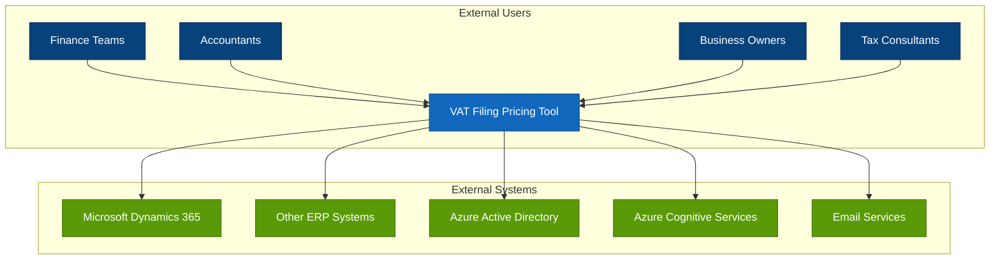
## Container Diagram
The container diagram shows the high-level technical components (containers) that make up the VAT Filing Pricing Tool system.
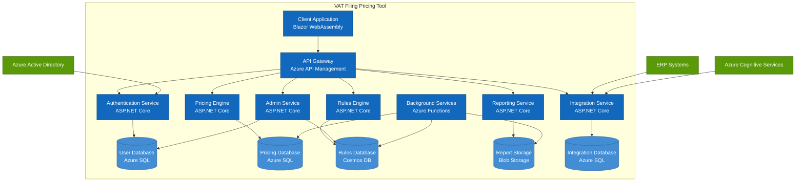
## Component Diagrams
The following component diagrams provide a more detailed view of each major subsystem within the VAT Filing Pricing Tool.
### Client Application Components
The client application is a Blazor WebAssembly single-page application (SPA) with the following components:
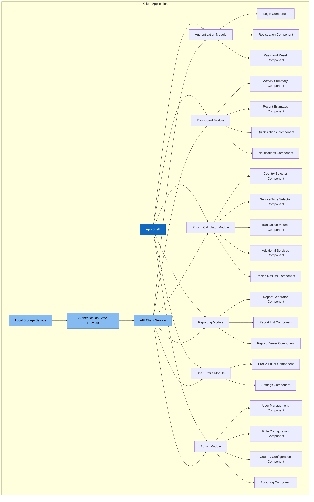
### Authentication Service Components
The Authentication Service manages user identity and access control with the following components:
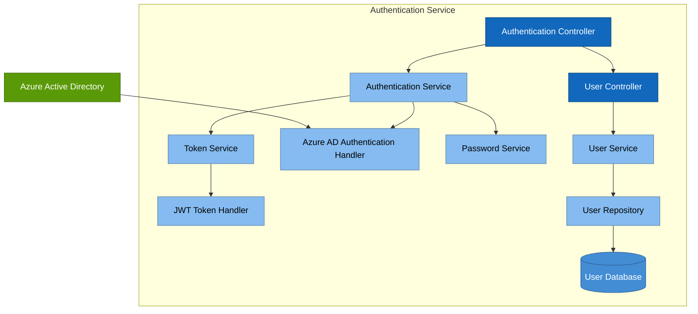
### Pricing Engine Components
The Pricing Engine calculates VAT filing costs based on multiple parameters with the following components:
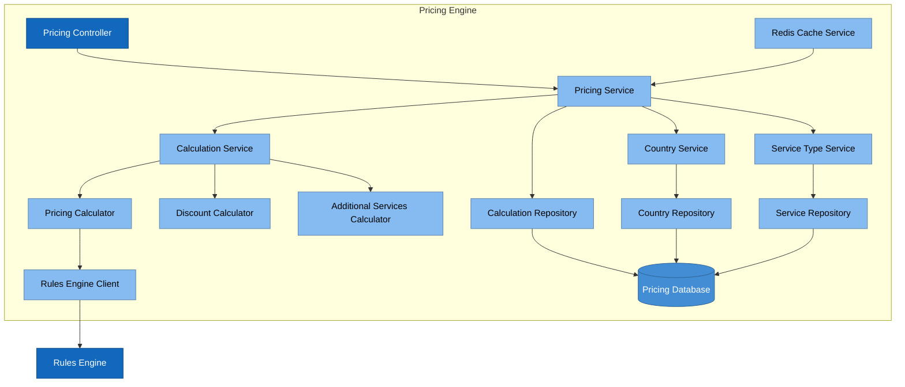
### Rules Engine Components
The Rules Engine manages and applies country-specific VAT rules with the following components:
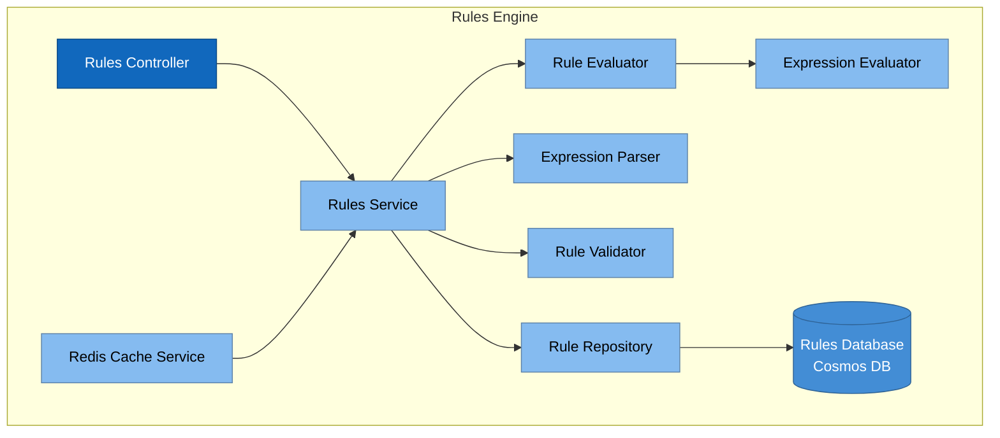
### Reporting Service Components
The Reporting Service generates and manages reports with the following components:
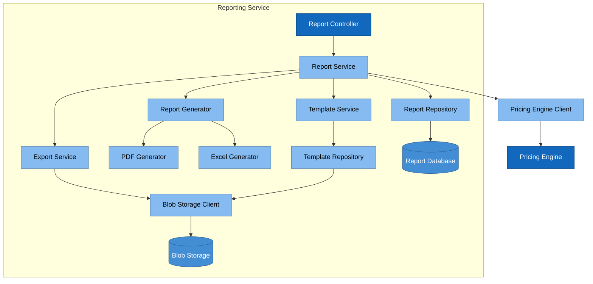
### Integration Service Components
The Integration Service facilitates data exchange with external systems with the following components:
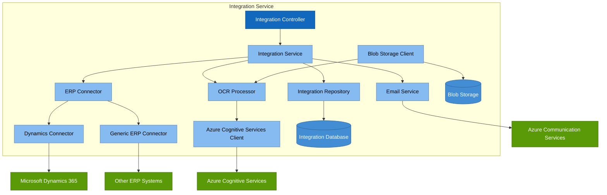
### Admin Service Components
The Admin Service provides administrative functionality with the following components:
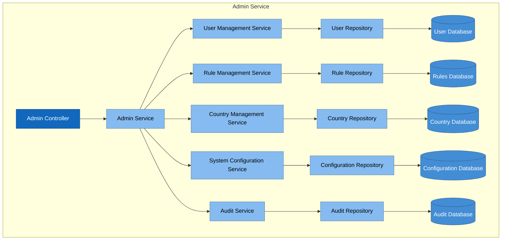
## Cross-Cutting Components
The following components are used across multiple services in the VAT Filing Pricing Tool:
### Logging and Monitoring Components
Components for logging, monitoring, and observability:
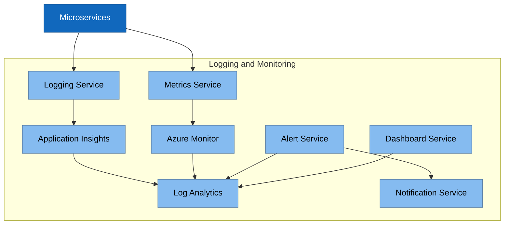
### Security Components
Components for security and data protection:
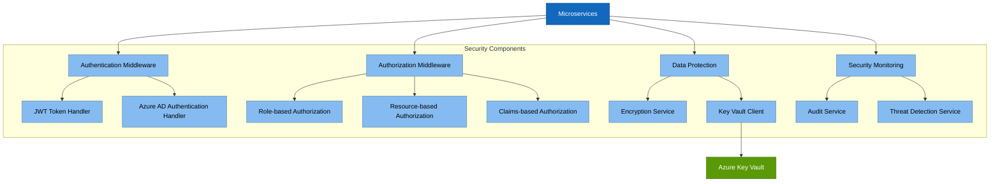
### Common Infrastructure Components
Shared infrastructure components used across services:
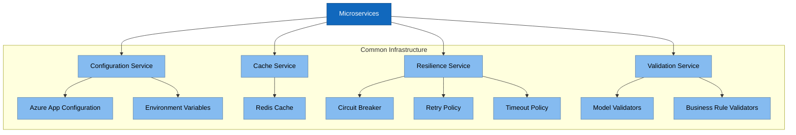
## Component Interaction Patterns
The VAT Filing Pricing Tool implements several service interaction patterns to ensure efficient communication between components:
### Request-Response Pattern
Used for synchronous operations where an immediate response is required:
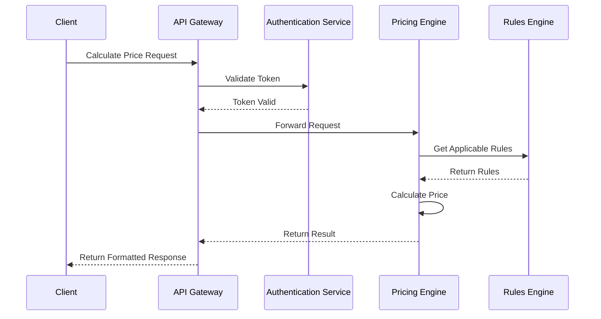
### Event-Driven Pattern
Used for asynchronous operations and notifications:
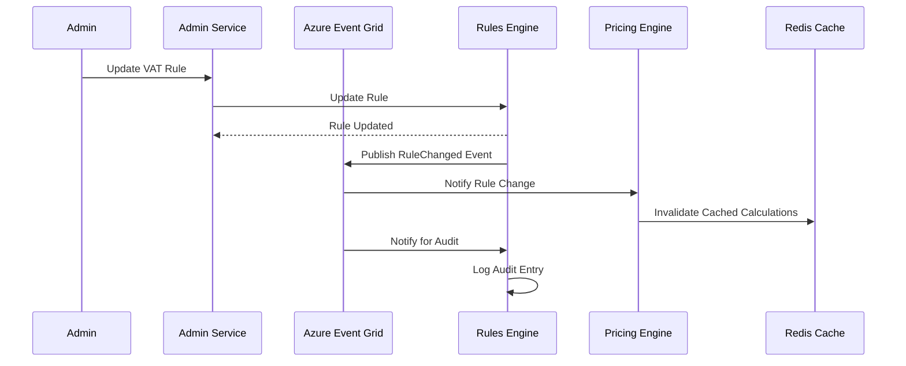
### Saga Pattern
Used for distributed transactions that span multiple services:
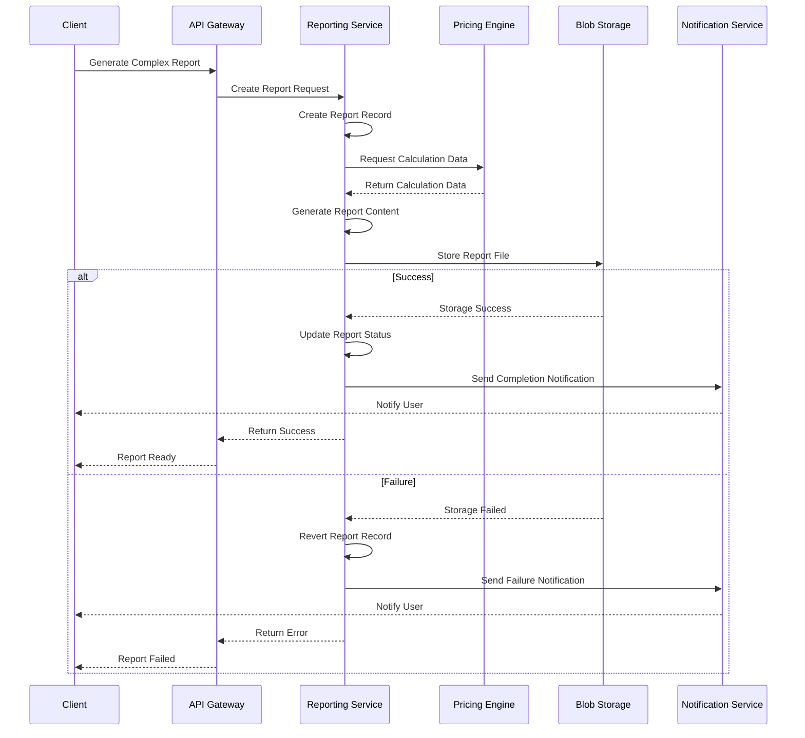
### Cache-Aside Pattern
Used for improving performance by caching frequently accessed data:
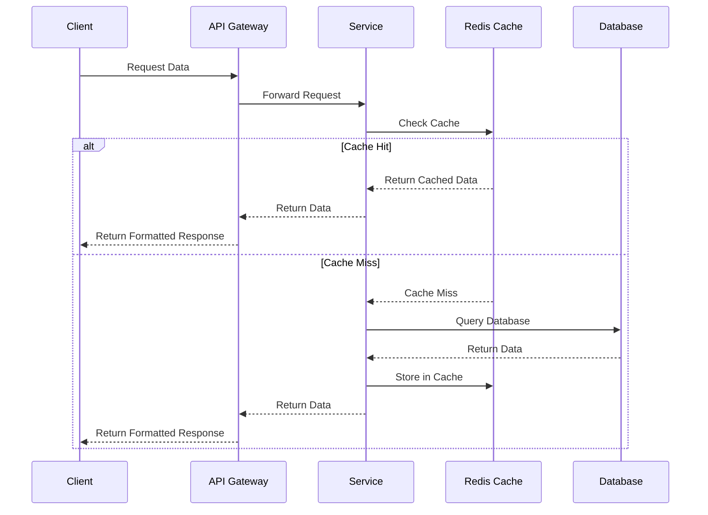
## Component Dependencies
The following diagram illustrates the dependencies between major components in the VAT Filing Pricing Tool:
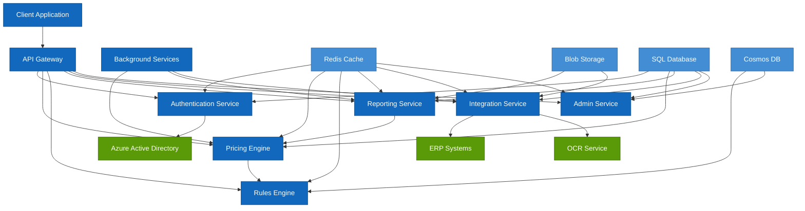
## Deployment View
The following diagram illustrates how the components are deployed on Azure infrastructure: