# VAT Filing Pricing Tool: Data Flow Diagrams

## Introduction

This document provides a comprehensive illustration of the data flows within the VAT Filing Pricing Tool, detailing how data moves between different components, services, and external systems. Understanding these data flows is essential for developers, architects, and other stakeholders to grasp how the system functions as a whole and how different parts interact.

The data flows documented here include authentication processes, pricing calculations, integration with external systems, configuration management, reporting processes, and security mechanisms. Each flow is presented with detailed diagrams and explanations to provide a clear understanding of the system's operation.

## High-Level Data Flow Overview

At a high level, data flows through the VAT Filing Pricing Tool in the following manner:

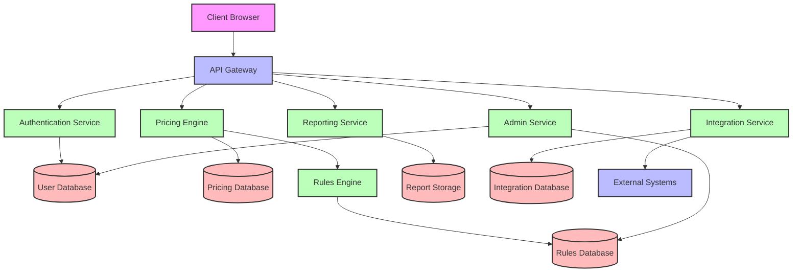
```mermaid
graph TD
    A[Client Browser] --> B[API Gateway]
    B --> C[Authentication Service]
    B --> D[Pricing Engine]
    B --> E[Reporting Service]
    B --> F[Integration Service]
    B --> G[Admin Service]
    
    C --> H[(User Database)]
    D --> I[(Pricing Database)]
    D --> J[Rules Engine]
    J --> K[(Rules Database)]
    E --> L[(Report Storage)]
    F --> M[(Integration Database)]
    F --> N[External Systems]
    G --> H
    G --> K
    
    style A fill:#f9f,stroke:#333,stroke-width:2px
    style B fill:#bbf,stroke:#333,stroke-width:2px
    style C fill:#bfb,stroke:#333,stroke-width:2px
    style D fill:#bfb,stroke:#333,stroke-width:2px
    style E fill:#bfb,stroke:#333,stroke-width:2px
    style F fill:#bfb,stroke:#333,stroke-width:2px
    style G fill:#bfb,stroke:#333,stroke-width:2px
    style H fill:#fbb,stroke:#333,stroke-width:2px
    style I fill:#fbb,stroke:#333,stroke-width:2px
    style J fill:#bfb,stroke:#333,stroke-width:2px
    style K fill:#fbb,stroke:#333,stroke-width:2px
    style L fill:#fbb,stroke:#333,stroke-width:2px
    style M fill:#fbb,stroke:#333,stroke-width:2px
    style N fill:#bbf,stroke:#333,stroke-width:2px
```

## Authentication Flow

The authentication flow describes how users authenticate with the system and how their identity is verified and maintained throughout their session.

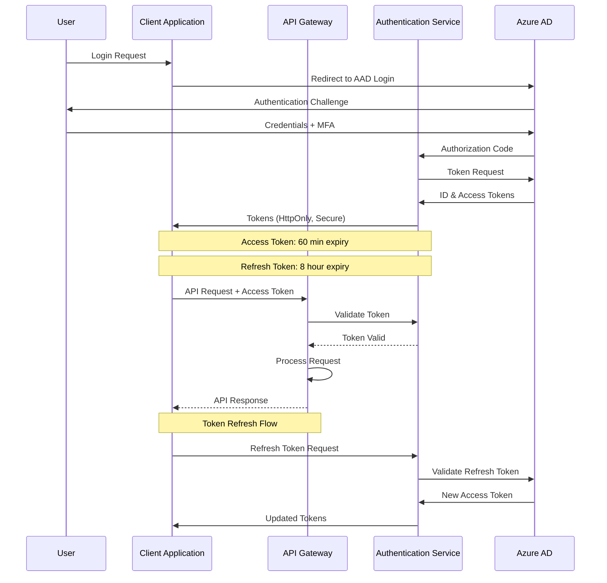
```mermaid
sequenceDiagram
    participant User
    participant Client as Client Application
    participant API as API Gateway
    participant Auth as Authentication Service
    participant AAD as Azure AD
    
    User->>Client: Login Request
    Client->>AAD: Redirect to AAD Login
    AAD->>User: Authentication Challenge
    User->>AAD: Credentials + MFA
    AAD->>Auth: Authorization Code
    Auth->>AAD: Token Request
    AAD->>Auth: ID & Access Tokens
    Auth->>Client: Tokens (HttpOnly, Secure)
    
    Note over Client,Auth: Access Token: 60 min expiry
    Note over Client,Auth: Refresh Token: 8 hour expiry
    
    Client->>API: API Request + Access Token
    API->>Auth: Validate Token
    Auth-->>API: Token Valid
    API->>API: Process Request
    API-->>Client: API Response
    
    Note over Client,API: Token Refresh Flow
    Client->>Auth: Refresh Token Request
    Auth->>AAD: Validate Refresh Token
    AAD->>Auth: New Access Token
    Auth->>Client: Updated Tokens
```

### Authentication Security Measures

The authentication flow incorporates several security measures to protect user credentials and prevent unauthorized access:

- **Multi-factor Authentication (MFA)**: Requiring something the user knows (password) and something they have (mobile device for authentication app)
- **Token-based Authentication**: Using JWT tokens with limited lifetimes
- **Secure Storage**: Tokens stored in HttpOnly, Secure cookies to prevent XSS attacks
- **Token Validation**: Tokens validated on every request
- **Role-based Authorization**: Access to resources based on user roles
- **Claims-based Authorization**: Fine-grained access control based on user claims

Tokens contain the following security features:
- Digital signature using RS256 algorithm
- Expiration time (exp) claim
- Not before (nbf) claim
- Issuer (iss) claim
- Audience (aud) claim
- Subject (sub) claim for user identity

### Session Management

User sessions are managed through the authentication tokens:

- Access tokens have a 60-minute lifetime
- Refresh tokens have an 8-hour lifetime
- Idle session timeout after 30 minutes
- Maximum session duration of 8 hours
- Concurrent session limitation (maximum 3 active sessions)
- Session revocation capability for security incidents

## Pricing Calculation Flow

The pricing calculation flow illustrates how user inputs are processed to generate VAT filing cost estimates.

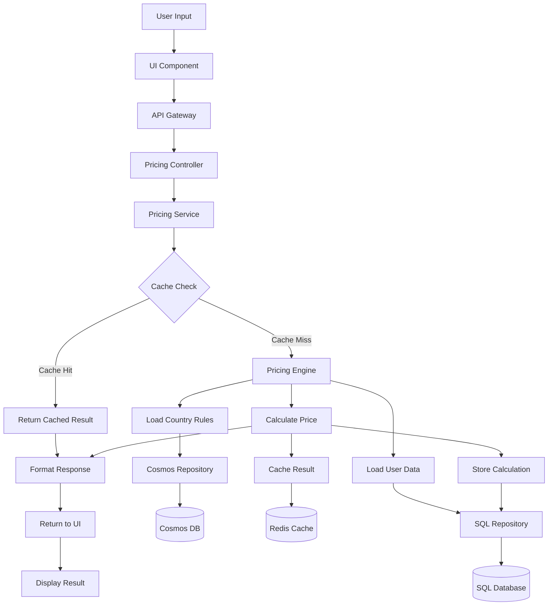
```mermaid
graph TD
    A[User Input] --> B[UI Component]
    B --> C[API Gateway]
    C --> D[Pricing Controller]
    D --> E[Pricing Service]
    
    E --> F{Cache Check}
    F -->|Cache Hit| G[Return Cached Result]
    F -->|Cache Miss| H[Pricing Engine]
    
    H --> I[Load User Data]
    I --> J[SQL Repository]
    J --> K[(SQL Database)]
    
    H --> L[Load Country Rules]
    L --> M[Cosmos Repository]
    M --> N[(Cosmos DB)]
    
    H --> O[Calculate Price]
    O --> P[Store Calculation]
    P --> J
    
    O --> Q[Cache Result]
    Q --> R[(Redis Cache)]
    
    G --> S[Format Response]
    O --> S
    S --> T[Return to UI]
    T --> U[Display Result]
```

### Multi-Country Calculation

For calculations involving multiple countries, the system processes each country separately and then aggregates the results:

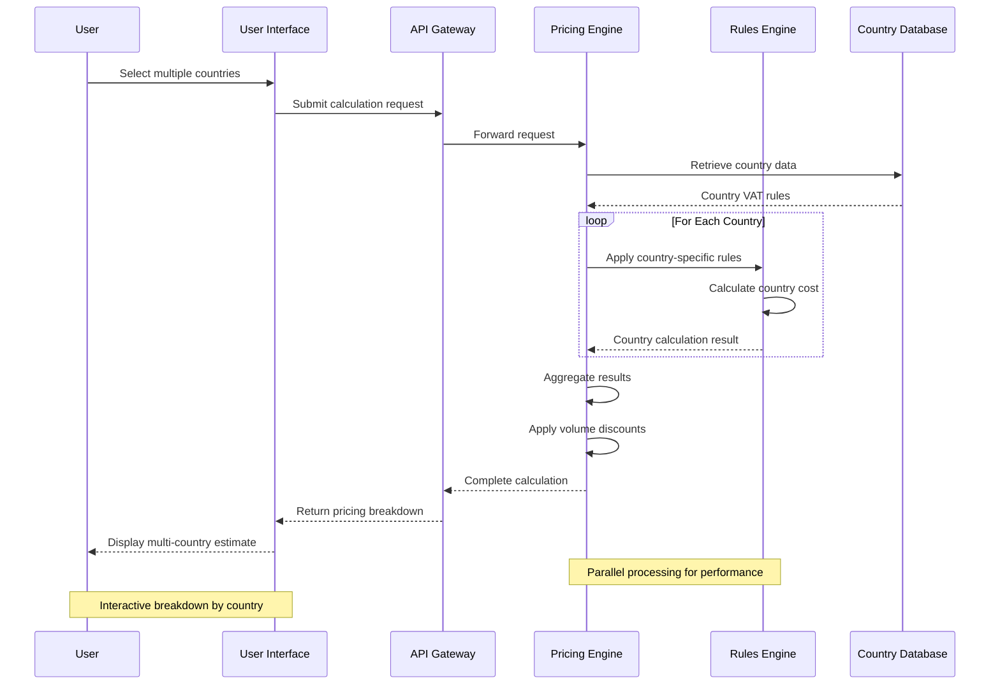
```mermaid
sequenceDiagram
    participant User
    participant UI as User Interface
    participant API as API Gateway
    participant Pricing as Pricing Engine
    participant Rules as Rules Engine
    participant DB as Country Database
    
    User->>UI: Select multiple countries
    UI->>API: Submit calculation request
    API->>Pricing: Forward request
    
    Pricing->>DB: Retrieve country data
    DB-->>Pricing: Country VAT rules
    
    loop For Each Country
        Pricing->>Rules: Apply country-specific rules
        Rules->>Rules: Calculate country cost
        Rules-->>Pricing: Country calculation result
    end
    
    Pricing->>Pricing: Aggregate results
    Pricing->>Pricing: Apply volume discounts
    
    Pricing-->>API: Complete calculation
    API-->>UI: Return pricing breakdown
    UI-->>User: Display multi-country estimate
    
    Note over Pricing,Rules: Parallel processing for performance
    Note over UI,User: Interactive breakdown by country
```

### Calculation Data Security

The calculation process incorporates several security measures:

- **Input Validation**: All user inputs are validated to prevent injection attacks
- **Parameter Sanitization**: Input parameters are sanitized before processing
- **Authorization Check**: Users can only access calculations they are authorized to view
- **Data Encryption**: Sensitive calculation data is encrypted at rest
- **Audit Logging**: All calculation requests are logged for audit purposes

## Integration Data Flow

The integration data flow illustrates how the system exchanges data with external systems such as ERP systems and document processing services.

### ERP Integration Flow

The ERP integration flow shows how the system exchanges data with Microsoft Dynamics 365 and other ERP systems:

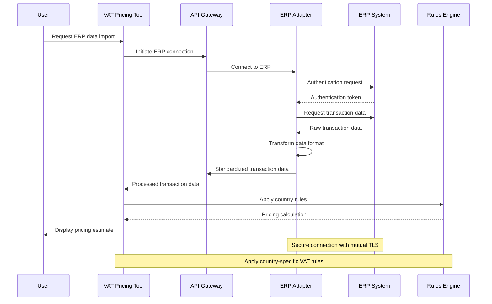
```mermaid
sequenceDiagram
    participant User
    participant VAT as VAT Pricing Tool
    participant Gateway as API Gateway
    participant Adapter as ERP Adapter
    participant ERP as ERP System
    participant Rules as Rules Engine
    
    User->>VAT: Request ERP data import
    VAT->>Gateway: Initiate ERP connection
    Gateway->>Adapter: Connect to ERP
    
    Adapter->>ERP: Authentication request
    ERP-->>Adapter: Authentication token
    
    Adapter->>ERP: Request transaction data
    ERP-->>Adapter: Raw transaction data
    
    Adapter->>Adapter: Transform data format
    Adapter->>Gateway: Standardized transaction data
    Gateway->>VAT: Processed transaction data
    
    VAT->>Rules: Apply country rules
    Rules-->>VAT: Pricing calculation
    
    VAT-->>User: Display pricing estimate
    
    Note over Adapter,ERP: Secure connection with mutual TLS
    Note over VAT,Rules: Apply country-specific VAT rules
```

### OCR Document Processing Flow

The OCR document processing flow shows how the system processes documents using Azure Cognitive Services:

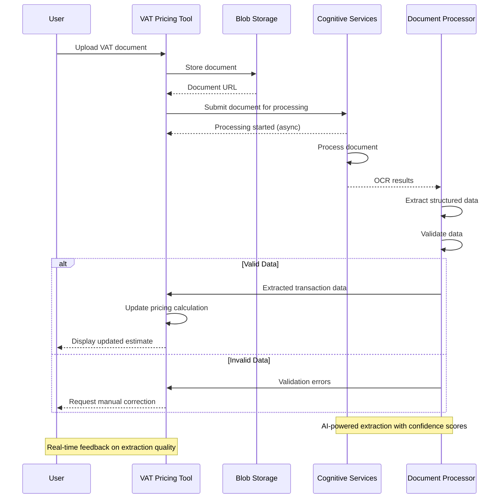
```mermaid
sequenceDiagram
    participant User
    participant VAT as VAT Pricing Tool
    participant Storage as Blob Storage
    participant OCR as Cognitive Services
    participant Processor as Document Processor
    
    User->>VAT: Upload VAT document
    VAT->>Storage: Store document
    Storage-->>VAT: Document URL
    
    VAT->>OCR: Submit document for processing
    OCR-->>VAT: Processing started (async)
    
    OCR->>OCR: Process document
    OCR-->>Processor: OCR results
    
    Processor->>Processor: Extract structured data
    Processor->>Processor: Validate data
    
    alt Valid Data
        Processor->>VAT: Extracted transaction data
        VAT->>VAT: Update pricing calculation
        VAT-->>User: Display updated estimate
    else Invalid Data
        Processor->>VAT: Validation errors
        VAT-->>User: Request manual correction
    end
    
    Note over OCR,Processor: AI-powered extraction with confidence scores
    Note over VAT,User: Real-time feedback on extraction quality
```

### Integration Security Measures

The integration flows incorporate several security measures:

- **API Security**: API keys, OAuth 2.0 authentication for external systems
- **Transport Security**: TLS 1.2+ for all external communications
- **Credential Management**: Secure storage of integration credentials in Azure Key Vault
- **Data Validation**: Thorough validation of imported data
- **Circuit Breaker**: Prevent cascading failures from integration issues
- **Rate Limiting**: Protection against excessive requests
- **IP Restrictions**: Restrict access to known IP addresses where applicable

## Configuration Flow

The configuration flow illustrates how system configurations, including country-specific rules and pricing models, are managed and propagated through the system.

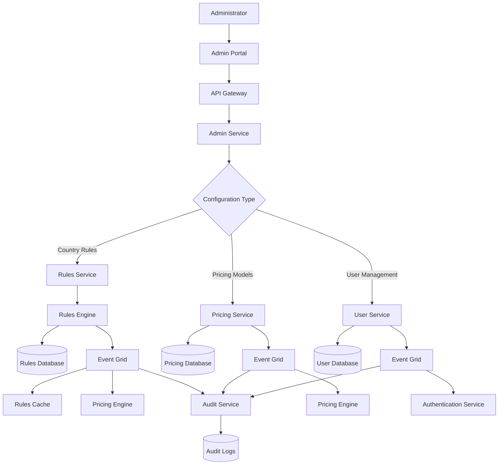
```mermaid
graph TD
    A[Administrator] --> B[Admin Portal]
    B --> C[API Gateway]
    C --> D[Admin Service]
    
    D --> E{Configuration Type}
    
    E -->|Country Rules| F[Rules Service]
    F --> G[Rules Engine]
    G --> H[(Rules Database)]
    G --> I[Event Grid]
    I --> J[Rules Cache]
    I --> K[Pricing Engine]
    I --> L[Audit Service]
    L --> M[(Audit Logs)]
    
    E -->|Pricing Models| N[Pricing Service]
    N --> O[(Pricing Database)]
    N --> P[Event Grid]
    P --> Q[Pricing Engine]
    P --> L
    
    E -->|User Management| R[User Service]
    R --> S[(User Database)]
    R --> T[Event Grid]
    T --> U[Authentication Service]
    T --> L
```

### Rule Update Sequence

When a country-specific rule is updated, the following sequence occurs:

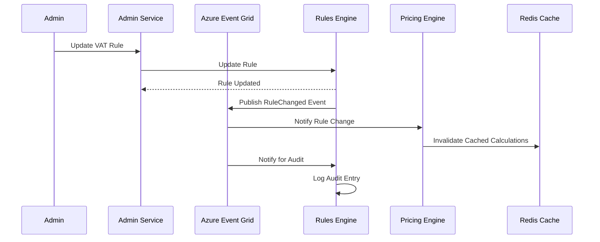
```mermaid
sequenceDiagram
    participant Admin
    participant AdminSvc as Admin Service
    participant EventGrid as Azure Event Grid
    participant Rules as Rules Engine
    participant Pricing as Pricing Engine
    participant Cache as Redis Cache
    
    Admin->>AdminSvc: Update VAT Rule
    AdminSvc->>Rules: Update Rule
    Rules-->>AdminSvc: Rule Updated
    
    Rules->>EventGrid: Publish RuleChanged Event
    
    EventGrid->>Pricing: Notify Rule Change
    Pricing->>Cache: Invalidate Cached Calculations
    
    EventGrid->>Rules: Notify for Audit
    Rules->>Rules: Log Audit Entry
```

### Configuration Security Measures

The configuration management process incorporates several security measures:

- **Role-based Access Control**: Only authorized administrators can modify configurations
- **Approval Workflows**: Critical configuration changes require approval
- **Validation Rules**: Configuration changes are validated before being applied
- **Version Control**: Configuration history is maintained
- **Audit Logging**: All configuration changes are logged for audit purposes
- **Secure Storage**: Configuration data is encrypted at rest
- **Change Notification**: Affected components are notified of configuration changes

## Reporting Flow

The reporting flow illustrates how reports are generated, stored, and delivered to users.

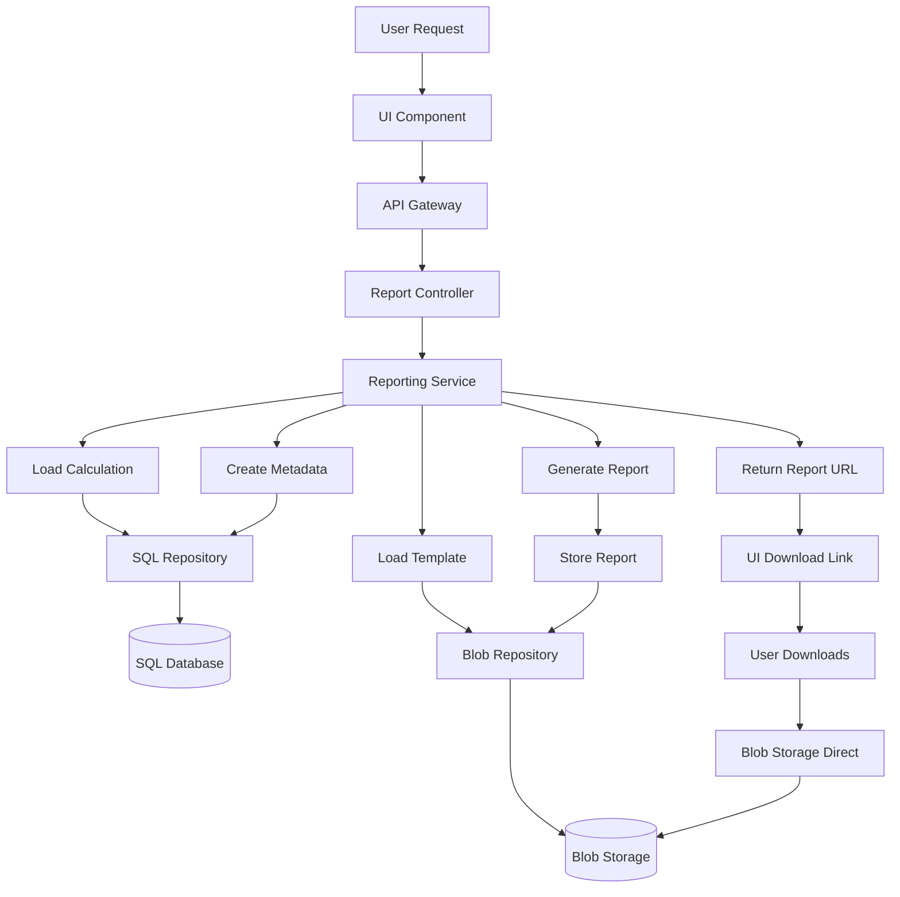
```mermaid
graph TD
    A[User Request] --> B[UI Component]
    B --> C[API Gateway]
    C --> D[Report Controller]
    D --> E[Reporting Service]
    
    E --> F[Load Calculation]
    F --> G[SQL Repository]
    G --> H[(SQL Database)]
    
    E --> I[Load Template]
    I --> J[Blob Repository]
    J --> K[(Blob Storage)]
    
    E --> L[Generate Report]
    L --> M[Store Report]
    M --> J
    
    E --> N[Create Metadata]
    N --> G
    
    E --> O[Return Report URL]
    O --> P[UI Download Link]
    P --> Q[User Downloads]
    Q --> R[Blob Storage Direct]
    R --> K
```

### Report Generation Sequence

The detailed sequence for generating a complex report:

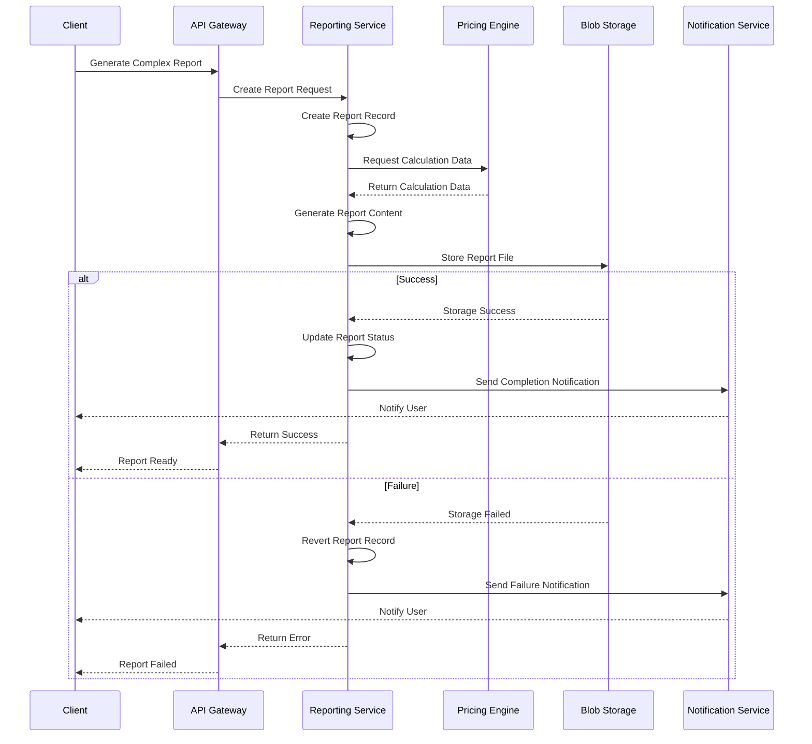
```mermaid
sequenceDiagram
    participant Client
    participant API as API Gateway
    participant Report as Reporting Service
    participant Pricing as Pricing Engine
    participant Storage as Blob Storage
    participant Notify as Notification Service
    
    Client->>API: Generate Complex Report
    API->>Report: Create Report Request
    Report->>Report: Create Report Record
    
    Report->>Pricing: Request Calculation Data
    Pricing-->>Report: Return Calculation Data
    
    Report->>Report: Generate Report Content
    Report->>Storage: Store Report File
    
    alt Success
        Storage-->>Report: Storage Success
        Report->>Report: Update Report Status
        Report->>Notify: Send Completion Notification
        Notify-->>Client: Notify User
        Report-->>API: Return Success
        API-->>Client: Report Ready
    else Failure
        Storage-->>Report: Storage Failed
        Report->>Report: Revert Report Record
        Report->>Notify: Send Failure Notification
        Notify-->>Client: Notify User
        Report-->>API: Return Error
        API-->>Client: Report Failed
    end
```

### Reporting Security Measures

The reporting process incorporates several security measures:

- **Authorization**: Users can only access reports they are authorized to view
- **Secure Storage**: Reports are stored securely in Azure Blob Storage
- **Secure Delivery**: Reports are delivered via HTTPS with authenticated access
- **Limited Lifetime**: Report download links have a limited lifetime
- **Content Security**: Reports are scanned for malicious content before delivery
- **Audit Logging**: All report generation and access is logged for audit purposes
- **Data Protection**: Reports containing sensitive data have additional protection measures

## Secure Data Flow

This section details the security measures applied to data as it flows through the system, ensuring confidentiality, integrity, and availability of sensitive information.

### Data Protection in Transit

All data flowing between components is protected in transit using the following measures:

- **TLS 1.2+**: All HTTP communication uses TLS 1.2 or higher
- **Certificate Validation**: Strict certificate validation for all TLS connections
- **Modern Cipher Suites**: Only strong cipher suites are allowed
- **Perfect Forward Secrecy**: Ensures past communications cannot be decrypted if a key is compromised
- **HTTP Strict Transport Security (HSTS)**: Forces secure connections
- **API Gateway Protection**: Additional layer of protection at the API gateway

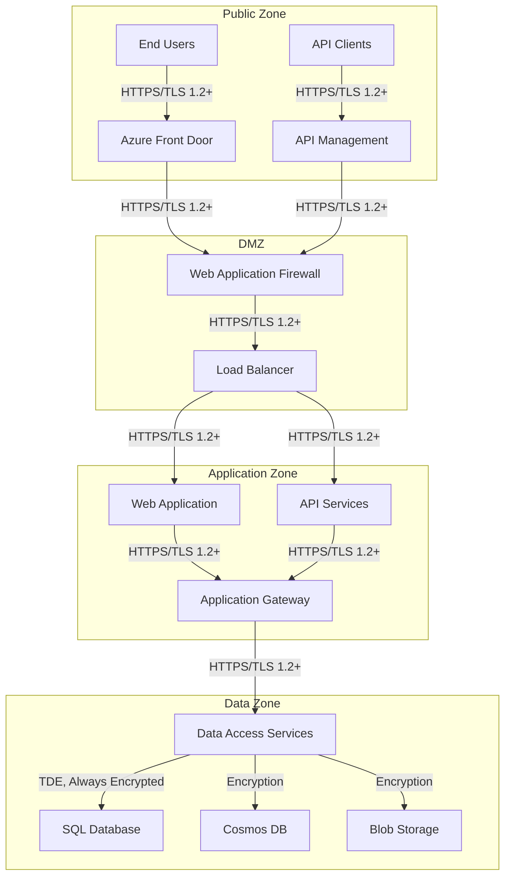
```mermaid
graph TD
    subgraph "Public Zone"
        A[End Users] -->|HTTPS/TLS 1.2+| B[Azure Front Door]
        C[API Clients] -->|HTTPS/TLS 1.2+| D[API Management]
    end
    
    subgraph "DMZ"
        B -->|HTTPS/TLS 1.2+| E[Web Application Firewall]
        D -->|HTTPS/TLS 1.2+| E
        E -->|HTTPS/TLS 1.2+| F[Load Balancer]
    end
    
    subgraph "Application Zone"
        F -->|HTTPS/TLS 1.2+| G[Web Application]
        F -->|HTTPS/TLS 1.2+| H[API Services]
        G -->|HTTPS/TLS 1.2+| I[Application Gateway]
        H -->|HTTPS/TLS 1.2+| I
    end
    
    subgraph "Data Zone"
        I -->|HTTPS/TLS 1.2+| J[Data Access Services]
        J -->|TDE, Always Encrypted| K[SQL Database]
        J -->|Encryption| L[Cosmos DB]
        J -->|Encryption| M[Blob Storage]
    end
```

### Data Protection at Rest

All data stored in the system is protected at rest using the following measures:

- **Transparent Data Encryption (TDE)**: For Azure SQL Database
- **Storage Service Encryption**: For Azure Blob Storage and Cosmos DB
- **Column-level Encryption**: For sensitive fields in SQL Database
- **Key Management**: Azure Key Vault for encryption key management
- **Customer-Managed Keys**: Option for customer-managed encryption keys
- **Key Rotation**: Regular rotation of encryption keys

### Data Classification and Protection Flow

Data is classified according to sensitivity and protected accordingly:

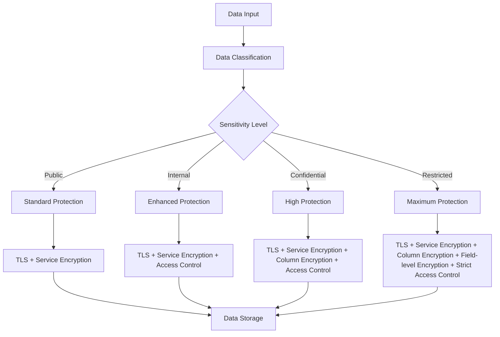
```mermaid
graph TD
    A[Data Input] --> B[Data Classification]
    B --> C{Sensitivity Level}
    
    C -->|Public| D[Standard Protection]
    D --> E[TLS + Service Encryption]
    
    C -->|Internal| F[Enhanced Protection]
    F --> G[TLS + Service Encryption + Access Control]
    
    C -->|Confidential| H[High Protection]
    H --> I[TLS + Service Encryption + Column Encryption + Access Control]
    
    C -->|Restricted| J[Maximum Protection]
    J --> K[TLS + Service Encryption + Column Encryption + Field-level Encryption + Strict Access Control]
    
    E --> L[Data Storage]
    G --> L
    I --> L
    K --> L
```

### Key Management Flow

Encryption keys are managed securely through Azure Key Vault:

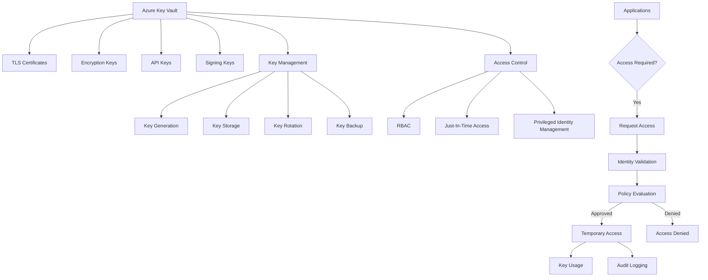
```mermaid
graph TD
    A[Azure Key Vault] --> B[TLS Certificates]
    A --> C[Encryption Keys]
    A --> D[API Keys]
    A --> E[Signing Keys]
    
    F[Key Management] --> G[Key Generation]
    F --> H[Key Storage]
    F --> I[Key Rotation]
    F --> J[Key Backup]
    
    K[Access Control] --> L[RBAC]
    K --> M[Just-In-Time Access]
    K --> N[Privileged Identity Management]
    
    A --> F
    A --> K
    
    O[Applications] --> P{Access Required?}
    P -->|Yes| Q[Request Access]
    Q --> R[Identity Validation]
    R --> S[Policy Evaluation]
    S -->|Approved| T[Temporary Access]
    S -->|Denied| U[Access Denied]
    T --> V[Key Usage]
    T --> W[Audit Logging]
```

## Component Interaction Patterns

The VAT Filing Pricing Tool implements several service interaction patterns to ensure efficient communication between components. This section provides a self-contained explanation of these patterns without relying on external documentation.

### Request-Response Pattern

Used for synchronous operations where an immediate response is required:

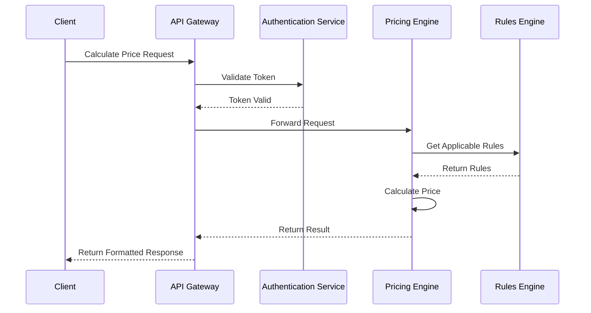
```mermaid
sequenceDiagram
    participant Client
    participant API as API Gateway
    participant Auth as Authentication Service
    participant Pricing as Pricing Engine
    participant Rules as Rules Engine
    
    Client->>API: Calculate Price Request
    API->>Auth: Validate Token
    Auth-->>API: Token Valid
    
    API->>Pricing: Forward Request
    Pricing->>Rules: Get Applicable Rules
    Rules-->>Pricing: Return Rules
    
    Pricing->>Pricing: Calculate Price
    Pricing-->>API: Return Result
    API-->>Client: Return Formatted Response
```

### Event-Driven Pattern

Used for asynchronous operations and notifications:

```mermaid
sequenceDiagram
    participant Admin
    participant AdminSvc as Admin Service
    participant EventGrid as Azure Event Grid
    participant Rules as Rules Engine
    participant Pricing as Pricing Engine
    participant Cache as Redis Cache
    
    Admin->>AdminSvc: Update VAT Rule
    AdminSvc->>Rules: Update Rule
    Rules-->>AdminSvc: Rule Updated
    
    Rules->>EventGrid: Publish RuleChanged Event
    
    EventGrid->>Pricing: Notify Rule Change
    Pricing->>Cache: Invalidate Cached Calculations
    
    EventGrid->>Rules: Notify for Audit
    Rules->>Rules: Log Audit Entry
```

### Saga Pattern

Used for distributed transactions that span multiple services:

```mermaid
sequenceDiagram
    participant Client
    participant API as API Gateway
    participant Report as Reporting Service
    participant Pricing as Pricing Engine
    participant Storage as Blob Storage
    participant Notify as Notification Service
    
    Client->>API: Generate Complex Report
    API->>Report: Create Report Request
    Report->>Report: Create Report Record
    
    Report->>Pricing: Request Calculation Data
    Pricing-->>Report: Return Calculation Data
    
    Report->>Report: Generate Report Content
    Report->>Storage: Store Report File
    
    alt Success
        Storage-->>Report: Storage Success
        Report->>Report: Update Report Status
        Report->>Notify: Send Completion Notification
        Notify-->>Client: Notify User
        Report-->>API: Return Success
        API-->>Client: Report Ready
    else Failure
        Storage-->>Report: Storage Failed
        Report->>Report: Revert Report Record
        Report->>Notify: Send Failure Notification
        Notify-->>Client: Notify User
        Report-->>API: Return Error
        API-->>Client: Report Failed
    end
```

### Cache-Aside Pattern

Used for improving performance by caching frequently accessed data:

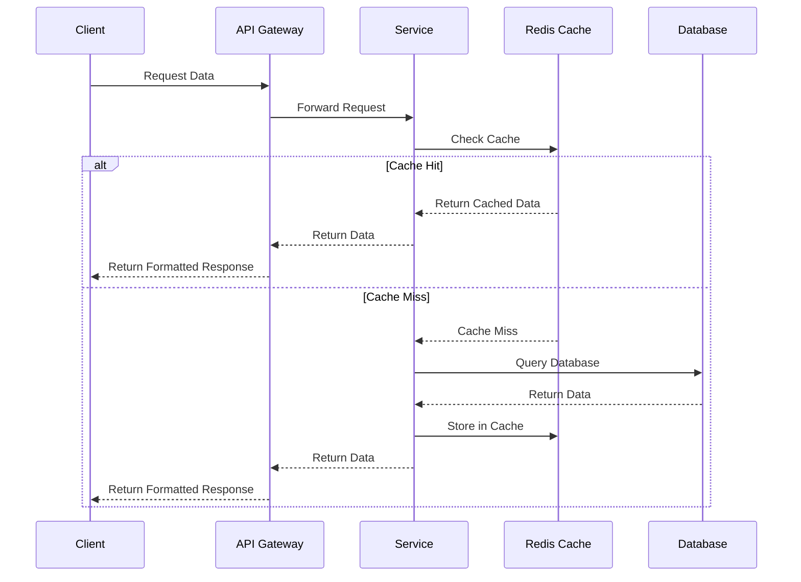
```mermaid
sequenceDiagram
    participant Client
    participant API as API Gateway
    participant Service as Service
    participant Cache as Redis Cache
    participant DB as Database
    
    Client->>API: Request Data
    API->>Service: Forward Request
    Service->>Cache: Check Cache
    
    alt Cache Hit
        Cache-->>Service: Return Cached Data
        Service-->>API: Return Data
        API-->>Client: Return Formatted Response
    else Cache Miss
        Cache-->>Service: Cache Miss
        Service->>DB: Query Database
        DB-->>Service: Return Data
        Service->>Cache: Store in Cache
        Service-->>API: Return Data
        API-->>Client: Return Formatted Response
    end
```