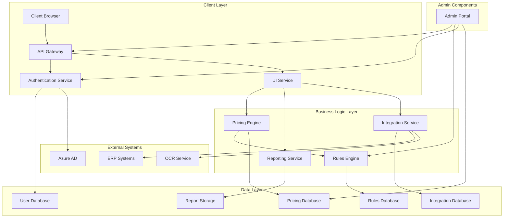

# System Architecture Overview

This document provides a comprehensive overview of the VAT Filing Pricing Tool system architecture. It describes the high-level architecture, key components, design principles, and technology choices that form the foundation of the system.

The VAT Filing Pricing Tool is a cloud-based application designed to provide businesses with accurate cost estimates for VAT filing services across multiple jurisdictions. The system addresses the complex challenge of determining VAT filing costs based on various factors including business size, transaction volume, filing frequency, and country-specific tax regulations.

## Introduction

### Purpose
The purpose of this document is to provide stakeholders with a clear understanding of the system architecture, including:

- High-level architectural overview
- Key components and their responsibilities
- Design principles and patterns
- Technology stack and infrastructure
- Integration points with external systems
- Security architecture
- Deployment architecture

### Audience
This document is intended for:

- Software architects and developers working on the system
- DevOps engineers responsible for deployment and operations
- Project managers and business stakeholders
- Security and compliance teams
- Third-party integrators

### Scope
This document covers the overall system architecture of the VAT Filing Pricing Tool. Detailed information about specific components, data flows, security measures, and API specifications can be found in the referenced documents.

## Architectural Overview
The VAT Filing Pricing Tool employs a cloud-based microservices architecture hosted on Microsoft Azure. This architecture was selected to enable scalability, maintainability, and security while providing a robust platform for VAT filing cost estimation services.

### Architectural Principles
The architecture is guided by the following principles:

- **Separation of concerns**: Each microservice handles a specific business capability
- **API-first design**: All services expose well-defined APIs
- **Cloud-native**: Leverages cloud services for scalability and resilience
- **Security by design**: Multiple security layers protect sensitive data
- **Scalability**: Components can scale independently based on demand
- **Observability**: Comprehensive monitoring and logging
- **DevOps-friendly**: Supports CI/CD and infrastructure as code

### High-Level Architecture Diagram
The following diagram illustrates the high-level architecture of the VAT Filing Pricing Tool:

### Key Architectural Characteristics
The architecture exhibits the following key characteristics:

- **Microservices-based**: Decomposed into independent, loosely-coupled services
- **Cloud-native**: Built for and optimized for cloud deployment
- **API-driven**: All functionality exposed through well-defined APIs
- **Containerized**: Services packaged as containers for consistency and portability
- **Resilient**: Designed to handle failures gracefully
- **Secure**: Multiple security layers protect sensitive data
- **Observable**: Comprehensive monitoring and logging
- **Scalable**: Can scale horizontally to handle increased load

## Core Components
The VAT Filing Pricing Tool consists of several core components, each responsible for specific functionality within the system.

### Client Application
The client application is a Blazor WebAssembly single-page application (SPA) that provides the user interface for the VAT Filing Pricing Tool. Key features include:

- Responsive design for desktop and mobile devices
- Interactive pricing calculator
- Detailed cost breakdowns and visualizations
- Report generation and export
- User profile management
- Administrative interface for authorized users

The client application communicates with backend services through the API Gateway using RESTful APIs.

### API Gateway
The API Gateway serves as the entry point for all client requests to the backend services. It provides:

- Request routing to appropriate microservices
- Authentication and authorization
- Rate limiting and throttling
- Request/response transformation
- API documentation (Swagger/OpenAPI)
- Monitoring and logging

The API Gateway is implemented using Azure API Management, which provides a comprehensive set of API management capabilities.

### Authentication Service
The Authentication Service manages user identity and access control. It integrates with Azure Active Directory for enterprise-grade authentication and provides:

- User authentication and authorization
- Token generation and validation
- Role-based access control
- Multi-factor authentication
- Single sign-on capabilities
- User profile management

For more details, see the [Security Architecture](security-architecture.md) document.

### Pricing Engine
The Pricing Engine is the core calculation component of the system. It calculates VAT filing costs based on multiple parameters including:

- Transaction volume
- Countries/jurisdictions
- Service type
- Filing frequency
- Additional services

The Pricing Engine applies complex calculation logic, including:

- Base price determination
- Volume-based scaling
- Country-specific rule application
- Additional service costs
- Discount application

It interacts with the Rules Engine to apply country-specific VAT rules to calculations.

### Rules Engine
The Rules Engine manages and applies country-specific VAT rules to pricing calculations. It provides:

- Rule storage and retrieval
- Rule evaluation and application
- Rule versioning with effective dates
- Expression parsing and evaluation
- Rule consistency validation

Rules are stored in a flexible document database (Cosmos DB) to accommodate varying rule structures across different countries.

### Reporting Service
The Reporting Service generates detailed reports on VAT filing costs. It provides:

- Report template management
- Report generation in multiple formats (PDF, Excel)
- Report storage and retrieval
- Scheduled report generation
- Report customization

Reports are stored in Azure Blob Storage and can be downloaded or emailed to users.

### Integration Service
The Integration Service facilitates data exchange with external systems. It provides:

- ERP system integration (Microsoft Dynamics 365)
- OCR document processing (Azure Cognitive Services)
- Data transformation and mapping
- Error handling and retry logic
- Integration monitoring and logging

The Integration Service uses adapters for different external systems, providing a consistent interface for the rest of the application.

### Admin Portal
The Admin Portal provides administrative functionality for authorized users. It allows:

- User management
- Pricing rule configuration
- Country configuration
- System settings management
- Audit log viewing

The Admin Portal is integrated into the main client application but with restricted access based on user roles.

## Data Architecture
The VAT Filing Pricing Tool uses multiple data stores optimized for different data types and access patterns.

### Data Stores
The system uses the following data stores:

- **Azure SQL Database**: Primary relational database for structured data
  - User profiles
  - Calculation records
  - Country information
  - Service definitions
  - Report metadata

- **Azure Cosmos DB**: Document database for flexible, schema-less data
  - Country-specific VAT rules
  - Configuration settings
  - Audit logs

- **Azure Redis Cache**: In-memory cache for frequently accessed data
  - Calculation results
  - Reference data
  - User sessions

- **Azure Blob Storage**: Object storage for large binary data
  - Generated reports (PDF, Excel)
  - Uploaded documents
  - Report templates

### Data Models
The core data models in the system include:

- **User**: System user with authentication details
- **Country**: VAT jurisdiction with specific rules
- **Service**: VAT filing service type
- **Calculation**: Record of a pricing calculation
- **Rule**: Country-specific VAT rule
- **Report**: Generated report document
- **Integration**: External system connection

For detailed entity relationships, see the Data Flow Diagram document.

### Data Flow
Data flows through the system in a structured manner:

1. **User Authentication Flow**: Client requests are authenticated through the Authentication Service
2. **Pricing Calculation Flow**: User inputs flow to the Pricing Engine, which consults the Rules Engine
3. **Integration Data Flow**: The Integration Service facilitates bidirectional data exchange with external systems
4. **Configuration Flow**: Administrative changes flow from the Admin Portal to respective services
5. **Reporting Flow**: Report generation requests flow from the Client Application to the Reporting Service

For detailed data flows, see the [Data Flow Diagram](data-flow-diagram.md) document.

### Data Protection
The system implements multiple layers of data protection:

- **Encryption at rest**: All data stores use encryption at rest
- **Encryption in transit**: All communication uses TLS 1.2+
- **Column-level encryption**: Sensitive fields use additional encryption
- **Key management**: Azure Key Vault manages encryption keys
- **Access control**: Fine-grained access control at the data level

For more details, see the [Security Architecture](security-architecture.md) document.

## Technology Stack
The VAT Filing Pricing Tool is built using modern technologies optimized for cloud deployment.

### Frontend Technologies
- **Framework**: Blazor WebAssembly
- **Languages**: C#, HTML, CSS, JavaScript
- **UI Components**: Blazor UI Kit / Material UI
- **State Management**: Built-in Blazor state management
- **API Communication**: HttpClient with JSON serialization
- **Authentication**: Microsoft Authentication Library (MSAL)

### Backend Technologies
- **Framework**: ASP.NET Core 6.0+
- **Language**: C# 10.0
- **API**: RESTful APIs with ASP.NET Core Web API
- **ORM**: Entity Framework Core 6.0+
- **Authentication**: Microsoft Identity with JWT
- **Validation**: FluentValidation
- **Documentation**: Swagger/OpenAPI

### Data Technologies
- **Relational Database**: Azure SQL Database
- **Document Database**: Azure Cosmos DB
- **Caching**: Azure Redis Cache
- **Object Storage**: Azure Blob Storage
- **Search**: Azure Cognitive Search (optional)
- **Analytics**: Azure Synapse Analytics (optional)

### Cloud Infrastructure
- **Cloud Provider**: Microsoft Azure
- **Compute**: Azure App Service, Azure Kubernetes Service
- **Networking**: Azure Virtual Network, Azure Front Door
- **API Management**: Azure API Management
- **Identity**: Azure Active Directory
- **Monitoring**: Azure Monitor, Application Insights
- **DevOps**: Azure DevOps, GitHub Actions

### Integration Technologies
- **ERP Integration**: Microsoft Dynamics 365 API
- **OCR Processing**: Azure Cognitive Services (Form Recognizer)
- **Email Notifications**: Azure Communication Services
- **PDF Generation**: PDFsharp
- **Excel Generation**: EPPlus

## Security Architecture
The VAT Filing Pricing Tool implements a comprehensive security architecture to protect sensitive financial and business data.

### Authentication and Identity
The system uses Azure Active Directory (AAD) as the primary authentication provider:

- **User Authentication**: AAD with multi-factor authentication
- **API Authentication**: JWT tokens with short lifetimes
- **Service-to-Service**: Managed identities and service principals
- **External System Authentication**: Securely stored credentials in Azure Key Vault

For more details, see the [Security Architecture](security-architecture.md) document.

### Authorization
The system implements a layered authorization approach:

- **Role-Based Access Control**: Predefined roles with specific permissions
- **Claims-Based Authorization**: Fine-grained access control based on user claims
- **Resource-Based Authorization**: Access control based on resource ownership
- **Policy Enforcement**: Authorization policies enforced at multiple levels

For more details, see the [Security Architecture](security-architecture.md) document.

### Network Security
The system implements multiple network security layers:

- **Azure Front Door**: Global edge protection with WAF
- **Virtual Network**: Isolated network environment
- **Network Security Groups**: Granular traffic control
- **Private Endpoints**: Private connections to PaaS services
- **Service Endpoints**: Secured access to Azure services

### Data Protection
The system protects data at multiple levels:

- **Encryption at Rest**: All data stores use encryption
- **Encryption in Transit**: TLS 1.2+ for all communications
- **Column-Level Encryption**: Additional encryption for sensitive fields
- **Key Management**: Azure Key Vault for key storage and rotation
- **Data Classification**: Data labeled according to sensitivity

For more details, see the [Security Architecture](security-architecture.md) document.

### Security Monitoring
The system includes comprehensive security monitoring:

- **Azure Security Center**: Centralized security monitoring
- **Azure Sentinel**: SIEM and SOAR capabilities
- **Application Insights**: Application-level security monitoring
- **Azure Monitor**: Infrastructure and resource monitoring
- **Log Analytics**: Centralized log collection and analysis

## Deployment Architecture
The VAT Filing Pricing Tool is deployed on Azure using a containerized approach with multiple environments.

### Deployment Environments
The system is deployed across multiple environments:

- **Development**: For active development and testing
- **Staging**: For pre-production validation
- **Production**: For live system operation

Each environment is isolated with its own resources and configuration.

### Containerization
The system uses Docker containers for consistent deployment:

- **Application Containers**: Microservices packaged as containers
- **Container Registry**: Azure Container Registry for image storage
- **Container Orchestration**: Azure Kubernetes Service (AKS)
- **Base Images**: Microsoft-provided base images with security updates

### High Availability
The system is designed for high availability:

- **Multi-Region Deployment**: Primary region in Western Europe, secondary in Northern Europe
- **Load Balancing**: Azure Front Door for global load balancing
- **Auto-Scaling**: Dynamic scaling based on load
- **Health Monitoring**: Continuous health checks with automated recovery
- **Database Replication**: Geo-replicated databases for disaster recovery

### CI/CD Pipeline
The system uses automated CI/CD pipelines:

- **Source Control**: Azure DevOps Repos or GitHub
- **Build Pipeline**: Compile, test, analyze, package
- **Release Pipeline**: Deploy, verify, promote
- **Infrastructure Pipeline**: Infrastructure as Code (ARM templates, Terraform)
- **Quality Gates**: Automated quality checks (tests, security scans)

### Monitoring and Operations
The system includes comprehensive monitoring:

- **Application Monitoring**: Application Insights for performance and errors
- **Infrastructure Monitoring**: Azure Monitor for resource utilization
- **Log Management**: Log Analytics for centralized logging
- **Alerting**: Automated alerts based on thresholds
- **Dashboards**: Custom dashboards for different stakeholders

## Integration Architecture
The VAT Filing Pricing Tool integrates with multiple external systems to provide comprehensive functionality.

### ERP Integration
The system integrates with ERP systems to retrieve transaction data:

- **Primary Integration**: Microsoft Dynamics 365 Finance
- **Integration Method**: REST API
- **Data Exchange**: Transaction volumes, invoice counts
- **Authentication**: OAuth 2.0 with client credentials
- **Error Handling**: Retry with exponential backoff

### OCR Document Processing
The system integrates with Azure Cognitive Services for document processing:

- **Service**: Azure Form Recognizer
- **Document Types**: VAT returns, invoices
- **Processing Flow**: Upload → Process → Extract → Validate
- **Data Extraction**: Structured data from documents
- **Validation**: Extracted data validated against business rules

### Email Notifications
The system sends email notifications using Azure Communication Services:

- **Notification Types**: Registration, report completion, alerts
- **Email Templates**: Customizable templates with branding
- **Delivery Tracking**: Email delivery and open tracking
- **Attachments**: Report attachments (PDF, Excel)

### API Integration
The system exposes APIs for external integration:

- **API Gateway**: Azure API Management
- **API Documentation**: Swagger/OpenAPI
- **Authentication**: OAuth 2.0 with JWT
- **Rate Limiting**: Configurable rate limits by client
- **Versioning**: URL path versioning (e.g., /api/v1/)

## Scalability and Performance
The VAT Filing Pricing Tool is designed for scalability and performance to handle varying workloads efficiently.

### Scalability Approach
The system implements a multi-faceted scalability approach:

- **Horizontal Scaling**: Add more instances to handle increased load
- **Vertical Scaling**: Increase resources for existing instances
- **Auto-Scaling**: Dynamically adjust resources based on demand
- **Microservices**: Independent scaling of individual services
- **Stateless Design**: Services designed to be stateless for easy scaling

### Performance Optimization
The system implements various performance optimizations:

- **Caching**: Multi-level caching strategy
  - Application-level caching for calculation results
  - Distributed caching with Redis
  - CDN for static content
- **Database Optimization**:
  - Indexing strategy for common queries
  - Query optimization
  - Read/write splitting where appropriate
- **Asynchronous Processing**:
  - Background processing for non-interactive operations
  - Message queues for workload distribution
- **Efficient API Design**:
  - Pagination for large result sets
  - Projection to return only needed fields
  - Compression for response payload

### Performance Requirements
The system is designed to meet the following performance requirements:

- **Response Time**:
  - User interface interactions: < 1 second
  - Simple pricing calculations: < 2 seconds
  - Complex multi-country calculations: < 5 seconds
  - Report generation: < 10 seconds
- **Throughput**:
  - Support for 100 concurrent users
  - 1,000 pricing calculations per minute
  - 50 report generations per minute
- **Availability**:
  - Core pricing functionality: 99.9% uptime
  - Reporting functionality: 99.5% uptime
  - Administrative functions: 99% uptime

### Load Testing
The system undergoes regular load testing to ensure performance requirements are met:

- **Test Types**: Load testing, stress testing, endurance testing
- **Test Tool**: Azure Load Testing
- **Test Scenarios**: Peak load, sustained load, spike load
- **Performance Metrics**: Response time, throughput, error rate
- **Capacity Planning**: Testing to determine scaling thresholds

## Resilience and Reliability
The VAT Filing Pricing Tool is designed for resilience and reliability to ensure continuous operation even in the face of failures.

### Resilience Patterns
The system implements various resilience patterns:

- **Circuit Breaker**: Prevent cascading failures when services become unavailable
- **Retry with Backoff**: Automatically retry transient failures with exponential backoff
- **Timeout**: Set appropriate timeouts for all external calls
- **Bulkhead**: Isolate failures to prevent system-wide impact
- **Fallback**: Provide alternative behavior when primary functionality fails

### Disaster Recovery
The system implements a comprehensive disaster recovery strategy:

- **Multi-Region Deployment**: Services deployed across multiple Azure regions
- **Database Geo-Replication**: Databases replicated across regions
- **Backup Strategy**: Regular backups with appropriate retention
- **Recovery Procedures**: Documented procedures for different failure scenarios
- **Recovery Testing**: Regular testing of recovery procedures

### Health Monitoring
The system includes comprehensive health monitoring:

- **Health Endpoints**: Each service exposes health check endpoints
- **Health Probes**: Load balancers use health probes to detect unhealthy instances
- **Dependency Checks**: Health checks include dependency health
- **Synthetic Transactions**: Regular execution of synthetic transactions
- **Alerting**: Automated alerts for health issues

### Incident Management
The system includes robust incident management:

- **Incident Detection**: Automated detection of incidents
- **Incident Response**: Defined procedures for different incident types
- **Incident Tracking**: Tracking and documentation of incidents
- **Post-Incident Review**: Analysis and improvement after incidents
- **Runbooks**: Predefined procedures for common issues

## Monitoring and Observability
The VAT Filing Pricing Tool implements comprehensive monitoring and observability to ensure system health and performance.

### Monitoring Infrastructure
The system uses Azure's monitoring capabilities:

- **Azure Monitor**: Core monitoring platform
- **Application Insights**: Application performance monitoring
- **Log Analytics**: Log collection and analysis
- **Azure Security Center**: Security monitoring
- **Azure Advisor**: Performance and cost optimization recommendations

### Logging Strategy
The system implements a comprehensive logging strategy:

- **Log Levels**: Debug, Information, Warning, Error, Critical
- **Structured Logging**: JSON-formatted logs with consistent schema
- **Correlation IDs**: Trace requests across services
- **Context Enrichment**: Logs include user context, operation context
- **Centralized Storage**: All logs stored in Log Analytics

### Metrics Collection
The system collects various metrics:

- **System Metrics**: CPU, memory, disk, network
- **Application Metrics**: Request rate, response time, error rate
- **Business Metrics**: Calculation count, user activity
- **Custom Metrics**: Domain-specific measurements
- **SLA Metrics**: Availability, performance against SLAs

### Alerting
The system implements a multi-level alerting strategy:

- **Alert Severity**: Critical, High, Medium, Low
- **Alert Channels**: Email, SMS, Teams notifications
- **Alert Aggregation**: Related alerts grouped to reduce noise
- **Alert Routing**: Alerts routed to appropriate teams
- **Alert Automation**: Automated responses to certain alerts

### Dashboards
The system provides various dashboards:

- **Executive Dashboard**: High-level system health and KPIs
- **Operational Dashboard**: Detailed system health and performance
- **Development Dashboard**: Technical metrics for developers
- **Security Dashboard**: Security posture and events
- **Business Dashboard**: Business metrics and trends

## Development and DevOps
The VAT Filing Pricing Tool follows modern development and DevOps practices to ensure quality and efficiency.

### Development Practices
The development team follows these practices:

- **Coding Standards**: Consistent coding standards enforced by analyzers
- **Code Reviews**: All code changes reviewed by peers
- **Test-Driven Development**: Tests written before implementation
- **Continuous Integration**: Automated builds and tests
- **Documentation**: Code and API documentation maintained alongside code

### Source Control
The system uses modern source control practices:

- **Repository**: Azure DevOps Repos or GitHub
- **Branching Strategy**: Feature branching with pull requests
- **Branch Protection**: Required reviews and build validation
- **Versioning**: Semantic versioning for releases
- **Tagging**: Release tags for traceability

### CI/CD Pipeline
The system uses automated CI/CD pipelines:

- **Build Pipeline**: Compile, test, analyze, package
- **Release Pipeline**: Deploy, verify, promote
- **Environment Promotion**: Dev → Staging → Production
- **Approval Gates**: Manual approvals for production
- **Rollback Capability**: Automated rollback on failure

### Testing Strategy
The system implements a comprehensive testing strategy:

- **Unit Testing**: Test individual components in isolation
- **Integration Testing**: Test component interactions
- **End-to-End Testing**: Test complete user journeys
- **Performance Testing**: Test system performance under load
- **Security Testing**: Test for security vulnerabilities
- **Accessibility Testing**: Test for accessibility compliance

### Infrastructure as Code
The system infrastructure is defined as code:

- **ARM Templates**: Azure Resource Manager templates
- **Terraform**: For cross-cloud resources (if applicable)
- **Kubernetes Manifests**: For container deployments
- **Configuration Management**: Environment-specific configuration
- **Secret Management**: Secure handling of secrets

## Future Considerations
The architecture is designed to accommodate future growth and evolution of the VAT Filing Pricing Tool.

### Scalability Enhancements
Future scalability enhancements may include:

- **Global Expansion**: Additional Azure regions for global coverage
- **Enhanced Caching**: More sophisticated caching strategies
- **Serverless Components**: Conversion of suitable components to serverless
- **Database Sharding**: For extremely large data volumes
- **Edge Computing**: Moving certain processing closer to users

### Feature Roadmap
Architectural considerations for planned features:

- **AI-Powered Recommendations**: Integration with Azure Machine Learning
- **Advanced Analytics**: Integration with Azure Synapse Analytics
- **Mobile Application**: Native mobile app with shared business logic
- **Expanded Integrations**: Additional ERP systems and tax authorities
- **Blockchain Verification**: Optional blockchain verification of filings

### Technology Evolution
The architecture will evolve with technology advancements:

- **Framework Updates**: Regular updates to latest .NET versions
- **Container Orchestration**: Enhancements in Kubernetes management
- **Serverless Adoption**: Increased use of serverless where appropriate
- **AI/ML Integration**: Incorporation of AI/ML capabilities
- **DevOps Automation**: Enhanced automation of operations

## Conclusion
The VAT Filing Pricing Tool architecture provides a robust, scalable, and secure foundation for delivering accurate VAT filing cost estimates to businesses. The microservices-based, cloud-native approach enables independent development, deployment, and scaling of components while maintaining system cohesion.

The architecture addresses key requirements for security, performance, scalability, and reliability while providing flexibility for future enhancements. By leveraging Azure's managed services, the system minimizes operational overhead while maximizing availability and security.

## References
- [Component Diagram](component-diagram.md)
- [Data Flow Diagram](data-flow-diagram.md)
- [Security Architecture](security-architecture.md)
- [API Documentation](../api/README.md)
- [Microsoft Azure Architecture Center](https://docs.microsoft.com/azure/architecture/)
- [.NET Architecture Guides](https://dotnet.microsoft.com/learn/dotnet/architecture-guides)